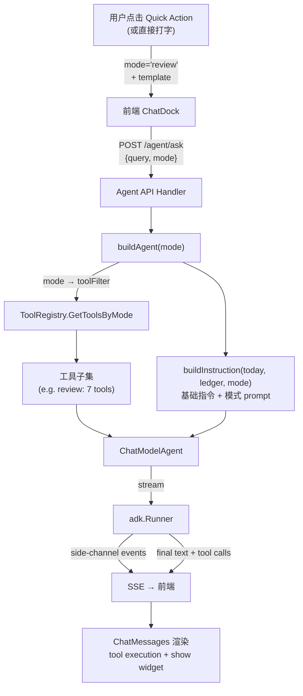
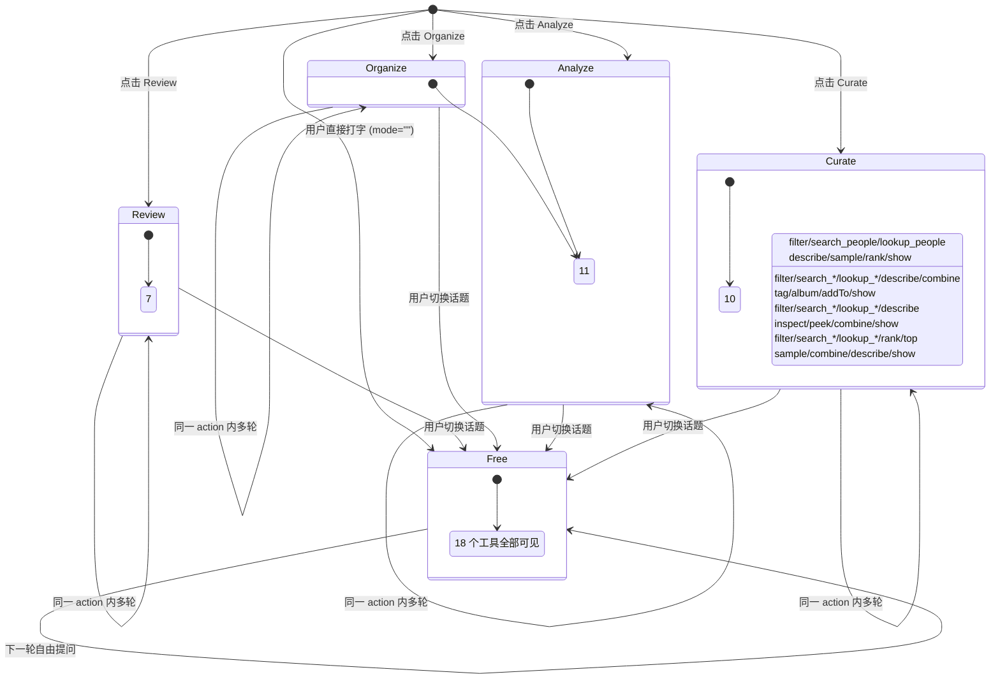
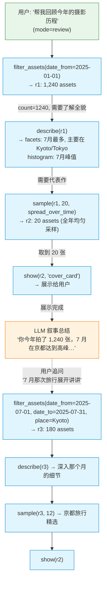
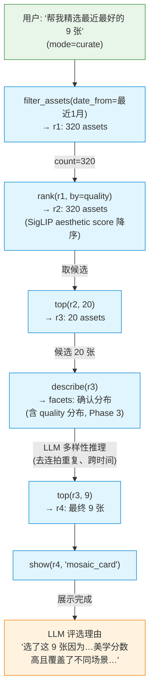
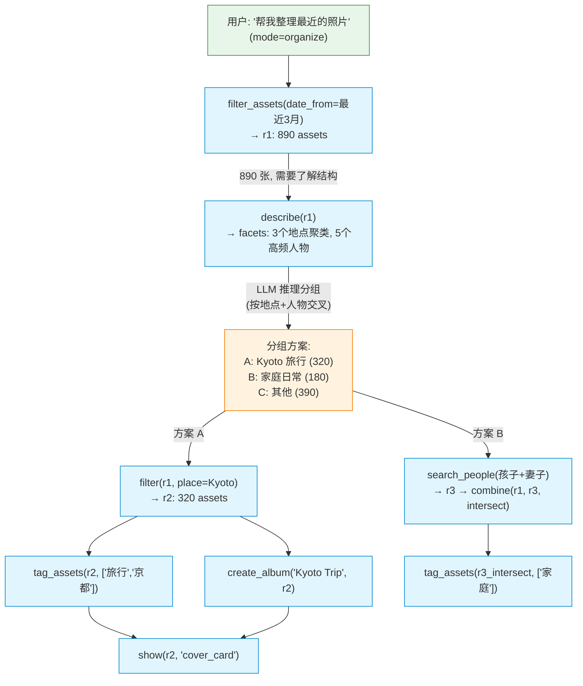
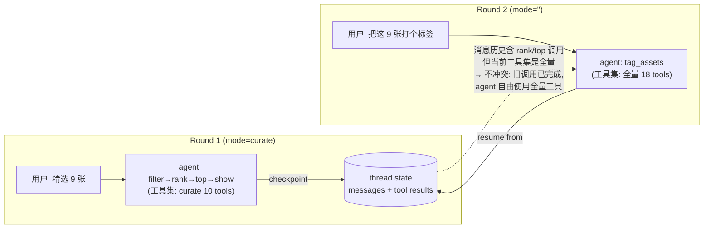

# Quick Actions & Progressive Tool Disclosure — Implementation Plan

> 状态: **implementation** · 面向: 编码代理
> 前置: [`agent-task.md`](./agent-task.md) T0–T3 已完成（工具链 + pin + widget + board 全部就绪）。
> 本计划交付 **Quick Action 系统**：用户选一个 action → 后端约束 agent 可见的工具子集 + 注入模式 prompt → agent 在受限范围内规划执行长链路任务。核心机制是**工具的渐进式披露**，而非 prompt 模板。

## 0. 核心洞察

单个工具几乎都是 UI 已有能力的包装（filter = filter 面板，rank = sort 下拉，tag = bulk action）。agent 的不可替代价值在于 **LLM 把工具串成链路 + 自然语言规划/推理/叙事**——这是 UI 的结构性盲区。

Quick Action 的价值不只是 prompting，更重要的是**工具的渐进式披露**：
- 约束 agent 可见的工具集 → 减少幻觉（精选模式下 agent 不知道 `tag_assets` 存在，不会偏移去打标签）
- 让模型有自知之明（"你在回顾模式"比一堆通用工具描述更能约束行为）
- 控制 agent 的任务范围 → 减少任务偏移

参考: eino ADK 提供了两种渐进式披露机制——[ToolSearch](https://www.cloudwego.io/docs/eino/core_modules/eino_adk/eino_adk_chatmodelagentmiddleware/middleware_toolsearch/) middleware（模型自己搜索工具）和 [Skill](https://www.cloudwego.io/docs/eino/core_modules/eino_adk/eino_adk_chatmodelagentmiddleware/middleware_skill/) middleware（模型自己激活技能）。但本项目的需求是**前端主动约束任务范围**，不是让模型自己发现——因此采用后端 `buildAgent` 层按 mode 过滤工具子集的方案。

## 0.5 已完成的基建

在 Quick Action 系统之前，以下基建已经落地：

| 基建 | 状态 | 说明 |
|---|---|---|
| `asset_quality_scores` 表 | ✅ | 存储 SigLIP MLP head 蒸馏的美学分数（1-10），ingest pipeline 自动写入 |
| `rank(quality)` 真实分数 | ✅ | SQL LEFT JOIN `asset_quality_scores`，有真实分数用真实分数，无分数 fallback 到旧 heuristic（1-2 范围，不抢位） |
| `rank` 工具描述诚实化 | ✅ | 明确说明 quality 来源是 SigLIP aesthetic head，fallback 是 rating/liked/resolution |
| 重构索引按钮始终可见 | ✅ | 全部已索引时仍可强制全量重跑（模型升级后需要） |
| `EmbeddingService.SaveAestheticScore` | ✅ | semantic worker 存 embedding 时同步存 aesthetic score |

## 1. 决策锁定

| # | 决策 |
|---|---|
| Q1 | 四个 Quick Action: **review**(回顾) / **organize**(整理) / **analyze**(洞察) / **curate**(精选) |
| Q2 | `/` 保留作为 quick action 触发入口（语义从 "slash macro" 改为 "quick action"）；同时输入框左侧增加 Plus 按钮触发 |
| Q3 | 工具子集在后端 `buildAgent` 按 mode 过滤（强制约束，不是提示级别） |
| Q4 | 模式 prompt 注入 `buildInstruction`（让 agent 知道当前模式 + 该模式的行为指引） |
| Q5 | mode 只影响**当前请求**的工具集；checkpoint resume 时用当前请求的 mode 重建 agent。消息历史里的旧工具调用结果不受影响（已完成）。 |
| Q6 | 自由模式（mode=""，用户直接打字）= 全量工具集（当前行为不变） |
| Q7 | Quick action 的初始消息是**开放性任务描述**（"帮我回顾今年"），不是精确指令（"按画质选 20 张"）——把规划空间留给 LLM |
| Q8 | `rank(quality)` 使用 SigLIP MLP head 美学分数（1-10），不再是 rating/liked/resolution 的 misleading heuristic |

## 2. 工具反馈充分性分析

> 核心问题：模型调用每个工具后，得到的反馈是否**足够做下一步决策**？

### 2.1 逐工具评估

| 工具 | 返回给模型 | 下一步决策需要 | 充分？ | 说明 |
|---|---|---|---|---|
| `filter_assets` | ref_id + count + 条件摘要 | 知道找到了多少、条件是否正确 | ✅ | — |
| `search_semantic` | ref_id + count + **完整性**(complete/truncated/empty/calibrated) | 知道集是否完整、是否需要 strict 重试 | ✅ 极好 | summary 精心设计了完整性反馈 |
| `search_text` | ref_id + count + 截断信息 | 同上 | ✅ | — |
| `search_people` | ref_id + count + 截断信息 | 同上 | ✅ | — |
| `combine` | ref_id + count + 操作类型 | 知道集合运算结果大小 | ✅ | — |
| `rank` | ref_id + count + 排序维度 | 知道按什么排了 | ✅ | **quality 维度现在基于 SigLIP 美学分数（1-10），不再依赖 misleading heuristic** |
| `top` | ref_id + count | 知道取了多少 | ✅ | — |
| `sample` | ref_id + count + strategy | 知道采样了 N 张 | ⚠️ | **不返回采样分布**——模型无法判断 spread_over_time 采样是否均匀 |
| `describe` | facets: count/date_range/histogram/types/top_places/top_people/cameras/liked/rating | 聚合视图 | ⚠️ | **缺 quality 分布维度**——可通过 `asset_quality_scores` 查询补上（Phase 3） |
| `peek` | 前 N 行: date/filename/type/rating/liked | 逐条细节 | ⚠️ | **缺 place/person**——模型无法验证地点/人物正确性 |
| `inspect` | 前 3 张 EXIF: camera/lens/focal/aperture/shutter/iso/size | 器材细节 | ✅ | — |
| `show` | "Displayed N assets" | 知道已展示 | ✅ | — |
| `tag_assets` | ref_id + count + summary | 知道打了多少 | ✅ | — |
| `create_album` | confirmation flow → summary | 需要用户确认 | ✅ | — |
| `add_to_album` | summary | 知道加了多少 | ✅ | — |
| `bulk_like` | summary | 同上 | ✅ | — |

### 2.2 缺口评估

两个 ⚠️ 缺口都是**效率问题**，不是阻断性问题——模型可以用现有工具组合绕过：

| 缺口 | 影响 action | 当前绕法 | 效率成本 | 状态 |
|---|---|---|---|---|
| ~~describe 缺 quality 分布~~ | ~~curate~~ | ~~filter → rank(quality) → top → peek 间接看质量~~ | ~~多 2 次工具调用~~ | ✅ 已解决（`asset_quality_scores` 可查，Phase 3 补入 describe facet 即可） |
| peek 缺 place/person | organize | filter → describe(top_places/top_people) 间接验证 | 多 1 次工具调用 | ⬜ Phase 3 |
| sample 不返回分布 | review | filter → describe(histogram) 间接看时间分布 | 多 1 次工具调用 | ⬜ Phase 3 |

**结论：现有工具反馈基本充分，不阻断 quick action 的实现。** quality 分布缺口已由 `asset_quality_scores` 表解决（Phase 3 只需补入 describe facet），其余两个缺口作为后续优化。

## 3. Quick Action 定义

### 3.1 工具子集矩阵

```mermaid
graph LR
    subgraph "全量工具集 (自由模式)"
        direction TB
        F[filter_assets]
        SS[search_semantic]
        ST[search_text]
        SP[search_people]
        LP[lookup_people]
        LA[lookup_albums]
        CB[combine]
        RK[rank]
        TP[top]
        SM[sample]
        DS[describe]
        PK[peek]
        IS[inspect]
        SH[show]
        BL[bulk_like]
        CA[create_album]
        AA[add_to_album]
        TA[tag_assets]
    end
```



| 工具 | review | organize | analyze | curate | 自由 |
|---|:---:|:---:|:---:|:---:|:---:|
| filter_assets | ✅ | ✅ | ✅ | ✅ | ✅ |
| search_semantic | | ✅ | ✅ | ✅ | ✅ |
| search_text | | | ✅ | | ✅ |
| search_people | ✅ | ✅ | ✅ | ✅ | ✅ |
| lookup_people | ✅ | ✅ | ✅ | ✅ | ✅ |
| lookup_albums | | ✅ | | | ✅ |
| combine | | ✅ | ✅ | ✅ | ✅ |
| rank | ✅ | | | ✅ | ✅ |
| top | | | | ✅ | ✅ |
| sample | ✅ | | | ✅ | ✅ |
| describe | ✅ | ✅ | ✅ | ✅ | ✅ |
| peek | | | ✅ | | ✅ |
| inspect | | | ✅ | | ✅ |
| show | ✅ | ✅ | ✅ | ✅ | ✅ |
| bulk_like | | | | | ✅ |
| create_album | | ✅ | | | ✅ |
| add_to_album | | ✅ | | | ✅ |
| tag_assets | | ✅ | | | ✅ |

> 设计原则：**被排除的工具不存在于 agent 的世界**。curate 模式下 agent 不知道 tag/album/inspect 存在——不会偏移。

### 3.2 模式 Prompt

每个 mode 的 instruction 片段追加到 `buildInstruction` 基础指令之后：

**review**:
> 你在**回顾模式**。帮用户回顾一段时间的摄影历程：先用 filter 圈定时间范围，用 describe 了解整体面貌，用 sample(spread_over_time) 取代表性照片，最后用 show 展示并给出叙事性总结。关注时间脉络和回忆叙事，不要整理或修改照片。

**organize**:
> 你在**整理模式**。帮用户分组归档照片：先 filter/describe 了解全貌，推理出合理的分组（按地点/时间/人物），然后用 tag_assets 打标签、create_album 建相册。主动建议整理方案，每一步操作前简述意图。

**analyze**:
> 你在**分析模式**。帮用户发现拍摄习惯和趋势：用 filter 圈定范围，用 describe 看聚合分布，用 inspect 看器材细节。给出数据驱动的洞察（最常用的焦段、拍摄高峰期、风格变化），用 show 展示佐证照片。

**curate**:
> 你在**精选模式**。帮用户选出最好的照片：用 filter 圈定候选池，rank(quality) 排序（quality 基于 SigLIP 美学模型分数 1-10，分数集中在 5-7 区间，中位数约 5.5-6，7+ 已是好照片，8+ 极罕见），top 截取。注意多样性——避免连拍重复。给出简短的评选理由，用 show 展示最终精选。

### 3.3 触发语

Quick Action 列表展示 label + description（i18n），点击后发送开放性 template：

| Action | Label | Description | Template (en) |
|---|---|---|---|
| review | Review | 回顾一段时间的摄影历程 | Help me review my photography journey this year |
| organize | Organize | 分组归档，建议标签和相册 | Help me organize my recent photos |
| analyze | Analyze | 发现拍摄习惯和趋势 | Analyze my shooting habits and trends |
| curate | Curate | 选出最好的照片 | Help me curate the best photos from recent uploads |

## 4. Agent 执行路径

### 4.1 全局流程



### 4.2 工具可见性状态



### 4.3 典型执行因果链 — Review（回顾）



### 4.4 典型执行因果链 — Curate（精选）

> `rank(quality)` 现在基于 SigLIP MLP head 美学分数（1-10），不再是 rating/liked/resolution 的 misleading heuristic。有真实分数的照片按美学模型排序，无分数的 fallback 到旧 heuristic 但限制在 1-2 范围（不抢位）。



### 4.5 典型执行因果链 — Organize（整理）



### 4.6 Checkpoint Resume 兼容性



> Resume 安全性：checkpoint 存的是**消息历史 + 中间状态**，不是 agent 配置。`buildAgent` 每次请求重建——用当前 mode 的工具集。消息历史里的旧工具调用（如 rank）已经完成、结果已在消息中，agent 不需要重新执行它们。唯一约束：当前工具集必须包含用户追问可能需要的工具——自由模式（全量）天然满足。

## 5. 实施阶段

> 质量门: `make server-test`、`make web-test`、改 API 注解后 `make dto`、Go `gofmt`。

### Phase 0 — 质量分数基建（已完成 ✅）

- [x] `asset_quality_scores` 表 + upsert/get 查询 + sqlc generate
- [x] `EmbeddingService.SaveAestheticScore` 接口 + 实现
- [x] `ml_semantic_worker.go` 存 embedding 时同步存 aesthetic score
- [x] `RankAssetIDsByQuality` SQL 改用 LEFT JOIN `asset_quality_scores`，真实分数优先，fallback 到旧 heuristic（1-2 范围）
- [x] `rank` 工具描述诚实化（明确 quality 来源是 SigLIP aesthetic head）
- [x] 重构索引按钮始终可见（全部已索引时仍可强制重跑）

### Phase 1 — 后端 mode → 工具子集过滤（核心）

- [ ] `server/internal/agent/core/tool_registry.go`:
  - 新增 `modeTools map[string]map[string]bool`（mode → 工具名集合）。
  - 新增 `GetToolsByMode(ctx, deps, mode)` 方法：mode 为空时返回全量（`GetAllTools`），否则只实例化该 mode 的工具子集。
  - 新增 `modeInstructions map[string]string`（mode → 模式 prompt 片段）。
- [ ] `server/internal/agent/core/agent_service.go`:
  - `AskAgent` 签名增加 `mode string` 参数。
  - `buildAgent` 增加 `mode` 参数：`registry.GetToolsByMode(ctx, deps, mode)` 替代 `GetAllTools`；`buildInstruction(today, ledger, mode)` 追加模式 prompt。
  - `buildInstruction` 增加 `mode` 参数，查 `modeInstructions` 追加片段。
- [ ] `server/internal/api/handler/agent_handler.go`:
  - `AskAgent` handler 从请求体解析 `mode` 字段，传入 service。
- [ ] `server/internal/api/dto/agent_dto.go`:
  - `AskAgentRequest` 增加 `Mode string` 字段。
- [ ] OpenAPI 注解 + `make dto`。

**验收**: 不同 mode 的请求，agent 看到不同的工具集（通过 `/api/v1/agent/tools?mode=curate` 验证）；mode="" 返回全量。

### Phase 2 — 前端 Quick Action 系统

> **交互模型修订（粘性模式）**：选中 quick action **不再灌模板、不自动发送**，而是设置一个**粘性 mode**——单一来源（ChatDock 持有 `activeMode`），在 context-chips 行展示一个可关闭的 mode pill，跨多轮保持，直到用户点 X 退出。三个入口（空状态卡片 / `/` 菜单 / 工具栏按钮）行为统一为「设置粘性 mode」。`SlashMacro.template` 字段保留为声明性配置，当前未被读取。
>
> **ChatDock/RichInput 视觉重构**（command-palette 风格，颜色全部走 daisyUI theme token）：
> - **双行 composer**：textarea 在上、底部工具栏（Sparkles=quick action / AtSign=mention / Send）。工具栏按钮经 `openTrigger(char)` 插入触发符并复用打字流（支持 type-to-filter）。
> - **命令面板**：mention/quick-action 统一为带 theme-token 图标 chip 的列表（person→primary / album→secondary / pin→accent / camera→info / lens→success / quick-action→primary），含描述行、`kbd` 键盘提示 footer；Escape 取消并剥离半成品触发符。
> - **空状态**：4 个 quick-action 卡片（per-mode 图标 + 标题 + 描述）+ hero avatar；per-mode 图标（review→History / organize→FolderTree / analyze→BarChart3 / curate→Sparkles）在卡片与 mode pill 间一致复用。
> - Send 键在生成中显示 spinner。新增 i18n：`lumilio.input.modePrompt`、`lumilio.mention.navigate`、`lumilio.mention.select`。

- [x] `web/src/features/lumilio/slash/slashMacros.ts`:
  - `SlashMacro` 含 `mode` 字段；四个 action 定义就绪。
  - 删除 `useQuickAsks`/`QuickAsk`（空状态改用 `useSlashMacros` 渲染 mode chip）。
- [x] `web/src/features/lumilio/components/Chat/MentionInput.tsx`:
  - `/` 菜单标题为 "Quick Actions"（i18n）。
  - 选 quick action → `onSetMode(mode)` 设粘性 mode，剥离 `/token`，**不插入模板**。
  - 移除组件内 `pendingMode` 状态与 in-row pill（mode 提升到 ChatDock）。
  - `onSubmit(query, mentions)` 不再带 mode；修复 submit 闭包（去掉 stale `pendingMode`）。
  - mode 激活时 placeholder 改为 `lumilio.input.modePrompt`；Plus 按钮在 mode 激活时 tint primary。
  - 左侧 Plus 按钮弹出同一 quick action 菜单。
- [x] `web/src/features/lumilio/components/Chat/ChatDock.tsx`:
  - 持有单一粘性 `activeMode`；`handleSubmit(value, mentions)` 读 `activeMode` 注入 `sendMessage`，**不在 send 时清除**。
  - 单一 mode pill 经 `ContextChips` 的 `leading` 槽渲染在 chips 行；删除原重复 badge。
  - 空状态渲染 4 个 mode chip（label + desc tooltip），点击 toggle 粘性 mode。
- [x] `web/src/features/lumilio/components/Chat/ContextChips.tsx`: 加 `leading` 槽（mode pill 与 context chips 同行，复用而非另写）。
- [x] `web/src/features/lumilio/state/chatStore.ts`: `sendMessage` 已支持 `mode`，写入请求 body（前置已就绪）。
- [x] i18n extract + 填 zh（新增 `lumilio.input.modePrompt`，剪除旧 `quickAsk.*`）。

**验收**: `/`、Plus 按钮、空状态 chip 三入口都设粘性 mode（单一 pill，跨多轮保持，X 退出）；带 mode 的请求发往 agent，受限工具集执行；quality gate（`vp check`/`vp lint`/`vp test`）全绿。

### Phase 3 — 工具反馈增强（非阻断优化，可延后）

减少长链路中的冗余工具调用。

- [ ] `describe` 增加 quality 维度 facet（**分位数统计，不做离散桶**）:
  - 背景：SigLIP MLP head 美学分数集中在 5-7 区间（中位数 ~5.5-6，7+ 已是好照片，8+ 极罕见，训练集 max 8.06）。Hard cutoff（如 ≥8=high）过于激进——绝大多数照片会挤进同一桶。
  - 方案：`facets.Build` 查询 `asset_quality_scores` 返回**分位数统计**，让 LLM 自己推理分布含义：
    ```sql
    SELECT
      percentile_cont(0.25) WITHIN GROUP (ORDER BY score) AS p25,
      percentile_cont(0.50) WITHIN GROUP (ORDER BY score) AS p50,
      percentile_cont(0.75) WITHIN GROUP (ORDER BY score) AS p75,
      percentile_cont(0.90) WITHIN GROUP (ORDER BY score) AS p90,
      COUNT(*) AS scored_count
    FROM asset_quality_scores WHERE asset_id = ANY($1)
    ```
  - 返回形如 `{scored: 318, unscored: 2, p25: 5.1, p50: 5.7, p75: 6.3, p90: 7.0}`——LLM 能推理"这个集合 p90 到了 7.0，比中位数高不少，top 10% 确实不错"。
  - 这和 describe 返回 time histogram 是同一设计哲学：给分布形状，不做主观判断。
  - curate 模式下 agent 一次 describe 就能评估候选池质量，省去 rank→top→peek 的间接探测。
- [ ] `rank` 工具描述补充分数分布上下文:
  - 现有描述只说"1-10"，LLM 可能误以为 5/10 是不及格。补充："分数集中在 5-7 区间，中位数约 5.5-6，7+ 已是好照片，8+ 极罕见。"
- [ ] `peek` 每行增加 place + person_names:
  - `AgentPeekAssets` 查询 JOIN place + person，返回行追加地点和人物。
  - organize 模式下 agent peek 就能验证分组正确性，省去额外 describe。
- [ ] `sample` 返回附带分布摘要:
  - SampleOutput 增加可选 `distribution` 字段（时间跨度 + 每个区间采样数）。
  - review 模式下 agent 一次 sample 就能判断采样代表性。

**验收**: curate 模式 describe 直接返回 quality 分布；organize 模式 peek 显示地点；review 模式 sample 显示分布。

## 6. 文件级变更清单

### 后端
| 文件 | 变更 | 状态 |
|---|---|---|
| `server/migrations/000005_ml_analysis_results.up.sql` | +asset_quality_scores 表 | ✅ |
| `server/internal/db/repo/queries/asset_quality_scores.sql` | +Upsert/Get 查询 | ✅ |
| `server/internal/db/repo/queries/agent_tools.sql` | RankAssetIDsByQuality LEFT JOIN 真实分数 | ✅ |
| `server/internal/service/embedding_service.go` | +SaveAestheticScore 接口/实现 | ✅ |
| `server/internal/queue/ml_semantic_worker.go` | 存 embedding 时同步存 score | ✅ |
| `server/internal/agent/tools/transformers.go` | rank 描述诚实化 | ✅ |
| `server/internal/agent/core/tool_registry.go` | +modeTools / modeInstructions / GetToolsByMode | Phase 1 |
| `server/internal/agent/core/agent_service.go` | AskAgent/buildAgent/buildInstruction 增加 mode | Phase 1 |
| `server/internal/api/handler/agent_handler.go` | 解析 mode 参数 | Phase 1 |
| `server/internal/api/dto/agent_dto.go` | AskAgentRequest +Mode | Phase 1 |
| `server/internal/agent/facets/facets.go` | quality 分位数 facet（查 asset_quality_scores percentile_cont） | Phase 3 |
| `server/internal/agent/tools/transformers.go` | rank 描述补充分数分布上下文 + sample 返回分布 | Phase 3 |
| `server/internal/agent/tools/peek.go` | peek 行 +place +person | Phase 3 |

### 前端
| 文件 | 变更 | 状态 |
|---|---|---|
| `web/src/features/monitor/components/MLMonitor.tsx` | 重构索引按钮始终可见 + 智能默认 checkbox | ✅ |
| `web/src/features/lumilio/slash/slashMacros.ts` | Quick action 定义 + mode 字段 | Phase 2 |
| `web/src/features/lumilio/components/Chat/MentionInput.tsx` | Plus 按钮 + mode 传递 | Phase 2 |
| `web/src/features/lumilio/components/Chat/ChatDock.tsx` | handleSubmit + mode | Phase 2 |
| `web/src/features/lumilio/state/chatStore.ts` | sendMessage + mode | Phase 2 |

## 7. 不做（出界）

- ❌ 不引入 ToolSearch middleware（工具才 18 个，不需要搜索发现；前端 action 主动约束更直接）。
- ❌ 不引入 Skill middleware（Skill 是模型自己选择激活，本需求是前端主动约束）。
- ❌ 不做 mode 在 thread 级别持久化（mode 只影响当前请求；下一轮自由提问自动回到全量工具集）。
- ❌ 不做 vision 工具（v1 限制，与 agent-task.md 一致）。
- ❌ 不做 action 内的自定义参数（v1 四个 action 固定，不支持用户自定义 quick action）。
- ❌ Phase 3 增强不阻断 Phase 1+2 的交付——可以先上线再优化反馈。

## 8. 备注

1. **mode 是"约束"不是"能力"**：mode 限制了 agent 能看到什么工具，但没有给 agent 新能力。agent 的推理/规划/叙事能力来自 LLM 本身，mode 只是帮它聚焦。
2. **自由模式是兜底**：用户随时可以直接打字（mode=""），agent 回到全量工具集。quick action 是"聚焦入口"，不是"唯一入口"。
3. **模板是开放的不是精确的**：quick action 的 template 留给 LLM 规划空间（"帮我回顾今年"），不是精确指令（"按画质选 20 张"）。精确指令 = UI 功能的自然语言版 = 没有价值。
4. **SlashIcon 已改为 Terminal**：之前的改动已落地，Quick Action 列表继续用 Terminal icon。
5. **quality 分数架构**：美学分数在 ingest pipeline 时预计算（SigLIP embedding → MLP head → score），存入 `asset_quality_scores` 表。agent 的 `rank(quality)` 通过 LEFT JOIN 读取，不做实时推理。这和人脸搜索（ingest 时预计算聚类，agent 按 person_id 查询）是同一架构模式。
6. **`rank(quality)` 不再危险**：旧 heuristic（rating 45% + liked 20% + resolution 35%）在冷启动时退化为纯分辨率排序，对模型是黑箱误导。新方案用真实美学分数（1-10），fallback 限制在 1-2 范围不抢位——curate 模式的整条链路（filter → rank → top → show）现在基于真实信号。
