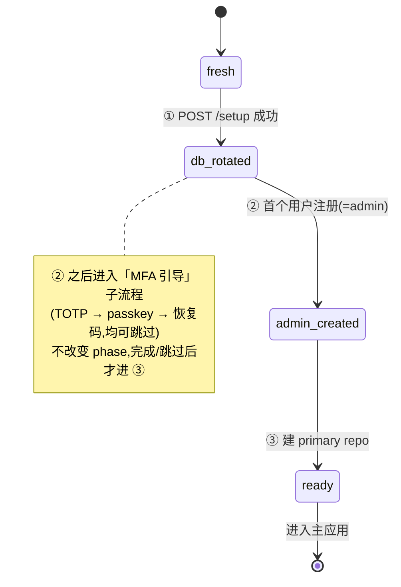
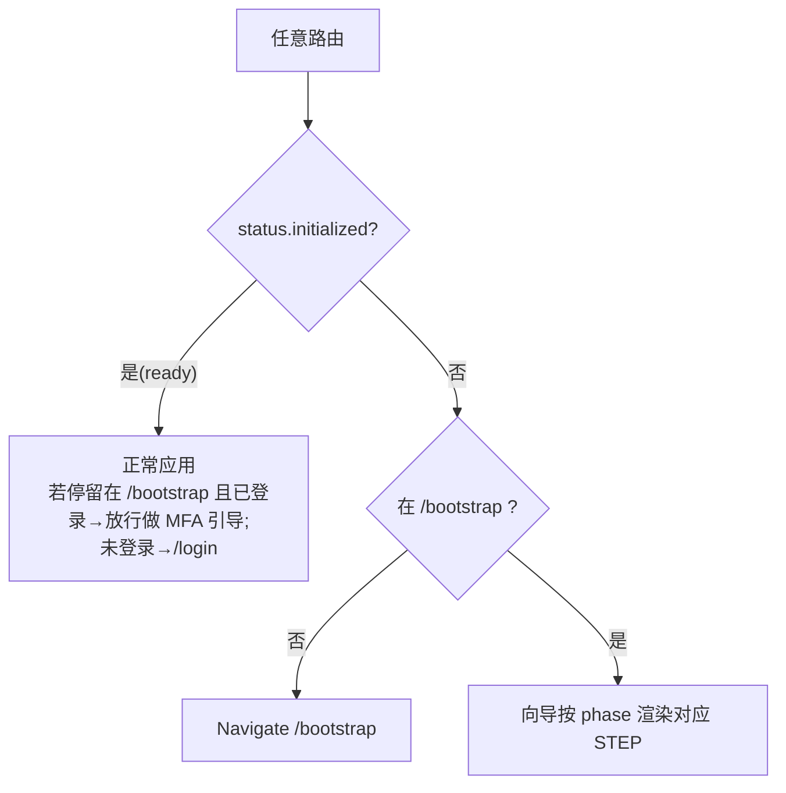

# Setup Wizard UX（首次启动向导）

> 临时设计稿。后端已就绪:单一 `bootstrap_phase` 驱动,向导按 phase 渲染步骤,
> 不把 register/create-primary 收进 `/setup/*`(保持解耦)。终端看不到 mermaid,
> 用 IDE/GitHub 渲染。
>
> **实现状态**:三层 gate(phase 驱动)= `SetupGate`(STEP① 数据库轮换)→
> `BootstrapGate`/`BootstrapWizard`(STEP② 管理员 + MFA)→ `PrimaryRepositoryGate`
> (STEP③ 主仓库)。已落地:STEP① 改为**欢迎页 + 点击**触发 `POST /setup`(不再自动);
> STEP③ 存储根**只读**展示 `default_root`(primary 固定 `<root>/primary`)。MFA UI 维持现状。
> 待办(非阻塞):跨三 gate 的统一步骤指示器(目前各 gate 自有进度 UI)。

## 0. 真相源与驱动

向导**只读** `GET /setup/status`,按 `bootstrap_phase` 决定显示哪一步。每完成一步
就 invalidate setup status → 重读 phase → 前进。三步分别打三个既有端点:

| Phase | 步骤 | 用户动作 → 端点 | 推进到 |
|---|---|---|---|
| `fresh` | ① 初始化系统 | `POST /api/v1/setup`(轮换 DB 凭据 + 写密钥) | `db_rotated` |
| `db_rotated` | ② 创建管理员(+ 可跳过 MFA 引导) | `POST /api/v1/auth/register/start`(首用户=admin,自动登录) | `admin_created` |
| `admin_created` | ③ 创建主仓库 | `POST /api/v1/repositories`(`role=primary`) | `ready` |
| `ready` | ✓ 完成 | 跳转主应用 `/` | — |

`/setup/status` 字段:`database_initialized / admin_initialized / primary_repository_initialized /
initialized / next_registration_role / repository_defaults{default_root, strategy, duplicate_handling}`。

## 1. 总流程(状态机)



## 2. 线框(ASCII)

```
┌──────────────────────────  /bootstrap  ──────────────────────────┐
│  Lumilio 首次设置                                  ●──○──○   (步骤指示) │
│                                                                    │
│  ── phase=fresh ──────────  STEP ① 欢迎 / 初始化系统 ───────────── │
│   欢迎使用 Lumilio Photos!点击下方按钮完成一次性初始化:            │
│   将把临时 bootstrap 数据库密码轮换为高熵密钥、生成应用密钥,        │
│   并落盘到 <root>/.secrets(只需一次,约数秒,不会自动执行)。       │
│                                            [ 开始初始化 ]           │
│   (失败 → 红色错误条 + [重试];幂等:已轮换则自动跳到 STEP ②)       │
└────────────────────────────────────────────────────────────────────┘

┌──────────────────────────  /bootstrap  ──────────────────────────┐
│  Lumilio 首次设置                                  ✓──●──○         │
│  ── phase=db_rotated ───────  STEP ② 创建管理员 ───────────────── │
│   第一个账户将成为**管理员**(next_registration_role=admin)。       │
│   用户名 [____________]                                            │
│   密码   [____________]   确认密码 [____________]                  │
│                                            [ 创建管理员账户 ]       │
│                                                                    │
│   注册成功 → 自动登录(拿到 token)→ 进入「MFA 引导」:             │
│     2a 设置两步验证 TOTP        [设置]  [稍后]                      │
│     2b 添加 Passkey(需先有 TOTP) [添加]  [稍后]                   │
│     2c 生成恢复码(请妥善保存)   [生成]  [稍后]                    │
│                                            [ 完成,下一步 ]         │
└────────────────────────────────────────────────────────────────────┘

┌──────────────────────────  /bootstrap  ──────────────────────────┐
│  Lumilio 首次设置                                  ✓──✓──●         │
│  ── phase=admin_created ─────  STEP ③ 创建主存储库 ─────────────── │
│   主库固定位于  <root>/primary   (根不可变,只读展示)              │
│     存储根   [ /data/storage ]            ← repository_defaults.default_root(只读) │
│     名称     [ Primary Storage ]                                   │
│     组织策略 (●date  ○flat  ○cas)         ← 预填 defaults.strategy │
│     重名处理 (●rename ○uuid ○overwrite)   ← 预填 defaults.duplicate_handling │
│                                            [ 创建主存储库 ]         │
└────────────────────────────────────────────────────────────────────┘

      ↓ phase=ready
┌──────────────────────────────────────────────────────────────────┐
│  ✓ 设置完成!正在进入 Lumilio …               → 重定向到  /        │
└────────────────────────────────────────────────────────────────────┘
```

## 3. 路由 / Gate 决策

一个 `SetupGate`(读 `/setup/status`)包在应用外层:



要点:
- **STEP ①** 公开(此时无任何用户,不能要求登录)。
- **STEP ②** 注册成功即自动登录;之后的 MFA 引导与 **STEP ③** 用这个 admin 的会话。
- 现有 `BootstrapGate` 的"已注册但还在 /bootstrap 做 MFA 引导"豁免逻辑保留:`!admin_initialized` 之外,已登录用户允许留在 `/bootstrap`。

## 4. 每步数据流

```
STEP ①  [开始初始化] → POST /setup
        ├─ 200 → invalidate(setup/status) → 重读 phase=db_rotated → 渲染 STEP ②
        └─ 409 ErrSystemAlreadyInitialized(已轮换)→ 同样重读 status,自然落到 STEP ②
        └─ 5xx → 错误条 + [重试]

STEP ②  [创建管理员] → POST /auth/register/start {username,password}
        ├─ 200 → 写入会话(token)+ bootstrap_admin=true → 进入 MFA 引导子流程
        │        (TOTP/passkey/recovery 各自端点;均可跳过)
        │        引导完成/全部跳过 → invalidate(setup/status) → phase=admin_created → STEP ③
        └─ 400/409 → 表单内联报错(用户名格式/弱密码/已存在)

STEP ③  [创建主存储库] → POST /repositories {role:"primary", storage_strategy, duplicate_handling}
        ├─ 200 → invalidate(setup/status) → phase=ready → 完成页 → Navigate /
        └─ 409 (primary 已存在,刷新竞态) → 重读 status,落到 ready/完成
```

> 注:STEP ③ 即使前端传 `root`,后端对 `role=primary` 一律落到 `<root>/primary`(根不可变)。
> 所以"存储根"是只读展示;用户实际只选 strategy/duplicate(写进该 primary 的 `.lumiliorepo`,
> 不影响全局 `repository_defaults` 模板)。

## 5. 恢复 / 边界

| 情况 | 行为 |
|---|---|
| 任意步刷新页面 | 重读 `/setup/status`,幂等落到当前 phase 对应 STEP(无状态丢失) |
| 半完成(如 db_rotated 无 admin) | 直接显示 STEP ② |
| STEP ① 重复点击 / 并发 | 后端幂等(已轮换→409),前端按 status 不重复展示 |
| 已 ready 但访问 /bootstrap | 已登录→放行(让其完成可选 MFA);未登录→/login |
| MFA 引导中途离开 | phase 已是 admin_created;下次进来从 STEP ③ 继续(MFA 是 admin 账户的可选增强,非 gate) |

## 6. 前端组件映射(迁移指引)

| 角色 | 现有组件 | 调整 |
|---|---|---|
| 外层 gate | `SetupGate` / `BootstrapGate` | 合二为一或分工:都读 `useSetupStatus`;`BootstrapGate` 已改读 `admin_initialized`(✓) |
| STEP ① | (新)或并入 SetupGate | 调 `POST /setup`(已有 `useSetupStatus`,补一个 setup mutation) |
| STEP ② | 现有 registration flow(`useRegistrationFlow` + MFA 引导页) | 注册成功后 invalidate `setupStatusQueryKey`(✓ 已改) |
| STEP ③ | `PrimaryRepositoryGate` | 存储根改为只读展示 `default_root`;只收 strategy/duplicate;移除 `preserve_filename`(已从后端删) |
| 步骤指示器 | 新增 | 由 `database_initialized / admin_initialized / primary_repository_initialized` 三布尔点亮 ①②③ |

## 7. UX 决策(已定)

1. ✅ **STEP ① = 欢迎页 + 用户点击**:进 `/bootstrap` 先显示欢迎/说明页(将轮换数据库凭据、生成应用密钥),用户点「开始初始化」才 `POST /setup`。不自动执行。
2. ✅ **MFA 引导保持现状**:沿用既有注册后的 `TOTP→passkey→恢复码`(均可跳过)UI,不动它;引导完成/跳过后正好接到 STEP ③ 创建主存储库。
3. ✅ **STEP ③ 存储根只读**:`<root>` 由部署配置决定(见下),不可变;向导只读展示 `default_root`,primary 固定 `<root>/primary`,用户仅选 strategy / duplicate。

### 存储根 `<root>` 来源(非用户输入)

| 形态 | 来源 / 优先级 |
|---|---|
| Docker / 裸机 | `config.StorageConfig.Path`:`STORAGE_PATH` env > TOML `[storage].path` > 默认 `data/storage` |
| Desktop | supervisor 注入(`NewDesktopConfig(DesktopParams.StoragePath)`) |

runtime 不可变(改需重启);`/primary` `/.secrets` `/.cloud` 均派生。

> ⚠ Docker 一致性待核实:`docker-compose.yml` 挂载 `/data/storage` 且写死
> `LUMILIO_DB_PASSWORD_FILE=/data/storage/.secrets/...`,但未显式设 `STORAGE_PATH`。
> 应显式 `STORAGE_PATH=/data/storage`(或 TOML 绝对 path)以免 root 与挂载点/secrets 错位。
