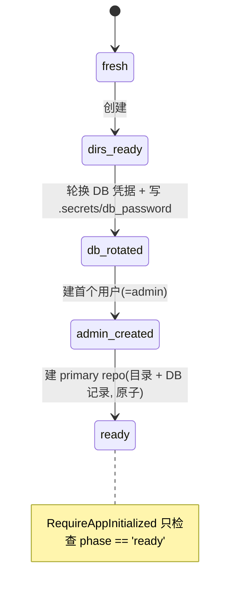

# Config / Settings / Bootstrap 统一重构

**Goal**: 把"配置"与"首次启动"重构成一个清晰、单一真相源、幂等的体系。三件事一起做:
1. **配置分层** — 区分 runtime 不可变(TOML)与 runtime 可变(DB),消除来源冲突。
2. **设置统一** — 前端 localStorage 偏好 / DB 可变设置 / TOML 不可变三层各自唯一真相源。
3. **Bootstrap 重构** — 删除隐式派生的多门判断,改为单一持久化 `bootstrap_phase` 状态机;统一 `/setup`,移除 `/auth/bootstrap-status`。

**Status**: In progress. 第一阶段(config 瘦身 + settings 领域类型,见 §8)已完成;期间顺带做完了
整个 storage 包的审查与重构(见 §10)。**当前进入第二阶段:Bootstrap 状态机 + storage provisioning**(§11)。

**铁律**: **完全破坏性重构,不保留任何兼容层,不做数据迁移。** 当前无生产环境、无 release。
旧 TOML 的 `[ml] [llm] [storage]` 段、`/auth/bootstrap-status`、重复的初始化检查等,直接删除。

**Migration 状态**:全部历史迁移已 **squash** 成 6 个基线(`000001_foundation` … `000006_cloud_agent`,pg_dump 式),
经真实 PG round-trip + 与旧历史 schema diff 验证等价。zeroshot/preserve 删除、one-running-scan 索引、
repo defaults 归属(`repository_defaults` 表)均已并入基线。**铁律下改基线而非加增量**;开发者重置用 `make dev-reset && make db`。
- 第二阶段后续仍需新增:`system_state`(bootstrap_phase)。

---

## 1. 三层设置模型

| 层 | 真相源(唯一) | 持久化 | 改动方式 | 内容 |
|---|---|---|---|---|
| **前端偏好** | 浏览器 | localStorage | 纯客户端 | 主题、视图密度、语言、栏宽 |
| **Runtime 可变** | **数据库** | `settings` 表 | **只能 API**(Settings tabs + Setup) | LLM、ML、primary repo 行为 |
| **Runtime 不可变** | **TOML**(desktop 下由 supervisor 注入) | 进程内存 | 改 TOML + 重启 | DB 连接、端口、日志、storage 根、扫描调度、HW accel、工具路径、CORS、WebAuthn、token TTL、geocoding、lumen |

**核心收敛**: 每层字段集互不相交 → 不存在 TOML↔API 冲突。TOML 不再充当可变设置的 seed;
可变设置的默认值固化在程序内 `DefaultSettings()`,所以 TOML 里**不再出现可变字段**。

## 2. 字段归类全表

### Runtime 可变(DB `settings`,默认来自 `DefaultSettings()`)

| 字段 | 说明 |
|---|---|
| `llm_agent_enabled`, `llm_provider`, `llm_model_name`, `llm_base_url`, `llm_api_key`(密文) | LLM |
| `ml_semantic_enabled`, `ml_bioclip_enabled`, `ml_ocr_enabled`, `ml_face_enabled` | ML 任务开关(zeroshot 跟随 semantic,无独立开关 — 已删) |
| repo: `strategy`, `duplicate_handling` | repo **行为**(非位置;`preserve_filename` 已删除为死旋钮)。**第二阶段从 settings 迁到 storage 自有 store** |

### Runtime 不可变(TOML)

| 段 | 字段 |
|---|---|
| 顶层 | `environment` |
| `[database]` | `host` `port` `user` `password` `password_file` `name` `ssl` |
| `[server]` | `port` `log_level` `cors_allowed_origins` `web_root` |
| `[logging]` | `level` `dir` `console_format` `file_format` `repository_audit_verbose` |
| `[storage]` | **仅 `path`(根)** — 见 §3 |
| `[repository_scan]` | `enabled` `interval_seconds` `settle_seconds` `max_concurrent_repos` `batch_size` |
| `[geocoding]` | `provider` `nominatim_endpoint` `language` `user_agent` |
| `[auth]` | `secret_key_path` `access_token_ttl` `refresh_token_ttl` `media_token_ttl` `webauthn_*`(决策4: 留 TOML) |
| `[transcode]` | `hardware_accel` |
| `[lumen]` | `discovery_*` `connection_insecure` |
| `[tools]` | `exiftool_path` `ffmpeg_path` `ffprobe_path` |

### 删除(从 TOML schema 移除)

`[ml]` `[llm]` 整段;`[storage]` 的 `strategy` / `preserve_filename` / `duplicate_handling`。

## 3. storage 路径模型

**`<path>` = 非 desktop 下唯一可读写根,不可变,TOML 单次设置(desktop 由 supervisor 注入)。**
其下子目录全部**派生 + 命名约定**,因此都不可变:

```
<path>/primary       primary repo 物理位置 (必须存在 → setup gate)
<path>/<other_repo>  用户创建的额外 repo (位置记录在 DB)
<path>/.secrets/     db_password, lumilio_secret_key (必须存在 → setup gate)
<path>/.cloud/       cloud 同步工作区 (必须存在 → setup gate)  ← 现在改为派生
```

- 位置全是不可变约定;**只有 repo 的行为(strategy/duplicate)可变**。
- `.secrets/` 保留复数命名(沿用现有 `defaultDBPasswordFilePath` / `deriveConfigPaths`)。
- `.cloud/`:cloud 包内部已自行派生 `<root>/.cloud/<provider>`(`provider_registry.go`),**app.go 传根是对的**(传 `CloudDir()` 反而会双重 `.cloud`)。`EnsureRootLayout` 只负责预创建 `.secrets`/`.cloud` 目录作为 dirs_ready 保证。

## 4. config 包拆分

- `config.AppConfig` **只保留 §2 的不可变字段**。删除 `LLMConfig` / `MLConfig` 与 `StorageConfig` 的可变三字段;`StorageConfig` 收缩为 `Path` + 派生方法(`SecretsDir()`, `CloudDir()`, `PrimaryDir()`, `DBPasswordPath()`, `SecretKeyPath()`)。
- 新增 settings 领域的 `DefaultSettings()`(在 `internal/service` 或 `internal/settings`),持有可变设置默认值。它是: seed 来源 / setup 表单初值 / DB 缺字段 fallback。
- **依赖纪律(从签名即可判断可变性)**:
  - 不可变 → consumer 收**值**: `config.DatabaseConfig`,无 `ctx`、无 `error`。
  - 可变 → consumer 收**接口**: `SettingsProvider.GetXxx(ctx) (..., error)`,每次问、可变。
  - 修掉现状: `settings_service.GetMLConfig/GetLLMConfig` 不再返回 `config.*Config`,改返回 settings 领域类型(`MLSettings`/`LLMSettings`);删除 config↔settings 的双向手工映射。`MLConfigProvider` 返回 `MLSettings`。

## 5. Bootstrap 状态机(单一真相源)

新增单行表 `system_state`,持久化 `bootstrap_phase`。**所有"是否初始化"判断只读这一列**,
消灭现状中 `setup_service.Status` 与 `RequireAppInitialized` 重复的、`==1/!=1` 互补的派生检查。



**转换规则**:
- 每步是一次幂等推进:已在目标态 → no-op(不再像现状那样重复 mint 新密码)。
- 转换守卫在**写入时**断言文件系统 + DB 不变量;之后请求路径只读 `phase`,不再每次探测。
- **"建 primary repo" 必须原子**:`<path>/primary` 目录 + DB `repositories` 记录同事务/同操作完成,杜绝"目录在但无记录"的半初始化态。
- 可选:启动时一次性 invariant 校验,若 `phase==ready` 但不变量被外部破坏则降级(local-first 容错)。
- seed(写 `DefaultSettings()` 入 DB)收编进 `fresh→dirs_ready` 一步、幂等;**不再是 `app.Run` 无条件执行**,解决现状的时序矛盾(settings 在系统尚未初始化时就被 seed)。

### DDL(新迁移,下一个序号 040)

```sql
-- up
CREATE TABLE system_state (
    id INTEGER PRIMARY KEY CHECK (id = 1),
    bootstrap_phase TEXT NOT NULL DEFAULT 'fresh'
        CHECK (bootstrap_phase IN ('fresh','dirs_ready','db_rotated','admin_created','ready')),
    updated_at TIMESTAMPTZ NOT NULL DEFAULT NOW()
);
INSERT INTO system_state (id) VALUES (1) ON CONFLICT DO NOTHING;
```

`settings` 表结构基本不变(它已是可变设置的存储);仅 seed 来源从 `config` 改为 `DefaultSettings()`。

## 6. API 变更

- **统一 `/setup`**: `GET /setup/status` 返回 `bootstrap_phase` + 下一步所需信息(含 `next_registration_role`,吸收原 bootstrap 语义)。`POST /setup/*` 按状态机推进各步。
- **删除 `/auth/bootstrap-status`**(handler + service `GetBootstrapStatus` + DTO + 前端调用),语义并入 `/setup/status`(决策5)。
- **新增 `GET /settings/runtime-info`**(只读): 返回生效的不可变配置(端口、HW accel、storage 根、扫描调度等),供前端 **Settings → Server Tab** 只读展示(决策3)。
- `RequireAppInitialized` 改为只读 `system_state.bootstrap_phase == 'ready'`。

## 7. 删除清单(破坏性,无兼容层)

- TOML: `[ml]` `[llm]` 段;`[storage]` 的 strategy/preserve/duplicate;同步更新 `server.example.toml`。
- `config`: `LLMConfig`/`MLConfig` 从 `AppConfig` 移除;`StorageConfig` 可变三字段移除;相关 env override(`ML_*`/`LLM_*`/`STORAGE_STRATEGY` 等)删除。
- `settings_service`: `GetMLConfig`/`GetLLMConfig` 返回 `config.*` 的签名;`seedFromConfig` 改为 `seedFromDefaults`;config↔settings 双向映射。
- `auth`: `GetBootstrapStatus` + `BootstrapStatus` + handler + 路由 + DTO。
- `setup_service`: `Status()` 里重复的三门派生(改为读 phase);`Initialize` 的"靠拒绝"幂等改为状态机推进。
- `initialization_middleware`: 三门探测改为单列读取。
- 前端: bootstrap-status 调用、相关类型(经 `make dto` 重新生成)。

## 8. 实施阶段

1. ✅ **config 瘦身**(完成): `AppConfig` 去可变字段;`StorageConfig` 收缩为 `Path` + 派生方法(`SecretsDir/CloudDir/PrimaryDir/DBPasswordPath/SecretKeyPath`);删 env override 与 TOML 段;更新 example.toml。
2. ✅ **settings 领域类型**(完成,与阶段1合并): 新建 `internal/settings` 包(`LLM`/`ML`/`RepoDefaults`/`Settings`/`Default(env)`);`settings_service` 改返回领域类型,断开 `config.*Config` 返回;`MLConfigProvider` 返回 `settings.ML`;`seedFromConfig→seedFromDefaults`。
   - 注:`internal/settings` 必须独立于 `service`(否则 `queue→service` 循环)。
3. ✅ **第二阶段:Bootstrap 状态机 + storage provisioning** — 见 §11(当前进行)。
4. ✅**API 统一**: 重写 `/setup`;删 `/auth/bootstrap-status`;加 `/settings/runtime-info`;中间件改读 phase。`make dto`。
5. ✅**前端**: Settings 三层落地(localStorage 偏好 / DB 可变 tabs / Server Tab 只读);setup 向导对接新状态机;删 bootstrap 调用。
6. ✅**质量门**: `make server-test`、`make web-test`;手动跑一遍 fresh→ready 首次启动。

## 9. 待确认/风险

- `geocoding` 暂归不可变(TOML),与 `auth` 一致缩小爆炸半径;若日后要可变再单独提。
- `bootstrap_phase` 与文件系统/DB 的一致性依赖"转换时守卫 + 可选启动校验";外部手工删文件会绕过,local-first 可接受。
- desktop 路径:`<path>` 由 supervisor 注入,派生子目录逻辑两端共用(`NewDesktopConfig` 与 TOML 路径都走同一套 `StorageConfig` 派生方法)。

## 10. storage 包审查记录(阶段1后的计划外工作,已完成)

为给第二阶段 provisioning 铺路,审查并重构了整个 storage 包(详见对话):
- **`RepositoryManager`**:接口 16→11;删死方法(LoadConfig/SaveConfig/RemoveRepositories/GetRepositoryAssetStats);`ValidateRepository`/`IsNestedRepository` 私有化;构造返回具体类型;删 `asset_service` 里指向接口的死指针字段。
- **`DirectoryManager`**:`repoDirs` 单一布局真相源(替代 `Directories`+`systemDirs` 双源),删 `backups`;接口 19→6,死方法私有化/删除;路径穿越钳制(`resolveInRepo`)+ 防覆盖;权限一致(staging/temp 0700)。
- **`StagingManager`**:staging 原语从 DirectoryManager 收归此处;接口 7→4;**修复 overwrite 回归**(防覆盖守卫误伤 overwrite 模式)。
- **`repocfg`**:删死函数(`NewDefaultRepositoryConfig`/`Clone`/`MergeWithDefaults`/`WithBackupPath`);删 `PreserveOriginalFilename`。
- **`scanner`**:删死 `Result`;**并发硬约束**(偏唯一索引 `042` + `ReclaimInterruptedRuns` 启动回收);**批量插入**(`discoverBatcher` + River `InsertMany`,落地 `BatchSize`)。
- 跨栈删除两个死旋钮:`zeroshot_classify_enabled`、`preserve_filename`(repocfg→DB→DTO→swagger→前端 全链路)。
- 包文档:`internal/storage/doc.go` + 接口契约文档(`RepositoryManager`/`DirectoryManager`/`StagingManager`)。

## 11. 第二阶段:Bootstrap 状态机 + storage provisioning(当前)

storage 将**全权负责** `<root>` 布局、强制 primary 仓库、repo 默认值;bootstrap 用单一 `bootstrap_phase`
真相源驱动 `fresh→…→ready`(§5)。子步骤(每步过质量门后再进下一步):

1. ✅ **`EnsureRootLayout(cfg)`**(完成) — `internal/storage/provisioning.go`:幂等创建 `<root>`(0755)、`.secrets`(0700)、`.cloud`(0700);`app.Run` 启动时(libvips 后、migrate 前)调用。`dirs_ready` 的文件系统生产者。cloud 接线**不动**(已内部派生 `.cloud`)。
2. ✅ **repo defaults 归属迁移**(完成) — 新建 storage 自有单行表 `repository_defaults`(strategy/duplicate_handling,migration 内 seed);`RepoDefaults` 出 `internal/settings`、入 `internal/storage`;`Get/UpdateRepositoryDefaults` 归 `RepositoryManager`。`default_root` 删除(它就是不可变 storage 根)。settings 表 + settings API **彻底移除 repo defaults**(前端本就只从 setup status 读);`setup_service` 改依赖 storage(去掉 `SettingsService` 依赖);handler 创建 repo 走 `repoManager.GetRepositoryDefaults`。`make dto` 已重生成。
   - 顺带修 🔴:`docker-compose.yml` command + `server/db.Dockerfile` 都加了 `shared_preload_libraries=pg_textsearch`(squash 的 `CREATE EXTENSION pg_textsearch` 在裸库上需要它)。
3. ✅ **`CreateRepository` + `EnsurePrimaryRepository`**(完成) — `repo_provisioning.go`:把 handler 的创建编排(primary-first/唯一/路径解析/套默认值/Add-vs-Init)下沉进 storage,typed errors 映射 HTTP;helper(`resolveRepositoryCreatePath`/slug)+ 测试随之迁入 storage。
4. ✅ **`system_state` + `BootstrapService`**(完成) — 基线新增单行表 `system_state(bootstrap_phase)`;`BootstrapService` 在**一个** `compute()` 里从门(db 凭据轮换/admin/primary)派生 phase,缓存进表;`Phase()` 在未 ready 时自愈重算、ready 后走快路径(无需在各 handler 散落 Reconcile)。
5. ✅ **单一真相源接线**(完成) — `RequireAppInitialized(bootstrap)` 只读 `IsReady`;`setup_service.Status` 从 phase 派生四个布尔(删掉重复的三门探测与 `==1/!=1`);`Initialize` 用文件门(DB-free)幂等拒绝并在轮换后 `Reconcile`;`app.Run` 启动 `Reconcile`。
6. ✅ **API 统一**(完成) — `next_registration_role` 折入 `/setup/status`;新增只读 `GET /settings/runtime-info`(Server Tab);**`/auth/bootstrap-status` 已删除**(handler/service/DTO/route),前端 `BootstrapGate` 改读 `/setup/status.admin_initialized`、`useRegistrationFlow` 改 invalidate setup status、`useBootstrapStatus` 删除。
7. **前端**(进行中):
   - ✅ **Setup 向导**(见 `setup-wizard-ux.md`):三层 gate 按 phase 驱动;STEP① `SetupGate` 改欢迎页+点击触发 `POST /setup`(不再自动轮换);STEP③ `PrimaryRepositoryGate` 存储根只读(`default_root`,primary 固定 `<root>/primary`);MFA 维持现状。
   - ✅ **Settings 状态地基** `features/settings/state/`(`preferences` localStorage / `useRuntimeInfo` DB 只读 / `systemSettings`+`useDraftSettings` DB 可变)+ `SettingsSection`(三态)。
   - ✅ **docker 配置一致性**:compose 显式 `STORAGE_PATH=/data/storage` + 删死 `ML_*` env;`server.local.toml` 清掉死 `[ml]/[llm]`、storage 可变字段。
   - ✅ 把现有 Settings 组件迁到新地基;(可选)跨 gate 统一步骤指示器。
   - ✅ 质量门:`make server-test` / `vp check`+`lint`+`test` / fresh→ready 手动走查。
