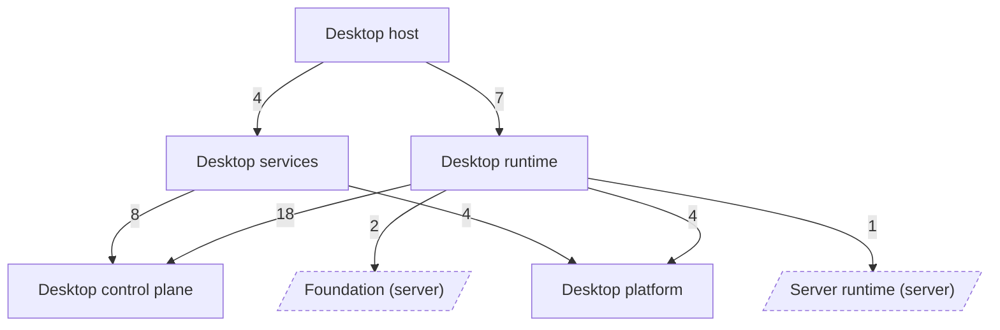

<!-- Generated by `task atlas:generate` from docs/atlas and source. Do not edit. -->

# Desktop groups

_architecture · source: `derived: docs/atlas/atlas.yaml + desktop imports`_

Every Desktop group and the dependencies between them, derived from source. Arrows point from importer to imported and a label counts package-level imports. Edges implied by a longer path are hidden; red edges are undeclared in atlas.yaml and orange dashed edges are reviewed exceptions.

## Elements

| Element | Description | Anchor |
| --- | --- | --- |
| Desktop platform | OS integration for the Desktop App: application-support paths, schema versions for desktop state files, signed resource manifests, and build metadata. | `group:desktop-platform` |
| Desktop control plane | The revisioned snapshot the control panel renders, its DTOs, and the request-id idempotent operation gate that serializes every mutation. | `group:desktop-control` |
| Desktop services | Optional supervised capabilities: the Lumen ML child process with signed staged artifacts, and signed application updates. | `group:desktop-services` |
| Desktop runtime | Hosts server/app in-process: the runtime generation supervisor, the schema-versioned runtime configuration transaction, preferences, the repository handoff, and coordinated shutdown. | `group:desktop-runtime` |
| Desktop host | The Wails v3 tray application: window and tray adapters and the main assembly. The product UI stays in the system browser. | `group:desktop-host` |
| Foundation (server) |  | `group:foundation` |
| Server runtime (server) |  | `group:runtime` |

## Every group dependency

The diagram hides an edge when a longer path between the same groups already implies it (transitive reduction). This is the complete derived list.

- `desktop-host` → `desktop-control`: 8 package import(s), declared
- `desktop-host` → `desktop-platform`: 3 package import(s), declared
- `desktop-host` → `desktop-runtime`: 7 package import(s), declared
- `desktop-host` → `desktop-services`: 4 package import(s), declared
- `desktop-runtime` → `desktop-control`: 18 package import(s), declared
- `desktop-runtime` → `desktop-platform`: 4 package import(s), declared
- `desktop-runtime` → `foundation`: 2 package import(s), declared
- `desktop-runtime` → `runtime`: 1 package import(s), declared
- `desktop-services` → `desktop-control`: 8 package import(s), declared
- `desktop-services` → `desktop-platform`: 4 package import(s), declared
