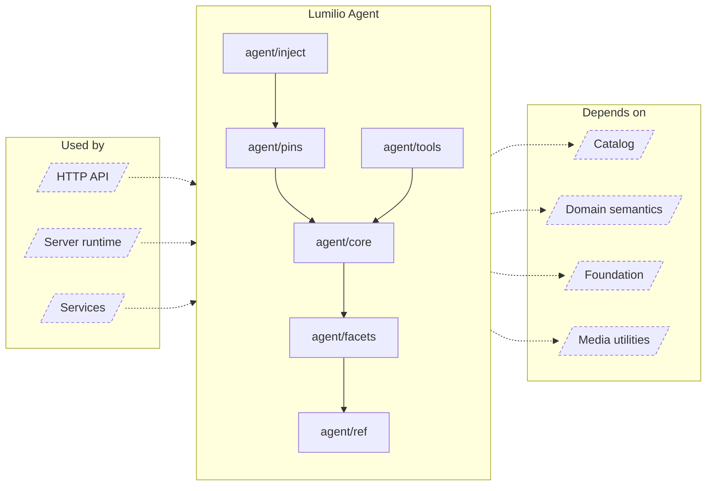

<!-- Generated by `task atlas:generate` from docs/atlas and source. Do not edit. -->

# Lumilio Agent

_architecture · source: `derived: //atlas:group agent + imports`_

The in-app assistant: the agent run loop, typed references and facets, pinned widgets, prompt injection of library context, and the tools the model may call over the catalog.

## Elements

| Element | Description | Anchor |
| --- | --- | --- |
| HTTP API |  | `group:http` |
| Server runtime |  | `group:runtime` |
| Services |  | `group:service` |
| agent/core | Package core runs the Lumilio Agent. | `mod:server/internal/agent/core` [`server/internal/agent/core/doc.go`](../../../../server/internal/agent/core/doc.go) |
| agent/facets | Package facets computes ref.FacetSummary aggregates over a ref snapshot. | `mod:server/internal/agent/facets` [`server/internal/agent/facets/doc.go`](../../../../server/internal/agent/facets/doc.go) |
| agent/inject | Package inject materializes ask-time context and mention bindings into the session ref ledger and a fixed-schema, explicitly untrusted data message. | `mod:server/internal/agent/inject` [`server/internal/agent/inject/doc.go`](../../../../server/internal/agent/inject/doc.go) |
| agent/pins | Package pins promotes session refs to durable widgets. | `mod:server/internal/agent/pins` [`server/internal/agent/pins/doc.go`](../../../../server/internal/agent/pins/doc.go) |
| agent/ref | Package ref implements the server-side handle store for the agent ref system. | `mod:server/internal/agent/ref` [`server/internal/agent/ref/doc.go`](../../../../server/internal/agent/ref/doc.go) |
| agent/tools | Package tools defines every tool the Lumilio Agent may call. | `mod:server/internal/agent/tools` [`server/internal/agent/tools/doc.go`](../../../../server/internal/agent/tools/doc.go) |
| Catalog |  | `group:catalog` |
| Domain semantics |  | `group:domain` |
| Foundation |  | `group:foundation` |
| Media utilities |  | `group:media` |
