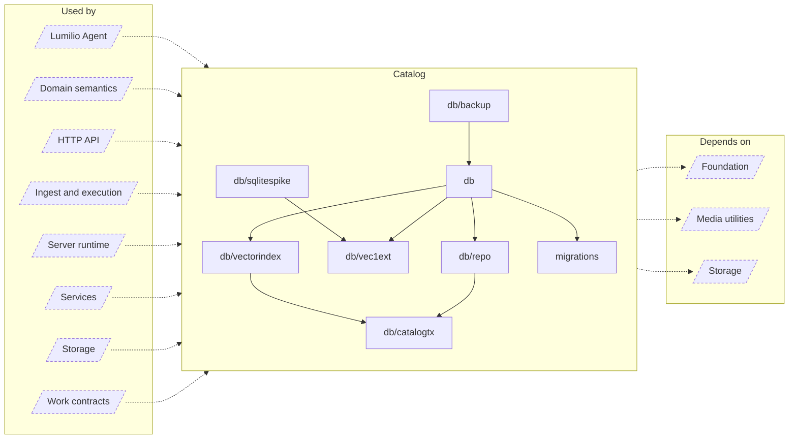

<!-- Generated by `task atlas:generate` from docs/atlas and source. Do not edit. -->

# Catalog

_architecture · source: `derived: //atlas:group catalog + imports`_

The embedded SQLite catalog and its QueueDB sibling: the single-writer runtime, named transactions, sqlc queries, the Vec1 vector index, migrations, and verified backups. The catalog is product truth.

## Elements

| Element | Description | Anchor |
| --- | --- | --- |
| Lumilio Agent |  | `group:agent` |
| Domain semantics |  | `group:domain` |
| HTTP API |  | `group:http` |
| Ingest and execution |  | `group:ingest` |
| Server runtime |  | `group:runtime` |
| Services |  | `group:service` |
| Storage |  | `group:storage` |
| Work contracts |  | `group:work` |
| db | Package db owns the catalog and queue SQLite runtimes. | `mod:server/internal/db` [`server/internal/db/doc.go`](../../../../server/internal/db/doc.go) |
| db/backup | Package backup creates, validates, retains, and restores consistent SQLite catalog snapshots. | `mod:server/internal/db/backup` [`server/internal/db/backup/doc.go`](../../../../server/internal/db/backup/doc.go) |
| db/catalogtx | Package catalogtx is the closed application transaction capability for the catalog. | `mod:server/internal/db/catalogtx` [`server/internal/db/catalogtx/doc.go`](../../../../server/internal/db/catalogtx/doc.go) |
| db/repo | Package repo is the sqlc-generated query layer over the catalog baseline (server/migrations/000001_storage_baseline.up.sql), plus a few hand-written helpers for query plans and model extensions. | `mod:server/internal/db/repo` [`server/internal/db/repo/doc.go`](../../../../server/internal/db/repo/doc.go) |
| db/sqlitespike | Package sqlitespike contains the isolated SQLite compatibility proof used before the production database runtime is migrated. | `mod:server/internal/db/sqlitespike` [`server/internal/db/sqlitespike/doc.go`](../../../../server/internal/db/sqlitespike/doc.go) |
| db/vec1ext | Package vec1ext statically registers the vendored SQLite Vec1 extension. | `mod:server/internal/db/vec1ext` [`server/internal/db/vec1ext/doc.go`](../../../../server/internal/db/vec1ext/doc.go) |
| db/vectorindex | Package vectorindex owns the rebuildable Vec1 semantic index. | `mod:server/internal/db/vectorindex` [`server/internal/db/vectorindex/doc.go`](../../../../server/internal/db/vectorindex/doc.go) |
| migrations | Package migrations embeds the catalog baseline (000001_storage_baseline.up.sql, schema version 1, the v26.1.0-rc.1 compatibility baseline) and its numbered forward steps, so they apply without depending on the working directory — the Desktop bundle has no repository checkout and an unpredictable CWD. | `mod:server/migrations` [`server/migrations/doc.go`](../../../../server/migrations/doc.go) |
| Foundation |  | `group:foundation` |
| Media utilities |  | `group:media` |
| Storage |  | `group:storage` |
