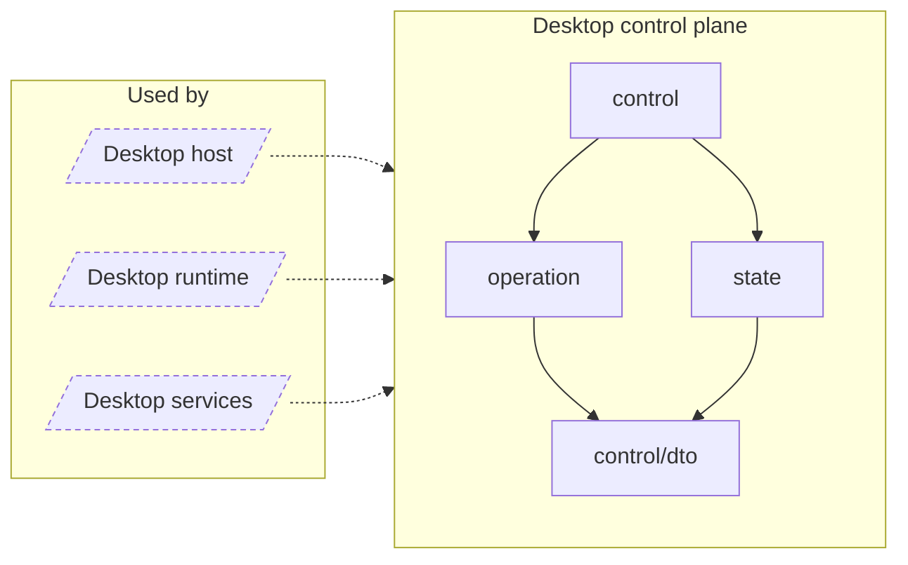

<!-- Generated by `task atlas:generate` from docs/atlas and source. Do not edit. -->

# Desktop control plane

_architecture · source: `derived: //atlas:group desktop-control + imports`_

The revisioned snapshot the control panel renders, its DTOs, and the request-id idempotent operation gate that serializes every mutation.

## Elements

| Element | Description | Anchor |
| --- | --- | --- |
| Desktop host |  | `group:desktop-host` |
| Desktop runtime |  | `group:desktop-runtime` |
| Desktop services |  | `group:desktop-services` |
| control | Package control is the service surface the Desktop Settings window calls through Wails bindings. | `mod:desktop/internal/control` [`desktop/internal/control/doc.go`](../../../../desktop/internal/control/doc.go) |
| control/dto | Package dto defines the Desktop control-plane wire types. | `mod:desktop/internal/control/dto` [`desktop/internal/control/dto/doc.go`](../../../../desktop/internal/control/dto/doc.go) |
| operation | Package operation tracks every durable or lifecycle mutation exposed by the Desktop control plane. | `mod:desktop/internal/operation` [`desktop/internal/operation/doc.go`](../../../../desktop/internal/operation/doc.go) |
| state | Package state owns the immutable DesktopSnapshot and its latest-only notification stream. | `mod:desktop/internal/state` [`desktop/internal/state/doc.go`](../../../../desktop/internal/state/doc.go) |
