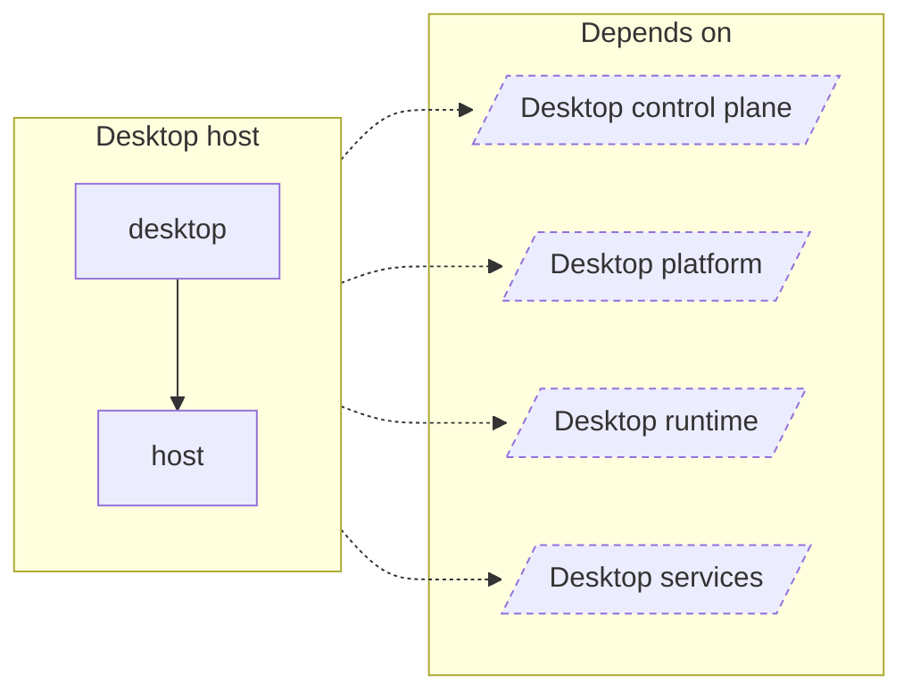

<!-- Generated by `task atlas:generate` from docs/atlas and source. Do not edit. -->

# Desktop host

_architecture · source: `derived: //atlas:group desktop-host + imports`_

The Wails v3 tray application: window and tray adapters and the main assembly. The product UI stays in the system browser.

## Elements

| Element | Description | Anchor |
| --- | --- | --- |
| desktop | Command desktop is the Lumilio Desktop App: a Wails v3 system-tray host that runs the complete Server in-process and opens the product in the system browser. | `mod:desktop` [`desktop/doc.go`](../../../../desktop/doc.go) |
| host | Package host adapts the Desktop control plane to Wails. | `mod:desktop/internal/host` [`desktop/internal/host/doc.go`](../../../../desktop/internal/host/doc.go) |
| Desktop control plane |  | `group:desktop-control` |
| Desktop platform |  | `group:desktop-platform` |
| Desktop runtime |  | `group:desktop-runtime` |
| Desktop services |  | `group:desktop-services` |
