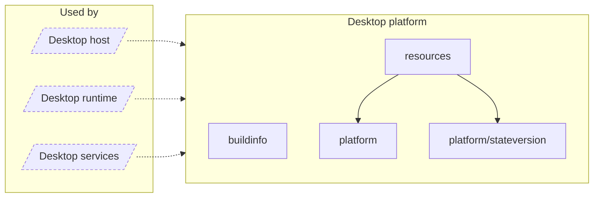

<!-- Generated by `task atlas:generate` from docs/atlas and source. Do not edit. -->

# Desktop platform

_architecture · source: `derived: //atlas:group desktop-platform + imports`_

OS integration for the Desktop App: application-support paths, schema versions for desktop state files, signed resource manifests, and build metadata.

## Elements

| Element | Description | Anchor |
| --- | --- | --- |
| Desktop host |  | `group:desktop-host` |
| Desktop runtime |  | `group:desktop-runtime` |
| Desktop services |  | `group:desktop-services` |
| buildinfo | Package buildinfo exposes Desktop release metadata to the typed control plane. | `mod:desktop/internal/buildinfo` [`desktop/internal/buildinfo/doc.go`](../../../../desktop/internal/buildinfo/doc.go) |
| platform | Package platform isolates Desktop operating-system differences: application-support and cache paths ([ResolvePaths]), bundled resources and media tools ([ResolveBundledResourcesDir], [ResolveMediaToolPaths]), libvips module configuration, crash-safe atomic file replacement ([WriteAtomic]), and owner-only directories ([EnsurePrivateDirectory]). | `mod:desktop/internal/platform` [`desktop/internal/platform/doc.go`](../../../../desktop/internal/platform/doc.go) |
| platform/stateversion | Package stateversion checks the schema version of a persisted Desktop state file. | `mod:desktop/internal/platform/stateversion` [`desktop/internal/platform/stateversion/doc.go`](../../../../desktop/internal/platform/stateversion/doc.go) |
| resources | Package resources verifies and materialises the immutable tool payload shipped with Desktop. | `mod:desktop/internal/resources` [`desktop/internal/resources/doc.go`](../../../../desktop/internal/resources/doc.go) |
