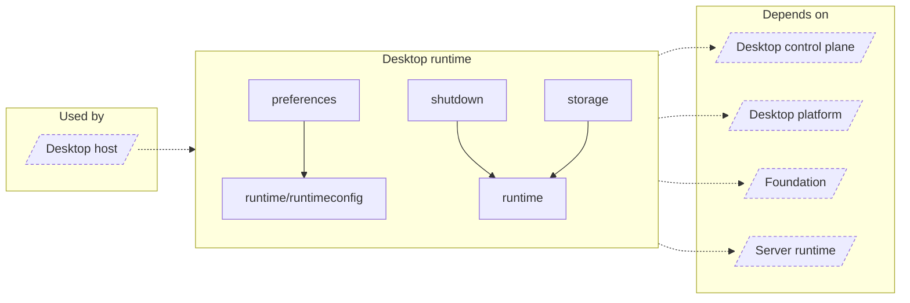

<!-- Generated by `task atlas:generate` from docs/atlas and source. Do not edit. -->

# Desktop runtime

_architecture · source: `derived: //atlas:group desktop-runtime + imports`_

Hosts server/app in-process: the runtime generation supervisor, the schema-versioned runtime configuration transaction, preferences, the repository handoff, and coordinated shutdown.

## Elements

| Element | Description | Anchor |
| --- | --- | --- |
| Desktop host |  | `group:desktop-host` |
| preferences | Package preferences owns the small set of Desktop host preferences stored in settings.v1.json. | `mod:desktop/internal/preferences` [`desktop/internal/preferences/doc.go`](../../../../desktop/internal/preferences/doc.go) |
| runtime | Package runtime owns the in-process Server generation. | `mod:desktop/internal/runtime` [`desktop/internal/runtime/doc.go`](../../../../desktop/internal/runtime/doc.go) |
| runtime/runtimeconfig | Package runtimeconfig stores the complete, schema-versioned Server intent and its crash-recoverable current/LKG pointers. | `mod:desktop/internal/runtime/runtimeconfig` [`desktop/internal/runtime/runtimeconfig/doc.go`](../../../../desktop/internal/runtime/runtimeconfig/doc.go) |
| shutdown | Package shutdown is the only owner allowed to arm the Wails application for exit. | `mod:desktop/internal/shutdown` [`desktop/internal/shutdown/doc.go`](../../../../desktop/internal/shutdown/doc.go) |
| storage | Package storage adapts the in-process repository control handoff into the small, cache-backed surface needed by Tray and Settings. | `mod:desktop/internal/storage` [`desktop/internal/storage/doc.go`](../../../../desktop/internal/storage/doc.go) |
| Desktop control plane |  | `group:desktop-control` |
| Desktop platform |  | `group:desktop-platform` |
| Foundation |  | `group:foundation` |
| Server runtime |  | `group:runtime` |
