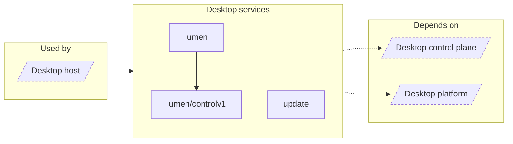

<!-- Generated by `task atlas:generate` from docs/atlas and source. Do not edit. -->

# Desktop services

_architecture · source: `derived: //atlas:group desktop-services + imports`_

Optional supervised capabilities: the Lumen ML child process with signed staged artifacts, and signed application updates.

## Elements

| Element | Description | Anchor |
| --- | --- | --- |
| Desktop host |  | `group:desktop-host` |
| lumen | Package lumen owns the optional Lumen Hub child process. | `mod:desktop/internal/lumen` [`desktop/internal/lumen/doc.go`](../../../../desktop/internal/lumen/doc.go) |
| lumen/controlv1 | Package controlv1 is the generated gRPC client and server for the Lumen Hub control protocol (control.proto). | `mod:desktop/internal/lumen/controlv1` [`desktop/internal/lumen/controlv1/doc.go`](../../../../desktop/internal/lumen/controlv1/doc.go) |
| update | Package update contains the platform-neutral trust and state policy for Desktop updates. | `mod:desktop/internal/update` [`desktop/internal/update/doc.go`](../../../../desktop/internal/update/doc.go) |
| Desktop control plane |  | `group:desktop-control` |
| Desktop platform |  | `group:desktop-platform` |
