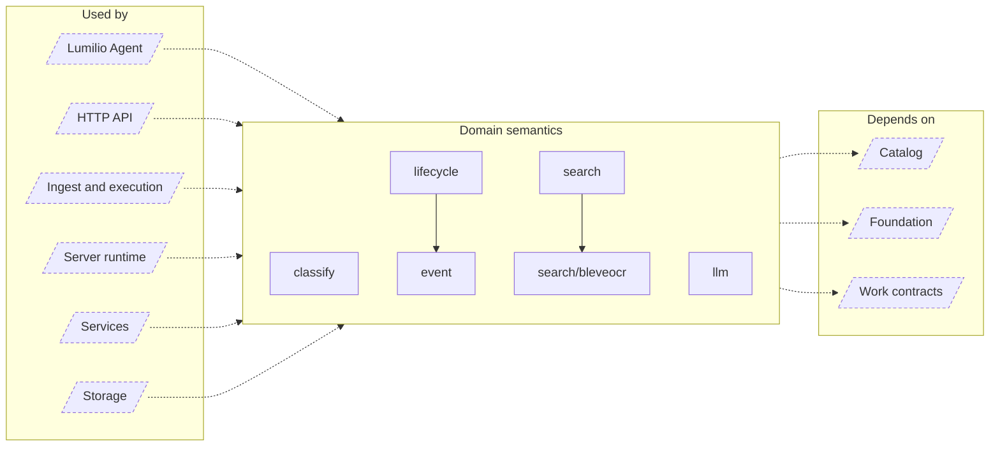

<!-- Generated by `task atlas:generate` from docs/atlas and source. Do not edit. -->

# Domain semantics

_architecture · source: `derived: //atlas:group domain + imports`_

Derived product meaning that is independent of storage and transport: Event topology, the Asset lifecycle rules, search (FTS5, vectors, OCR sidecar), zero-shot classification math, and the LLM provider adapter.

## Elements

| Element | Description | Anchor |
| --- | --- | --- |
| Lumilio Agent |  | `group:agent` |
| HTTP API |  | `group:http` |
| Ingest and execution |  | `group:ingest` |
| Server runtime |  | `group:runtime` |
| Services |  | `group:service` |
| Storage |  | `group:storage` |
| classify | Package classify holds the pure, dependency-free math for zero-shot classification: prompt-ensemble prototypes, contrastive scoring against L2-normalized embeddings, and confidence calibration. | `mod:server/internal/classify` [`server/internal/classify/doc.go`](../../../../server/internal/classify/doc.go) |
| event | Package event owns deterministic media Event semantics: owner-scoped Event candidates, the events-v1 segmentation and reconciliation, user corrections, and resolution. | `mod:server/internal/event` [`server/internal/event/doc.go`](../../../../server/internal/event/doc.go) |
| lifecycle | Package lifecycle holds the Asset lifecycle's catalog rules. | `mod:server/internal/lifecycle` [`server/internal/lifecycle/doc.go`](../../../../server/internal/lifecycle/doc.go) |
| llm | Package llm adapts the configured chat-model provider for the Lumilio Agent. | `mod:server/internal/llm` [`server/internal/llm/doc.go`](../../../../server/internal/llm/doc.go) |
| search | Package search answers library queries by fusing independent retrievers. | `mod:server/internal/search` [`server/internal/search/doc.go`](../../../../server/internal/search/doc.go) |
| search/bleveocr | Package bleveocr maintains the rebuildable Bleve full-text index over OCR text, stored beside the catalog at [PathForDatabase]. | `mod:server/internal/search/bleveocr` [`server/internal/search/bleveocr/doc.go`](../../../../server/internal/search/bleveocr/doc.go) |
| Catalog |  | `group:catalog` |
| Foundation |  | `group:foundation` |
| Work contracts |  | `group:work` |
