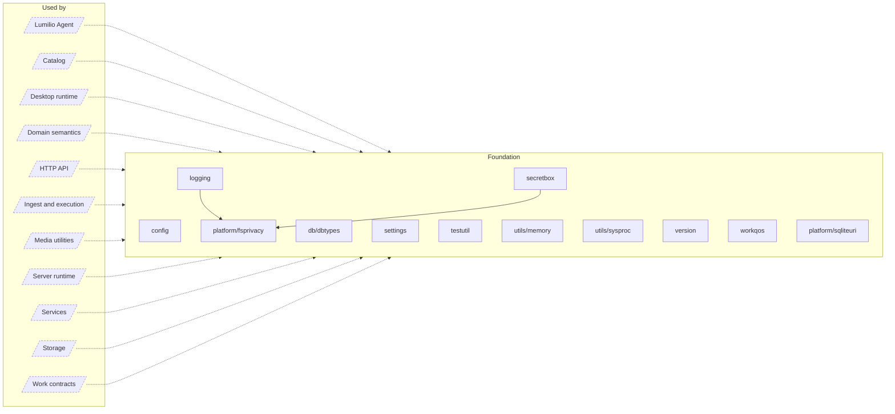

<!-- Generated by `task atlas:generate` from docs/atlas and source. Do not edit. -->

# Foundation

_architecture · source: `derived: //atlas:group foundation + imports`_

Dependency-free primitives every layer may use: the strict TOML configuration loader, runtime-mutable settings types, logging, version, work QoS classes, catalog value types, secret sealing, and OS/SQLite platform helpers. Nothing here knows about Assets, repositories, or HTTP.

## Elements

| Element | Description | Anchor |
| --- | --- | --- |
| Lumilio Agent |  | `group:agent` |
| Catalog |  | `group:catalog` |
| Desktop runtime |  | `group:desktop-runtime` |
| Domain semantics |  | `group:domain` |
| HTTP API |  | `group:http` |
| Ingest and execution |  | `group:ingest` |
| Media utilities |  | `group:media` |
| Server runtime |  | `group:runtime` |
| Services |  | `group:service` |
| Storage |  | `group:storage` |
| Work contracts |  | `group:work` |
| config | Package config is the strict runtime-immutable configuration boundary. | `mod:server/config` [`server/config/doc.go`](../../../../server/config/doc.go) |
| db/dbtypes | Package dbtypes holds the value types the catalog persists in JSON and text columns: [AssetType], per-type metadata ([PhotoSpecificMetadata], [VideoSpecificMetadata], [AudioSpecificMetadata]), ML result payloads (faces, OCR, classification), [StackKind], vectors, and nullable collection types. | `mod:server/internal/db/dbtypes` [`server/internal/db/dbtypes/doc.go`](../../../../server/internal/db/dbtypes/doc.go) |
| logging | Package logging builds the process logger. | `mod:server/internal/logging` [`server/internal/logging/doc.go`](../../../../server/internal/logging/doc.go) |
| secretbox | Package secretbox seals small application secrets (cloud credentials and encrypted settings values) with AES keys derived per scope from one root secret. | `mod:server/internal/secretbox` [`server/internal/secretbox/doc.go`](../../../../server/internal/secretbox/doc.go) |
| settings | Package settings defines the runtime-mutable settings domain: the typed values whose single source of truth is the database `settings` table and which are changed at runtime through the API (Settings tabs + Setup), never through TOML. | `mod:server/internal/settings` [`server/internal/settings/doc.go`](../../../../server/internal/settings/doc.go) |
| testutil | Package testutil seeds catalog fixtures for tests. | `mod:server/internal/testutil` [`server/internal/testutil/doc.go`](../../../../server/internal/testutil/doc.go) |
| utils/memory | Package memory adapts upload behaviour to host memory. | `mod:server/internal/utils/memory` [`server/internal/utils/memory/doc.go`](../../../../server/internal/utils/memory/doc.go) |
| utils/sysproc | Package sysproc holds process-spawning helpers shared by media tools. | `mod:server/internal/utils/sysproc` [`server/internal/utils/sysproc/doc.go`](../../../../server/internal/utils/sysproc/doc.go) |
| version | Package version carries the product version stamped at build time: | `mod:server/internal/version` [`server/internal/version/doc.go`](../../../../server/internal/version/doc.go) |
| workqos | Package workqos defines the durable service class of catalog-owned work. | `mod:server/internal/workqos` [`server/internal/workqos/doc.go`](../../../../server/internal/workqos/doc.go) |
| platform/fsprivacy | Package fsprivacy applies owner-only filesystem access policies using the native mechanism of the host operating system. | `mod:server/platform/fsprivacy` [`server/platform/fsprivacy/doc.go`](../../../../server/platform/fsprivacy/doc.go) |
| platform/sqliteuri | Package sqliteuri builds cross-platform SQLite file URIs. | `mod:server/platform/sqliteuri` [`server/platform/sqliteuri/doc.go`](../../../../server/platform/sqliteuri/doc.go) |
