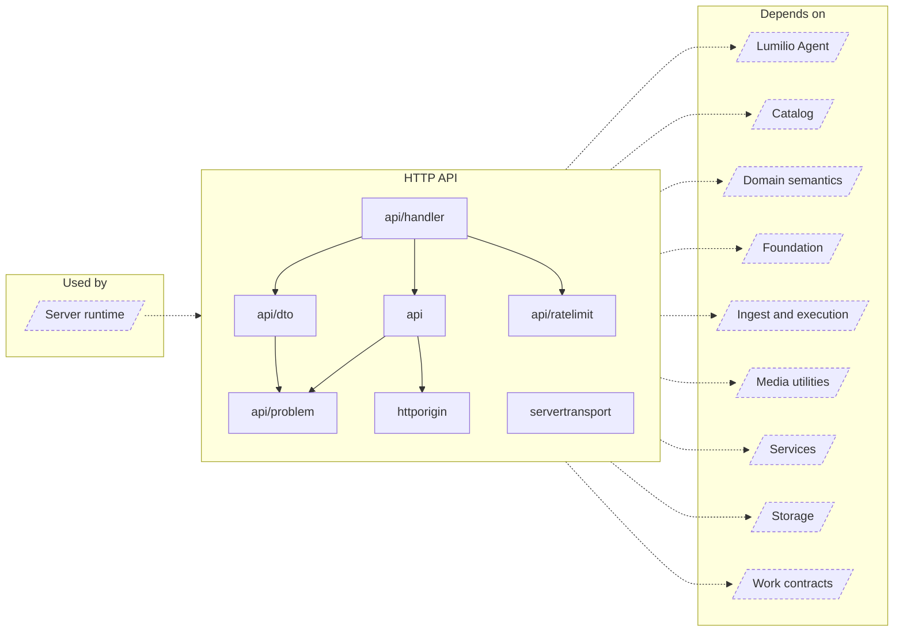

<!-- Generated by `task atlas:generate` from docs/atlas and source. Do not edit. -->

# HTTP API

_architecture · source: `derived: //atlas:group http + imports`_

The transport edge: router and auth boundaries, handlers, DTOs, RFC 9457 Problem responses, rate limiting, request-origin policy, and the plaintext/ACME listeners.

## Elements

| Element | Description | Anchor |
| --- | --- | --- |
| Server runtime |  | `group:runtime` |
| api | Package api is the HTTP transport root. | `mod:server/internal/api` [`server/internal/api/doc.go`](../../../../server/internal/api/doc.go) |
| api/dto | Package dto defines the HTTP request and response shapes. | `mod:server/internal/api/dto` [`server/internal/api/dto/doc.go`](../../../../server/internal/api/dto/doc.go) |
| api/handler | Package handler implements the HTTP controllers that server/internal/api.NewRouter mounts: one handler type per domain ([AssetHandler], [AuthHandler], [AlbumHandler], [StorageHandler], [SetupHandler], [AgentHandler], [MusicHandler], [CloudHandler], and others). | `mod:server/internal/api/handler` [`server/internal/api/handler/doc.go`](../../../../server/internal/api/handler/doc.go) |
| api/problem | Package problem is the closed RFC 9457 vocabulary of the API. | `mod:server/internal/api/problem` [`server/internal/api/problem/doc.go`](../../../../server/internal/api/problem/doc.go) |
| api/ratelimit | Package ratelimit provides the bounded, in-memory fixed-window [Limiter] with lockout used for authentication endpoints. | `mod:server/internal/api/ratelimit` [`server/internal/api/ratelimit/doc.go`](../../../../server/internal/api/ratelimit/doc.go) |
| httporigin | Package httporigin derives the request-facing browser origin, so operators never configure one canonical public URL. | `mod:server/internal/httporigin` [`server/internal/httporigin/doc.go`](../../../../server/internal/httporigin/doc.go) |
| servertransport | Package servertransport owns the HTTP/TLS listeners for one application runtime generation. | `mod:server/internal/servertransport` [`server/internal/servertransport/doc.go`](../../../../server/internal/servertransport/doc.go) |
| Lumilio Agent |  | `group:agent` |
| Catalog |  | `group:catalog` |
| Domain semantics |  | `group:domain` |
| Foundation |  | `group:foundation` |
| Ingest and execution |  | `group:ingest` |
| Media utilities |  | `group:media` |
| Services |  | `group:service` |
| Storage |  | `group:storage` |
| Work contracts |  | `group:work` |
