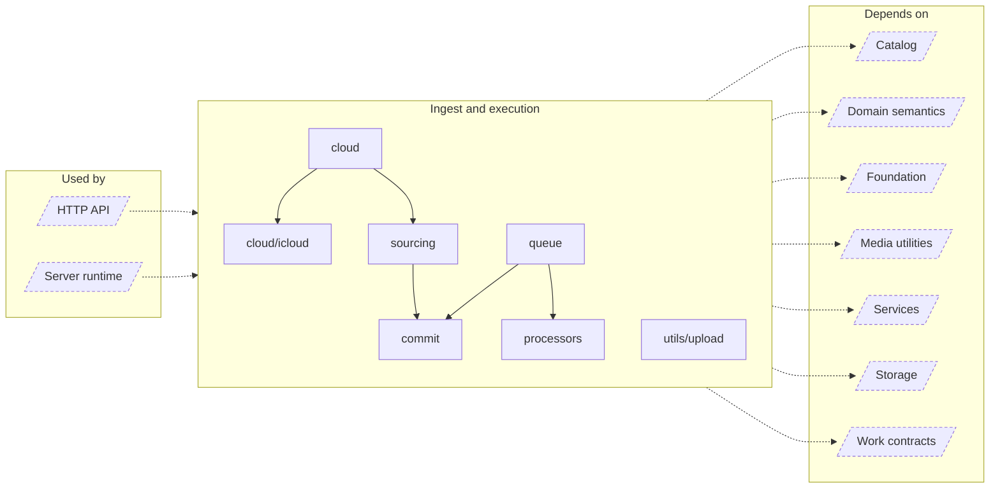

<!-- Generated by `task atlas:generate` from docs/atlas and source. Do not edit. -->

# Ingest and execution

_architecture · source: `derived: //atlas:group ingest + imports`_

Everything that moves bytes and background results into the catalog: staged sourcing for upload and cloud import, the River workers and scheduler, media processors, and the commit coordinator that is the only writer of asynchronous results.

## Elements

| Element | Description | Anchor |
| --- | --- | --- |
| HTTP API |  | `group:http` |
| Server runtime |  | `group:runtime` |
| cloud | Package cloud provides the cloud storage abstraction layer for importing remote assets into a local Lumilio repository (Cloud → Local sync). | `mod:server/internal/cloud` [`server/internal/cloud/doc.go`](../../../../server/internal/cloud/doc.go) |
| cloud/icloud | Package icloud is a native iCloud Photos client adapted from an open-source project (see LICENSE and README.md in this directory). | `mod:server/internal/cloud/icloud` [`server/internal/cloud/icloud/doc.go`](../../../../server/internal/cloud/icloud/doc.go) |
| commit | Package commit is the sole catalog-write capability for asynchronous work. | `mod:server/internal/commit` [`server/internal/commit/doc.go`](../../../../server/internal/commit/doc.go) |
| processors | Package processors runs the read/compute stages of asset processing: ingest of a staged source, metadata extraction (exiftool and ffprobe), thumbnails and video frames, transcodes, and ML inputs. | `mod:server/internal/processors` [`server/internal/processors/doc.go`](../../../../server/internal/processors/doc.go) |
| queue | Package queue adapts River to Lumilio's catalog-owned work model. | `mod:server/internal/queue` [`server/internal/queue/doc.go`](../../../../server/internal/queue/doc.go) |
| sourcing | Package sourcing materializes staged uploads and cloud imports into a repository without losing them to a crash. | `mod:server/internal/sourcing` [`server/internal/sourcing/doc.go`](../../../../server/internal/sourcing/doc.go) |
| utils/upload | Package upload implements the HTTP upload wire protocol for batch and chunked transfers. | `mod:server/internal/utils/upload` [`server/internal/utils/upload/doc.go`](../../../../server/internal/utils/upload/doc.go) |
| Catalog |  | `group:catalog` |
| Domain semantics |  | `group:domain` |
| Foundation |  | `group:foundation` |
| Media utilities |  | `group:media` |
| Services |  | `group:service` |
| Storage |  | `group:storage` |
| Work contracts |  | `group:work` |
