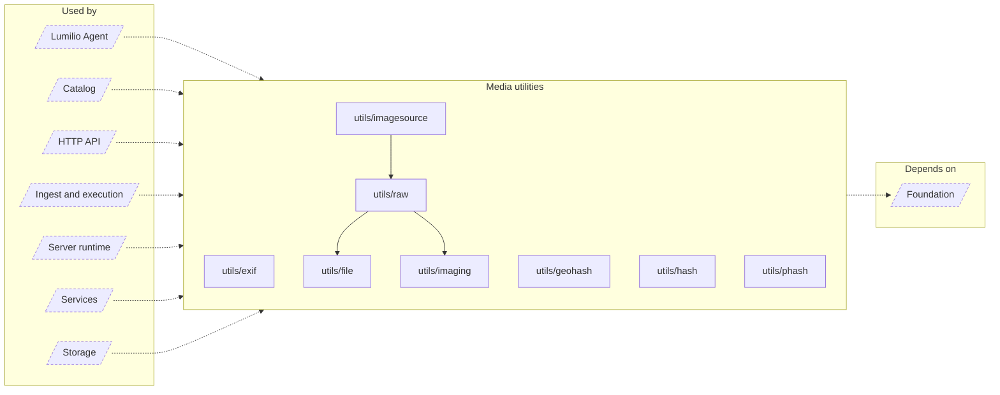

<!-- Generated by `task atlas:generate` from docs/atlas and source. Do not edit. -->

# Media utilities

_architecture · source: `derived: //atlas:group media + imports`_

Stateless file and media mechanics: content hashing, EXIF extraction, libvips imaging, LibRaw decoding, perceptual hashes, geohash, and process helpers. Pure functions over bytes and paths; no catalog access.

## Elements

| Element | Description | Anchor |
| --- | --- | --- |
| Lumilio Agent |  | `group:agent` |
| Catalog |  | `group:catalog` |
| HTTP API |  | `group:http` |
| Ingest and execution |  | `group:ingest` |
| Server runtime |  | `group:runtime` |
| Services |  | `group:service` |
| Storage |  | `group:storage` |
| utils/exif | Package exif extracts photo, video, and audio metadata by streaming file bytes through an external exiftool process. | `mod:server/internal/utils/exif` [`server/internal/utils/exif/doc.go`](../../../../server/internal/utils/exif/doc.go) |
| utils/file | Package file classifies media files: it maps filenames and MIME types to a catalog Asset type ([DetermineAssetType], [DetermineAssetTypeWithFilename]), owns the supported-extension registry ([IsSupported], [GetSupportedExtensions]), and validates uploads ([ValidateFile]). | `mod:server/internal/utils/file` [`server/internal/utils/file/doc.go`](../../../../server/internal/utils/file/doc.go) |
| utils/geohash | Package geohash encodes coordinates as geohash strings with [Encode]. | `mod:server/internal/utils/geohash` [`server/internal/utils/geohash/doc.go`](../../../../server/internal/utils/geohash/doc.go) |
| utils/hash | Package hash computes content identity. | `mod:server/internal/utils/hash` [`server/internal/utils/hash/doc.go`](../../../../server/internal/utils/hash/doc.go) |
| utils/imagesource | Package imagesource turns a stored photo into the decodable image every consumer needs. | `mod:server/internal/utils/imagesource` [`server/internal/utils/imagesource/doc.go`](../../../../server/internal/utils/imagesource/doc.go) |
| utils/imaging | Package imaging is the libvips boundary. | `mod:server/internal/utils/imaging` [`server/internal/utils/imaging/doc.go`](../../../../server/internal/utils/imaging/doc.go) |
| utils/phash | Package phash computes perceptual hashes for near-duplicate detection. | `mod:server/internal/utils/phash` [`server/internal/utils/phash/doc.go`](../../../../server/internal/utils/phash/doc.go) |
| utils/raw | Package raw is the CGo LibRaw boundary for camera RAW files. | `mod:server/internal/utils/raw` [`server/internal/utils/raw/doc.go`](../../../../server/internal/utils/raw/doc.go) |
| Foundation |  | `group:foundation` |
