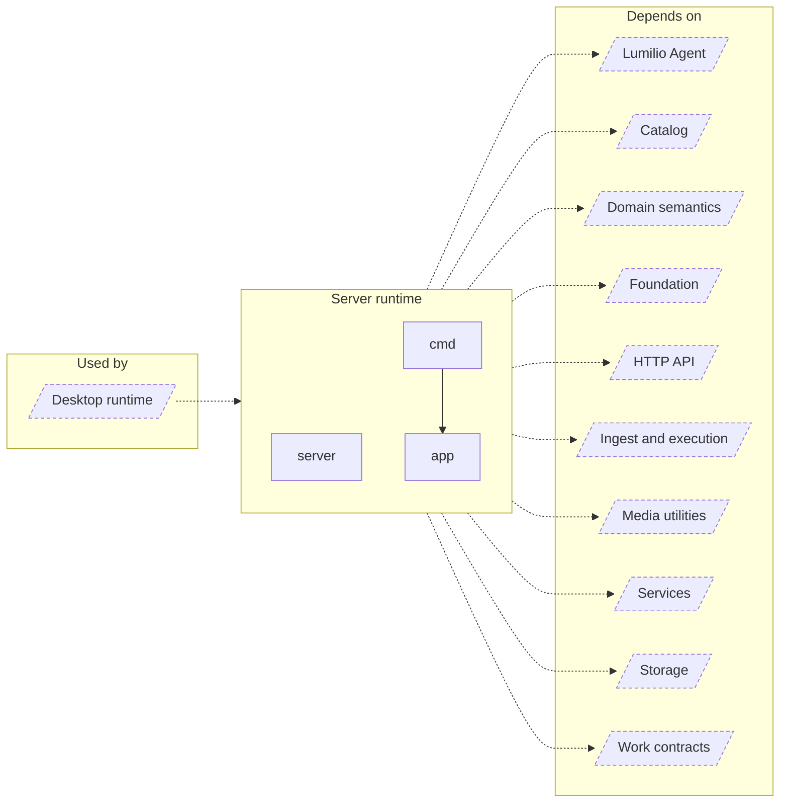

<!-- Generated by `task atlas:generate` from docs/atlas and source. Do not edit. -->

# Server runtime

_architecture · source: `derived: //atlas:group runtime + imports`_

Process composition: the CLI entry point, the Docker entrypoint, and server/app, the only place that wires every subsystem together and owns startup and graceful shutdown. Desktop hosts the same runtime in-process.

## Elements

| Element | Description | Anchor |
| --- | --- | --- |
| Desktop runtime |  | `group:desktop-runtime` |
| server | Command docker-entrypoint prepares Docker bind mounts for the app user, drops privileges, and then executes the requested Server command. | `mod:server` [`server/doc.go`](../../../../server/doc.go) |
| app | Package app contains the server bootstrap: it wires configuration, logging, storage, the job queue, ML services, and the HTTP router, then serves until the provided context is cancelled. | `mod:server/app` [`server/app/doc.go`](../../../../server/app/doc.go) |
| cmd | Command server is the standalone Server entry point. | `mod:server/cmd` [`server/cmd/doc.go`](../../../../server/cmd/doc.go) |
| Lumilio Agent |  | `group:agent` |
| Catalog |  | `group:catalog` |
| Domain semantics |  | `group:domain` |
| Foundation |  | `group:foundation` |
| HTTP API |  | `group:http` |
| Ingest and execution |  | `group:ingest` |
| Media utilities |  | `group:media` |
| Services |  | `group:service` |
| Storage |  | `group:storage` |
| Work contracts |  | `group:work` |
