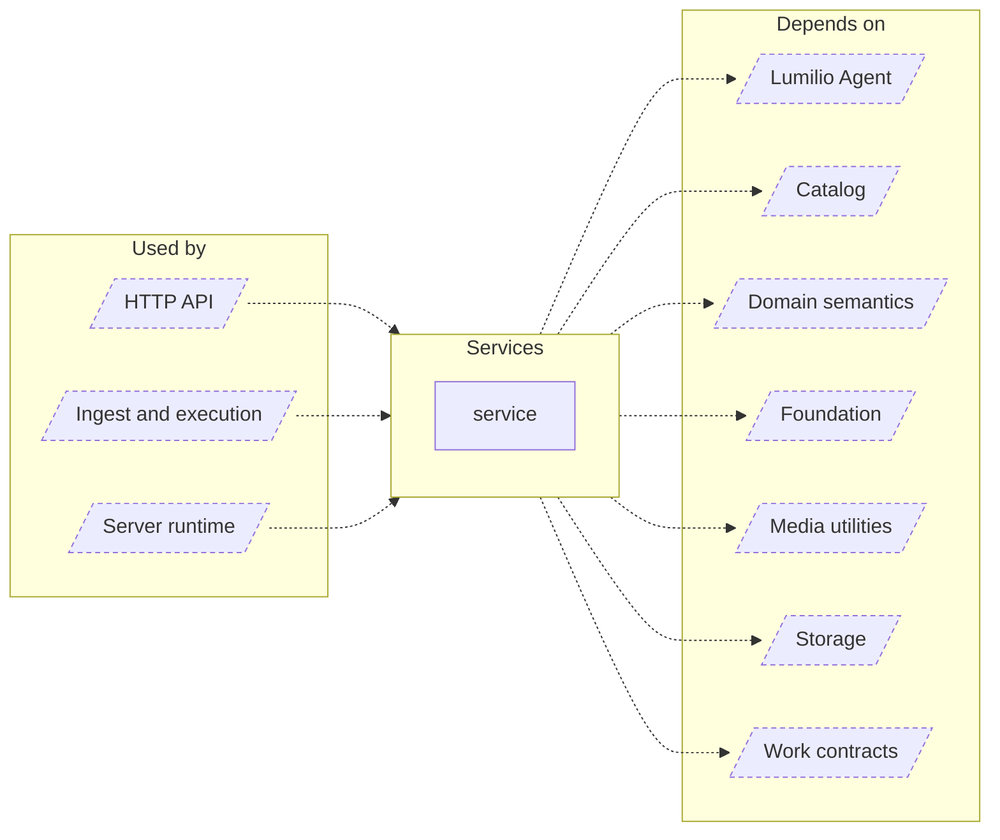

<!-- Generated by `task atlas:generate` from docs/atlas and source. Do not edit. -->

# Services

_architecture · source: `derived: //atlas:group service + imports`_

Business logic behind the HTTP API: authentication and MFA, assets, albums, people, music, settings, setup, search orchestration, cloud import planning, and ML adapters.

## Elements

| Element | Description | Anchor |
| --- | --- | --- |
| HTTP API |  | `group:http` |
| Ingest and execution |  | `group:ingest` |
| Server runtime |  | `group:runtime` |
| service | Package service holds the business logic behind the HTTP API. | `mod:server/internal/service` [`server/internal/service/doc.go`](../../../../server/internal/service/doc.go) |
| Lumilio Agent |  | `group:agent` |
| Catalog |  | `group:catalog` |
| Domain semantics |  | `group:domain` |
| Foundation |  | `group:foundation` |
| Media utilities |  | `group:media` |
| Storage |  | `group:storage` |
| Work contracts |  | `group:work` |
