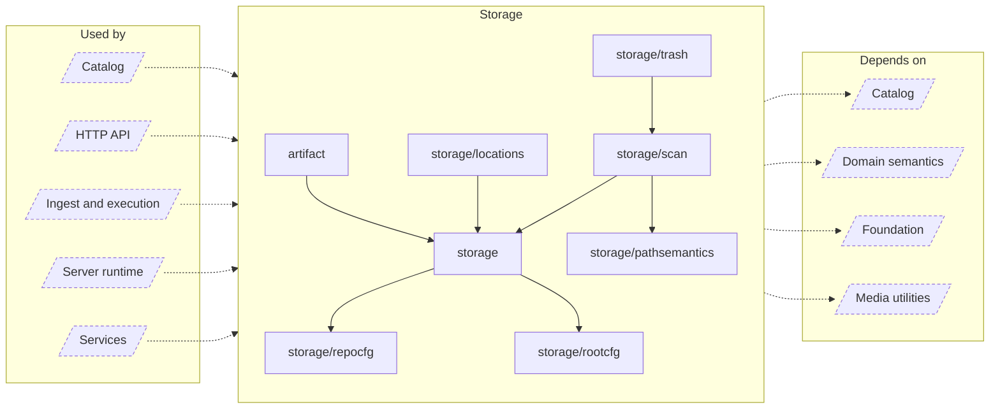

<!-- Generated by `task atlas:generate` from docs/atlas and source. Do not edit. -->

# Storage

_architecture · source: `derived: //atlas:group storage + imports`_

Storage Locations and Repositories on disk: repository lifecycle and layout, the scan index that mirrors each repository tree in repository_entries, the journaled repository trash, and immutable derived artifacts.

## Elements

| Element | Description | Anchor |
| --- | --- | --- |
| Catalog |  | `group:catalog` |
| HTTP API |  | `group:http` |
| Ingest and execution |  | `group:ingest` |
| Server runtime |  | `group:runtime` |
| Services |  | `group:service` |
| artifact | Package artifact owns the one immutable publication contract for derived pipeline files inside a registered repository. | `mod:server/internal/artifact` [`server/internal/artifact/doc.go`](../../../../server/internal/artifact/doc.go) |
| storage | Package storage owns Lumilio's on-disk media layout and the lifecycle of repositories. | `mod:server/internal/storage` [`server/internal/storage/doc.go`](../../../../server/internal/storage/doc.go) |
| storage/locations | Package locations resolves logical Assets to a present physical file immediately before media I/O. It holds the RepositoryFS lifecycle lease for the lifetime of the returned capability and falls through unavailable copies without changing catalog state. | `mod:server/internal/storage/locations` [`server/internal/storage/locations/doc.go`](../../../../server/internal/storage/locations/doc.go) |
| storage/pathsemantics | Package pathsemantics turns filesystem-specific name comparison rules into durable repository name keys. | `mod:server/internal/storage/pathsemantics` [`server/internal/storage/pathsemantics/doc.go`](../../../../server/internal/storage/pathsemantics/doc.go) |
| storage/repocfg | Package repocfg defines a single repository's own configuration: the .lumiliorepo file and the catalog column that mirrors it. | `mod:server/internal/storage/repocfg` [`server/internal/storage/repocfg/doc.go`](../../../../server/internal/storage/repocfg/doc.go) |
| storage/rootcfg | Package rootcfg owns the portable .lumilioroot marker used to identify an authorized repository container independently from its current mount path. | `mod:server/internal/storage/rootcfg` [`server/internal/storage/rootcfg/doc.go`](../../../../server/internal/storage/rootcfg/doc.go) |
| storage/scan | Package scan is the repository scan index (#222). | `mod:server/internal/storage/scan` [`server/internal/storage/scan/doc.go`](../../../../server/internal/storage/scan/doc.go) |
| storage/trash | Package trash moves deleted Assets' files into their repository's trash and back. | `mod:server/internal/storage/trash` [`server/internal/storage/trash/doc.go`](../../../../server/internal/storage/trash/doc.go) |
| Catalog |  | `group:catalog` |
| Domain semantics |  | `group:domain` |
| Foundation |  | `group:foundation` |
| Media utilities |  | `group:media` |
