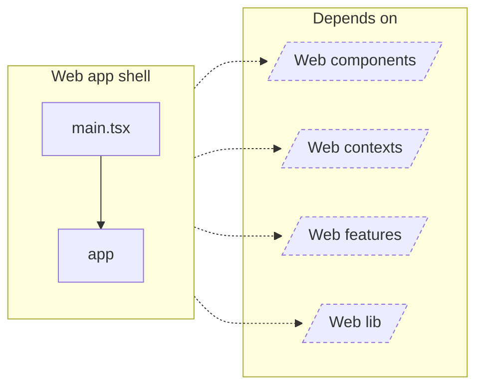

<!-- Generated by `task atlas:generate` from docs/atlas and source. Do not edit. -->

# Web app shell

_architecture · source: `derived: //atlas:group web-app + imports`_

Composition root: providers, router, shell, and fatal-error handling. No domain behaviour.

## Elements

| Element | Description | Anchor |
| --- | --- | --- |
| app |  | `mod:web/src/app` |
| main.tsx |  | `mod:web/src/main.tsx` |
| Web components |  | `group:web-components` |
| Web contexts |  | `group:web-contexts` |
| Web features |  | `group:web-features` |
| Web lib |  | `group:web-lib` |
