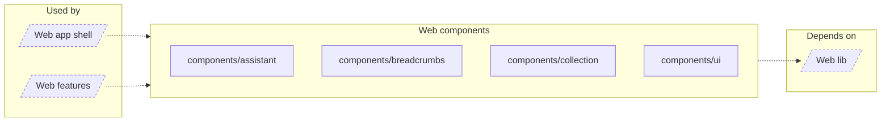

<!-- Generated by `task atlas:generate` from docs/atlas and source. Do not edit. -->

# Web components

_architecture · source: `derived: //atlas:group web-components + imports`_

Reusable presentational UI with no feature, API, or store dependency.

## Elements

| Element | Description | Anchor |
| --- | --- | --- |
| Web app shell |  | `group:web-app` |
| Web features |  | `group:web-features` |
| components/assistant |  | `mod:web/src/components/assistant` |
| components/breadcrumbs |  | `mod:web/src/components/breadcrumbs` |
| components/collection |  | `mod:web/src/components/collection` |
| components/ui |  | `mod:web/src/components/ui` |
| Web lib |  | `group:web-lib` |
