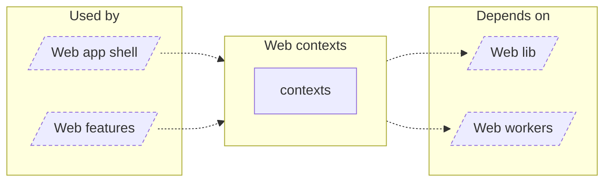

<!-- Generated by `task atlas:generate` from docs/atlas and source. Do not edit. -->

# Web contexts

_architecture · source: `derived: //atlas:group web-contexts + imports`_

Truly application-wide React providers: global notifications and worker access.

## Elements

| Element | Description | Anchor |
| --- | --- | --- |
| Web app shell |  | `group:web-app` |
| Web features |  | `group:web-features` |
| contexts |  | `mod:web/src/contexts` |
| Web lib |  | `group:web-lib` |
| Web workers |  | `group:web-workers` |
