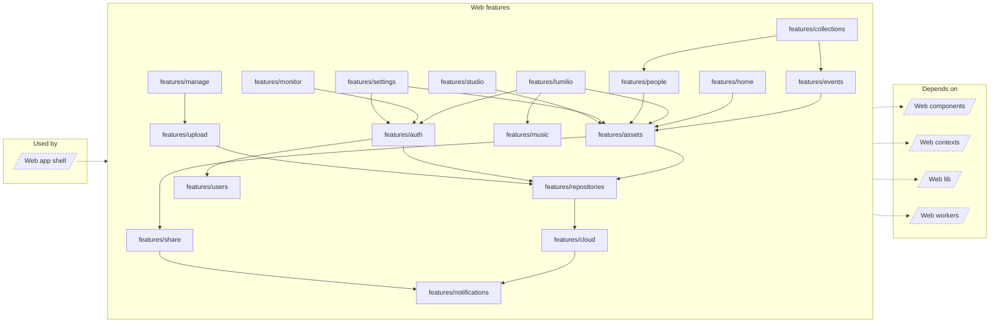

<!-- Generated by `task atlas:generate` from docs/atlas and source. Do not edit. -->

# Web features

_architecture · source: `derived: //atlas:group web-features + imports`_

Product capabilities. Each feature owns its routes, flows, model, API adapters, and state, and documents itself in doc.ts. Features import each other only through narrow public entries, acyclically.

## Elements

| Element | Description | Anchor |
| --- | --- | --- |
| Web app shell |  | `group:web-app` |
| features/assets | Assets owns catalog and Trash browsing, reusable asset-set presentation, selection, filtering, viewer inspection, and export/bulk asset actions. Collection, People, Home, Share, Studio, and Lumilio reuse its reviewed public surfaces instead of implementing another gallery or viewer. | `mod:web/src/features/assets` [`web/src/features/assets/doc.ts`](../../../../web/src/features/assets/doc.ts) |
| features/auth | Authentication owns the verified browser session, public sign-in and registration flows, MFA and password challenges, first-run bootstrap, and application access gates. Profile editing and ordinary user administration remain in Users and Settings. | `mod:web/src/features/auth` [`web/src/features/auth/doc.ts`](../../../../web/src/features/auth/doc.ts) |
| features/cloud | Cloud is an API capability shared by Settings and admin Storage. It owns provider descriptors, authenticated cloud credentials, repository bindings, explicit import runs, and the repository source-management flow. | `mod:web/src/features/cloud` [`web/src/features/cloud/doc.ts`](../../../../web/src/features/cloud/doc.ts) |
| features/collections | Collections owns grouped ways of browsing the catalog: albums, places, people entry surfaces, folders, tags, Liked, duplicate review, shared-link navigation, and classifier views. Person identity correction remains in People; asset presentation remains in Assets. | `mod:web/src/features/collections` [`web/src/features/collections/doc.ts`](../../../../web/src/features/collections/doc.ts) |
| features/events | Events owns deterministic, user-correctable media organization. | `mod:web/src/features/events` [`web/src/features/events/doc.ts`](../../../../web/src/features/events/doc.ts) |
| features/home | Home owns the authenticated `/` dashboard: featured media, catalog statistics, and a bounded spacetime-map preview. It is a read-oriented composition surface; editing, asset browsing, collection membership, upload destinations, and preference persistence remain with their owning features. | `mod:web/src/features/home` [`web/src/features/home/doc.ts`](../../../../web/src/features/home/doc.ts) |
| features/lumilio | Lumilio owns the authenticated assistant experience: the `/lumilio` board, reusable chat dock, streamed assistant blocks, contextual asset handoff, mentions, slash modes, and durable board pins. Media, collections, people, and settings remain in their own features and contribute only explicit context or public data. | `mod:web/src/features/lumilio` [`web/src/features/lumilio/doc.ts`](../../../../web/src/features/lumilio/doc.ts) |
| features/manage | Upload owns the authenticated `/upload` surface. It presents itself as Upload, not Manage: it is not an administration page, and storage administration, verification, cloud source binding, and catalog rebuilds live on the admin Storage route inside `features/repositories`. | `mod:web/src/features/manage` [`web/src/features/manage/doc.ts`](../../../../web/src/features/manage/doc.ts) |
| features/monitor | Monitor owns the admin-only `/server-monitor` operational dashboard for current Catalog processing, ML indexing coverage, rebuild commands, and runtime capabilities. It observes and triggers backend work but does not define task enablement, queue semantics, or repository configuration. | `mod:web/src/features/monitor` [`web/src/features/monitor/doc.ts`](../../../../web/src/features/monitor/doc.ts) |
| features/music | Music owns the first-class local listening domain: audio tracks, release albums, artist credits, playlists, and transient playback sessions. Asset storage, likes, trash, and media delivery remain owned by Assets; this feature stores only the music projection and user corrections. | `mod:web/src/features/music` [`web/src/features/music/doc.ts`](../../../../web/src/features/music/doc.ts) |
| features/notifications | Notifications is the narrow feature facade for application-wide notifications. It exposes product commands and navigation surfaces while the cross-cutting notification runtime remains owned by `GlobalContext`. | `mod:web/src/features/notifications` [`web/src/features/notifications/doc.ts`](../../../../web/src/features/notifications/doc.ts) |
| features/people | People owns recognized identities, person detail, and the correction tools for face clusters. Collections owns the people rail/grid entry; Assets owns photo presentation. AI clustering is assistive, while user corrections are durable authority. | `mod:web/src/features/people` [`web/src/features/people/doc.ts`](../../../../web/src/features/people/doc.ts) |
| features/repositories | Repositories owns the shared repository option contract, browse scope, concrete upload destination, and the admin Storage surface. Manage consumes the non-admin list; admin Storage owns authorization, create/open, verify, reconnect, detach, and native Desktop handoff. | `mod:web/src/features/repositories` [`web/src/features/repositories/doc.ts`](../../../../web/src/features/repositories/doc.ts) |
| features/settings | Settings owns the authenticated `/settings` route, device-local preferences, server-backed mutable system settings, runtime information, SQLite backup management, cloud-account composition, and administrator user management. Repository and Cloud data contracts remain in their own features. | `mod:web/src/features/settings` [`web/src/features/settings/doc.ts`](../../../../web/src/features/settings/doc.ts) |
| features/share | Share owns revocable, time-limited public links for asset snapshots, albums, and people. Owner-facing creation and management stay inside the authenticated app, while the public viewer is deliberately outside the gated route tree. | `mod:web/src/features/share` [`web/src/features/share/doc.ts`](../../../../web/src/features/share/doc.ts) |
| features/studio | Studio owns the authenticated `/studio` workspace for non-destructive photo editing. It selects an existing photo, edits sidecar instructions, renders a preview, and exports a new file without changing the preserved original. | `mod:web/src/features/studio` [`web/src/features/studio/doc.ts`](../../../../web/src/features/studio/doc.ts) |
| features/upload | Upload owns browser file intake, the in-session queue, hashing, duplicate precheck, batch/chunk transport, ingest-job tracking, and global progress UI. Manage chooses where the full editor appears; Upload owns how files reach a concrete repository. | `mod:web/src/features/upload` [`web/src/features/upload/doc.ts`](../../../../web/src/features/upload/doc.ts) |
| features/users | Users is an API-only feature for listing managed users, updating profiles and access, and changing the current user's password. Auth and Settings compose this contract; the feature owns no route or workflow UI. | `mod:web/src/features/users` [`web/src/features/users/doc.ts`](../../../../web/src/features/users/doc.ts) |
| Web components |  | `group:web-components` |
| Web contexts |  | `group:web-contexts` |
| Web lib |  | `group:web-lib` |
| Web workers |  | `group:web-workers` |
