<!-- Generated by `task atlas:generate` from docs/atlas and source. Do not edit. -->

# Web lib

_architecture · source: `derived: //atlas:group web-lib + imports`_

Non-visual lower layer: the generated OpenAPI client, i18n, preferences, theme, formatting, geo, and small cross-feature contracts. Never imports a feature.

```mermaid
flowchart LR
    subgraph n_g_Used_by["Used by"]
        n_in_web_app[/"Web app shell"/]
        n_in_web_components[/"Web components"/]
        n_in_web_contexts[/"Web contexts"/]
        n_in_web_features[/"Web features"/]
        n_in_web_workers[/"Web workers"/]
    end
    subgraph n_g_Web_lib["Web lib"]
        n_web_src_config["config"]
        n_web_src_lib["lib"]
        n_web_src_lib_albums["lib/albums"]
        n_web_src_lib_assets["lib/assets"]
        n_web_src_lib_assistant["lib/assistant"]
        n_web_src_lib_capabilities["lib/capabilities"]
        n_web_src_lib_duplicates["lib/duplicates"]
        n_web_src_lib_format["lib/format"]
        n_web_src_lib_geo["lib/geo"]
        n_web_src_lib_http_commons["lib/http-commons"]
        n_web_src_lib_layout["lib/layout"]
        n_web_src_lib_media["lib/media"]
        n_web_src_lib_preferences["lib/preferences"]
        n_web_src_lib_settings["lib/settings"]
        n_web_src_lib_theme["lib/theme"]
        n_web_src_lib_upload["lib/upload"]
        n_web_src_lib_utils["lib/utils"]
        n_web_src_lib_workers["lib/workers"]
    end
    n_in_web_app -.-> n_g_Web_lib
    n_in_web_components -.-> n_g_Web_lib
    n_in_web_contexts -.-> n_g_Web_lib
    n_in_web_features -.-> n_g_Web_lib
    n_in_web_workers -.-> n_g_Web_lib
    n_web_src_lib_albums --> n_web_src_lib_http_commons
    n_web_src_lib_assets --> n_web_src_lib_http_commons
    n_web_src_lib_capabilities --> n_web_src_lib_http_commons
    n_web_src_lib_duplicates --> n_web_src_lib_http_commons
    n_web_src_lib_layout --> n_web_src_lib_http_commons
    n_web_src_lib_preferences --> n_web_src_lib_theme
    n_web_src_lib_theme --> n_web_src_lib_preferences
    n_web_src_lib_upload --> n_web_src_lib
    n_web_src_lib_upload --> n_web_src_lib_http_commons
    classDef external stroke-dasharray:4 3
    class n_in_web_app,n_in_web_components,n_in_web_contexts,n_in_web_features,n_in_web_workers external
```

## Elements

| Element | Description | Anchor |
| --- | --- | --- |
| Web app shell |  | `group:web-app` |
| Web components |  | `group:web-components` |
| Web contexts |  | `group:web-contexts` |
| Web features |  | `group:web-features` |
| Web workers |  | `group:web-workers` |
| config |  | `mod:web/src/config` |
| lib |  | `mod:web/src/lib` |
| lib/albums |  | `mod:web/src/lib/albums` |
| lib/assets |  | `mod:web/src/lib/assets` |
| lib/assistant |  | `mod:web/src/lib/assistant` |
| lib/capabilities |  | `mod:web/src/lib/capabilities` |
| lib/duplicates |  | `mod:web/src/lib/duplicates` |
| lib/format |  | `mod:web/src/lib/format` |
| lib/geo |  | `mod:web/src/lib/geo` |
| lib/http-commons |  | `mod:web/src/lib/http-commons` |
| lib/layout |  | `mod:web/src/lib/layout` |
| lib/media |  | `mod:web/src/lib/media` |
| lib/preferences |  | `mod:web/src/lib/preferences` |
| lib/settings |  | `mod:web/src/lib/settings` |
| lib/theme |  | `mod:web/src/lib/theme` |
| lib/upload |  | `mod:web/src/lib/upload` |
| lib/utils |  | `mod:web/src/lib/utils` |
| lib/workers |  | `mod:web/src/lib/workers` |
