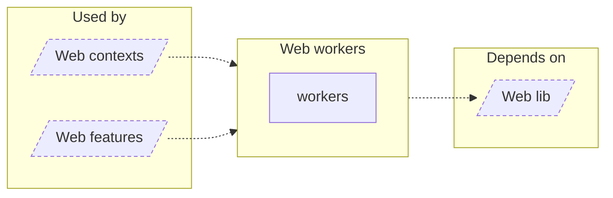

<!-- Generated by `task atlas:generate` from docs/atlas and source. Do not edit. -->

# Web workers

_architecture · source: `derived: //atlas:group web-workers + imports`_

Browser worker entry points (hashing, justified layout, Studio tools) and the shared worker client.

## Elements

| Element | Description | Anchor |
| --- | --- | --- |
| Web contexts |  | `group:web-contexts` |
| Web features |  | `group:web-features` |
| workers |  | `mod:web/src/workers` |
| Web lib |  | `group:web-lib` |
