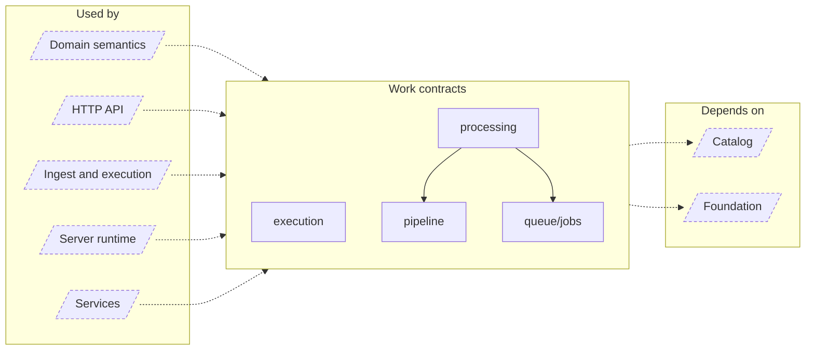

<!-- Generated by `task atlas:generate` from docs/atlas and source. Do not edit. -->

# Work contracts

_architecture · source: `derived: //atlas:group work + imports`_

Catalog-owned asynchronous work vocabulary: desired/applied pipeline contracts, the closed River macro-job catalog, the process-wide execution governor, and the administrator processing read model.

## Elements

| Element | Description | Anchor |
| --- | --- | --- |
| Domain semantics |  | `group:domain` |
| HTTP API |  | `group:http` |
| Ingest and execution |  | `group:ingest` |
| Server runtime |  | `group:runtime` |
| Services |  | `group:service` |
| execution | Package execution owns process-wide admission for fine-grained pipeline work. | `mod:server/internal/execution` [`server/internal/execution/doc.go`](../../../../server/internal/execution/doc.go) |
| pipeline | Package pipeline defines catalog-owned asynchronous work contracts. | `mod:server/internal/pipeline` [`server/internal/pipeline/doc.go`](../../../../server/internal/pipeline/doc.go) |
| processing | Package processing is the administrator read model for background work: one closed catalog of user-facing stages, each counted in one declared unit from Catalog desired/applied facts, with River contributing only the execution facts (running and retryable deliveries). | `mod:server/internal/processing` [`server/internal/processing/doc.go`](../../../../server/internal/processing/doc.go) |
| queue/jobs | Package jobs is the closed River macro-job catalog. | `mod:server/internal/queue/jobs` [`server/internal/queue/jobs/doc.go`](../../../../server/internal/queue/jobs/doc.go) |
| Catalog |  | `group:catalog` |
| Foundation |  | `group:foundation` |
