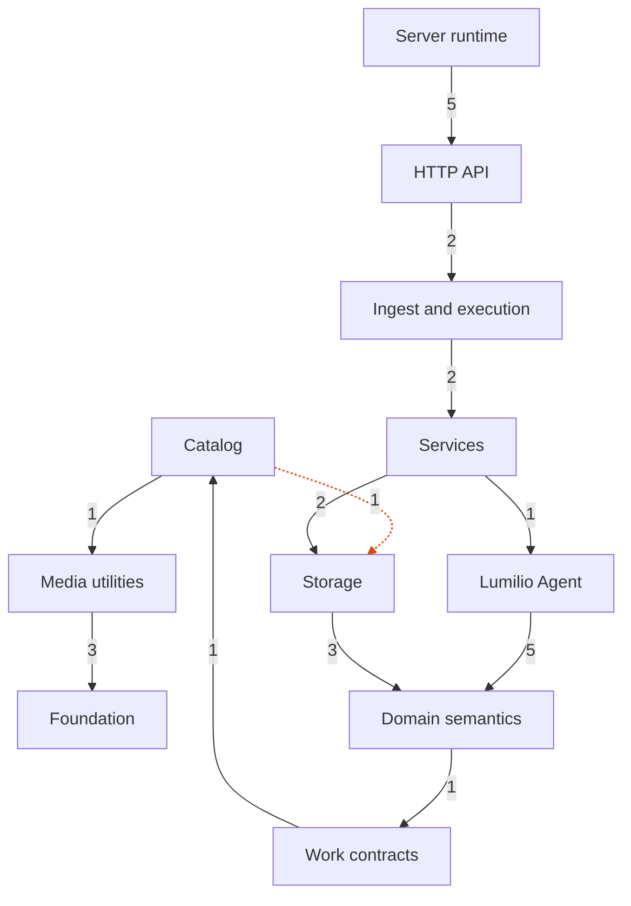

<!-- Generated by `task atlas:generate` from docs/atlas and source. Do not edit. -->

# Server groups

_architecture · source: `derived: docs/atlas/atlas.yaml + server imports`_

Every Server group and the dependencies between them, derived from source. Arrows point from importer to imported and a label counts package-level imports. Edges implied by a longer path are hidden; red edges are undeclared in atlas.yaml and orange dashed edges are reviewed exceptions.

## Elements

| Element | Description | Anchor |
| --- | --- | --- |
| Foundation | Dependency-free primitives every layer may use: the strict TOML configuration loader, runtime-mutable settings types, logging, version, work QoS classes, catalog value types, secret sealing, and OS/SQLite platform helpers. Nothing here knows about Assets, repositories, or HTTP. | `group:foundation` |
| Media utilities | Stateless file and media mechanics: content hashing, EXIF extraction, libvips imaging, LibRaw decoding, perceptual hashes, geohash, and process helpers. Pure functions over bytes and paths; no catalog access. | `group:media` |
| Catalog | The embedded SQLite catalog and its QueueDB sibling: the single-writer runtime, named transactions, sqlc queries, the Vec1 vector index, migrations, and verified backups. The catalog is product truth. | `group:catalog` |
| Work contracts | Catalog-owned asynchronous work vocabulary: desired/applied pipeline contracts, the closed River macro-job catalog, the process-wide execution governor, and the administrator processing read model. | `group:work` |
| Domain semantics | Derived product meaning that is independent of storage and transport: Event topology, the Asset lifecycle rules, search (FTS5, vectors, OCR sidecar), zero-shot classification math, and the LLM provider adapter. | `group:domain` |
| Storage | Storage Locations and Repositories on disk: repository lifecycle and layout, the scan index that mirrors each repository tree in repository_entries, the journaled repository trash, and immutable derived artifacts. | `group:storage` |
| Lumilio Agent | The in-app assistant: the agent run loop, typed references and facets, pinned widgets, prompt injection of library context, and the tools the model may call over the catalog. | `group:agent` |
| Services | Business logic behind the HTTP API: authentication and MFA, assets, albums, people, music, settings, setup, search orchestration, cloud import planning, and ML adapters. | `group:service` |
| Ingest and execution | Everything that moves bytes and background results into the catalog: staged sourcing for upload and cloud import, the River workers and scheduler, media processors, and the commit coordinator that is the only writer of asynchronous results. | `group:ingest` |
| HTTP API | The transport edge: router and auth boundaries, handlers, DTOs, RFC 9457 Problem responses, rate limiting, request-origin policy, and the plaintext/ACME listeners. | `group:http` |
| Server runtime | Process composition: the CLI entry point, the Docker entrypoint, and server/app, the only place that wires every subsystem together and owns startup and graceful shutdown. Desktop hosts the same runtime in-process. | `group:runtime` |

## Every group dependency

The diagram hides an edge when a longer path between the same groups already implies it (transitive reduction). This is the complete derived list.

- `agent` → `catalog`: 6 package import(s), declared
- `agent` → `domain`: 5 package import(s), declared
- `agent` → `foundation`: 6 package import(s), declared
- `agent` → `media`: 1 package import(s), declared
- `catalog` → `foundation`: 7 package import(s), declared
- `catalog` → `media`: 1 package import(s), declared
- `catalog` → `storage`: 1 package import(s), reviewed exception
- `domain` → `catalog`: 5 package import(s), declared
- `domain` → `foundation`: 3 package import(s), declared
- `domain` → `work`: 1 package import(s), declared
- `http` → `agent`: 5 package import(s), declared
- `http` → `catalog`: 3 package import(s), declared
- `http` → `domain`: 2 package import(s), declared
- `http` → `foundation`: 11 package import(s), declared
- `http` → `ingest`: 2 package import(s), declared
- `http` → `media`: 4 package import(s), declared
- `http` → `service`: 2 package import(s), declared
- `http` → `storage`: 5 package import(s), declared
- `http` → `work`: 2 package import(s), declared
- `ingest` → `catalog`: 8 package import(s), declared
- `ingest` → `domain`: 1 package import(s), declared
- `ingest` → `foundation`: 13 package import(s), declared
- `ingest` → `media`: 8 package import(s), declared
- `ingest` → `service`: 2 package import(s), declared
- `ingest` → `storage`: 9 package import(s), declared
- `ingest` → `work`: 6 package import(s), declared
- `media` → `foundation`: 3 package import(s), declared
- `runtime` → `agent`: 5 package import(s), declared
- `runtime` → `catalog`: 4 package import(s), declared
- `runtime` → `domain`: 2 package import(s), declared
- `runtime` → `foundation`: 7 package import(s), declared
- `runtime` → `http`: 5 package import(s), declared
- `runtime` → `ingest`: 5 package import(s), declared
- `runtime` → `media`: 1 package import(s), declared
- `runtime` → `service`: 1 package import(s), declared
- `runtime` → `storage`: 6 package import(s), declared
- `runtime` → `work`: 3 package import(s), declared
- `service` → `agent`: 1 package import(s), declared
- `service` → `catalog`: 4 package import(s), declared
- `service` → `domain`: 5 package import(s), declared
- `service` → `foundation`: 6 package import(s), declared
- `service` → `media`: 3 package import(s), declared
- `service` → `storage`: 2 package import(s), declared
- `service` → `work`: 1 package import(s), declared
- `storage` → `catalog`: 9 package import(s), declared
- `storage` → `domain`: 3 package import(s), declared
- `storage` → `foundation`: 6 package import(s), declared
- `storage` → `media`: 3 package import(s), declared
- `work` → `catalog`: 1 package import(s), declared
- `work` → `foundation`: 3 package import(s), declared
