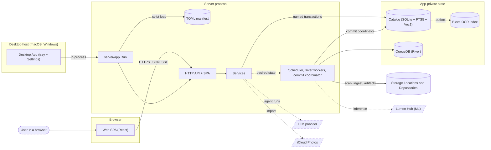

<!-- Generated by `task atlas:generate` from docs/atlas and source. Do not edit. -->

# System context

_architecture · source: `docs/atlas/views/architecture/system-context.yaml`_

Lumilio at the highest level: one Go Server process owns the SQLite catalog, the disposable River queue, and every registered repository on disk, and serves both the API and the React SPA. Machine learning, LLMs, and cloud import are optional external services. The Desktop App runs the same Server in-process; Linux runs it as a container.

## Elements

| Element | Description | Anchor |
| --- | --- | --- |
| User in a browser |  | `ext:User` |
| Web SPA (React) | Served by the Server; typed against the generated OpenAPI client. | `mod:web/src/app` |
| Desktop App (tray + Settings) | Supervises one in-process Server generation; the product UI stays in the browser. | `go:desktop/internal/runtime.Controller` [`desktop/internal/runtime/controller.go:156`](../../../../desktop/internal/runtime/controller.go#L156) |
| TOML manifest | Complete, schema-versioned, runtime-immutable configuration. | `go:config.LoadAppConfig` [`server/config/config.go:398`](../../../../server/config/config.go#L398) |
| HTTP API + SPA | Auth, origin, setup, and rate-limit boundaries; RFC 9457 Problems. | `go:api.NewRouter` [`server/internal/api/router.go:374`](../../../../server/internal/api/router.go#L374) |
| Services |  | `mod:server/internal/service` [`server/internal/service/doc.go`](../../../../server/internal/service/doc.go) |
| Scheduler, River workers, commit coordinator |  | `go:queue.Scheduler` [`server/internal/queue/scheduler.go:28`](../../../../server/internal/queue/scheduler.go#L28) |
| server/app.Run | The only composition root; owns startup and graceful shutdown. | `go:server/app.Run` [`server/app/app.go:101`](../../../../server/app/app.go#L101) |
| Catalog (SQLite + FTS5 + Vec1) | Product truth. One writer, bounded query-only readers. | `go:db.DB` [`server/internal/db/db.go:47`](../../../../server/internal/db/db.go#L47) |
| QueueDB (River) | Disposable delivery state; may be recreated. | `go:db.QueueDB` [`server/internal/db/queue.go:35`](../../../../server/internal/db/queue.go#L35) |
| Bleve OCR index | Rebuildable sidecar fed by a catalog outbox. | `go:bleveocr.Index` [`server/internal/search/bleveocr/index.go:32`](../../../../server/internal/search/bleveocr/index.go#L32) |
| Storage Locations and Repositories | User media on disk. Originals are never rewritten. | `go:server/internal/storage.RepositoryFS` [`server/internal/storage/repository_fs.go:181`](../../../../server/internal/storage/repository_fs.go#L181) |
| Lumen Hub (ML) | Optional. Semantic, face, OCR, and BioCLIP inference over mDNS or a configured URL. | `ext:Lumen Hub` |
| LLM provider | Optional. Powers the Lumilio Agent. | `ext:LLM provider` |
| iCloud Photos | Optional cloud import source. | `ext:iCloud Photos` |

## Anchored flows

| From → To | Label | Anchor |
| --- | --- | --- |
| web → http | HTTPS JSON, SSE | `go:api.RegisterSPA` [`server/internal/api/spa.go:21`](../../../../server/internal/api/spa.go#L21) |
| desktop → runtime | in-process | `go:desktop/internal/runtime.Controller.Start` [`desktop/internal/runtime/controller.go:265`](../../../../desktop/internal/runtime/controller.go#L265) |
| work → catalog | commit coordinator | `go:commit.Coordinator` [`server/internal/commit/coordinator.go:122`](../../../../server/internal/commit/coordinator.go#L122) |
| catalog → ocr | outbox | `go:bleveocr.Writer` [`server/internal/search/bleveocr/writer.go:20`](../../../../server/internal/search/bleveocr/writer.go#L20) |
| work → lumen | inference | `go:service.LumenService` [`server/internal/service/lumen_service.go:34`](../../../../server/internal/service/lumen_service.go#L34) |
| services → llm | agent runs | `go:llm.NewChatModel` [`server/internal/llm/chat_model.go:36`](../../../../server/internal/llm/chat_model.go#L36) |
| services → icloud | import | `go:icloud.NewClient` [`server/internal/cloud/icloud/client.go:52`](../../../../server/internal/cloud/icloud/client.go#L52) |

## Three configuration owners

Browser preferences live in localStorage; runtime-mutable settings live in the catalog and change through the Settings and Setup APIs; runtime-immutable process configuration lives in the complete TOML manifest. There is no fourth source: no code defaults, no automatic config search, and no ordinary environment overrides.

## Delivery shapes

Linux runs the Server as a host-network container at port 6680. macOS and Windows run the Desktop App, which hosts the same server/app runtime in-process and opens the product in the system browser.

## Related views

- [Server groups](../architecture/server-groups.md)
- [Web groups](../architecture/web-groups.md)
- [Desktop groups](../architecture/desktop-groups.md)
- [Browser upload to catalog Asset](../sequence/upload-to-catalog.md)
- [Background work — desired state to applied state](../dataflow/background-work.md)
