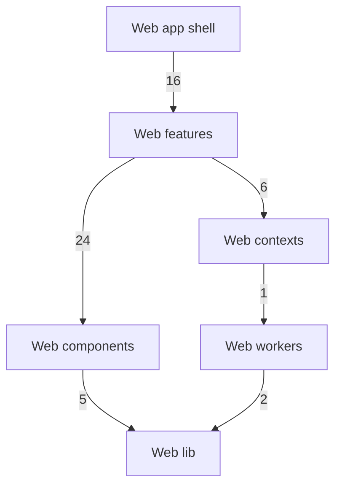

<!-- Generated by `task atlas:generate` from docs/atlas and source. Do not edit. -->

# Web groups

_architecture · source: `derived: docs/atlas/atlas.yaml + web imports`_

Every Web group and the dependencies between them, derived from source. Arrows point from importer to imported and a label counts package-level imports. Edges implied by a longer path are hidden; red edges are undeclared in atlas.yaml and orange dashed edges are reviewed exceptions.

## Elements

| Element | Description | Anchor |
| --- | --- | --- |
| Web lib | Non-visual lower layer: the generated OpenAPI client, i18n, preferences, theme, formatting, geo, and small cross-feature contracts. Never imports a feature. | `group:web-lib` |
| Web workers | Browser worker entry points (hashing, justified layout, Studio tools) and the shared worker client. | `group:web-workers` |
| Web components | Reusable presentational UI with no feature, API, or store dependency. | `group:web-components` |
| Web contexts | Truly application-wide React providers: global notifications and worker access. | `group:web-contexts` |
| Web features | Product capabilities. Each feature owns its routes, flows, model, API adapters, and state, and documents itself in doc.ts. Features import each other only through narrow public entries, acyclically. | `group:web-features` |
| Web app shell | Composition root: providers, router, shell, and fatal-error handling. No domain behaviour. | `group:web-app` |

## Every group dependency

The diagram hides an edge when a longer path between the same groups already implies it (transitive reduction). This is the complete derived list.

- `web-app` → `web-components`: 2 package import(s), declared
- `web-app` → `web-contexts`: 1 package import(s), declared
- `web-app` → `web-features`: 16 package import(s), declared
- `web-app` → `web-lib`: 4 package import(s), declared
- `web-components` → `web-lib`: 5 package import(s), declared
- `web-contexts` → `web-lib`: 1 package import(s), declared
- `web-contexts` → `web-workers`: 1 package import(s), declared
- `web-features` → `web-components`: 24 package import(s), declared
- `web-features` → `web-contexts`: 6 package import(s), declared
- `web-features` → `web-lib`: 76 package import(s), declared
- `web-features` → `web-workers`: 1 package import(s), declared
- `web-workers` → `web-lib`: 2 package import(s), declared
