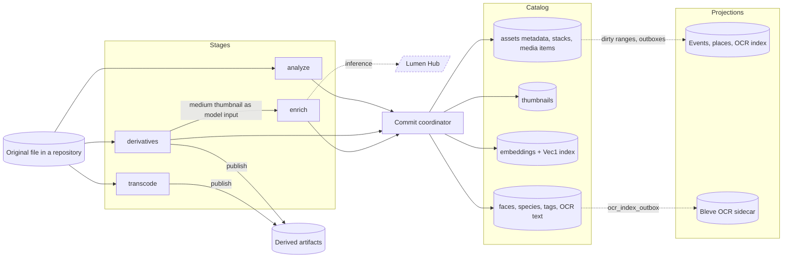

<!-- Generated by `task atlas:generate` from docs/atlas and source. Do not edit. -->

# Asset processing — from original to searchable

_dataflow · source: `docs/atlas/views/dataflow/asset-processing.yaml`_

What each pipeline stage reads and what it produces. The original file is only ever read. Stages are independent desired/applied pairs, so a missing ML service delays enrichment without blocking metadata, thumbnails, or browsing.

## Elements

| Element | Description | Anchor |
| --- | --- | --- |
| Original file in a repository | Resolved to a present entry just before I/O; never rewritten. | `go:locations.Resolver` [`server/internal/storage/locations/resolver.go:22`](../../../../server/internal/storage/locations/resolver.go#L22) |
| analyze | exiftool and ffprobe metadata, capture time, GPS, component relations. | `go:processors.AssetProcessor.ComputeMetadataTask` [`server/internal/processors/metadata_task.go:35`](../../../../server/internal/processors/metadata_task.go#L35) |
| derivatives | Thumbnail ladder, video frames, audio artwork (libvips, LibRaw). | `go:processors.AssetProcessor.LoadThumbnailTask` [`server/internal/processors/thumbnail_task.go:42`](../../../../server/internal/processors/thumbnail_task.go#L42) |
| transcode | Browser-playable video and audio renditions (ffmpeg). | `go:processors.AssetProcessor.ComputeTranscodeTask` [`server/internal/processors/transcode_task.go:74`](../../../../server/internal/processors/transcode_task.go#L74) |
| enrich | pHash, semantic embedding, BioCLIP, OCR, faces, zero-shot tags, video frames. | `go:queue.EnrichmentRunner` [`server/internal/queue/enrichment_runner.go:93`](../../../../server/internal/queue/enrichment_runner.go#L93) |
| Lumen Hub |  | `go:service.LumenService` [`server/internal/service/lumen_service.go:34`](../../../../server/internal/service/lumen_service.go#L34) |
| Derived artifacts | Immutable files under the repository's .lumilio area. | `go:artifact.Store` [`server/internal/artifact/store.go:42`](../../../../server/internal/artifact/store.go#L42) |
| Commit coordinator |  | `go:commit.Coordinator` [`server/internal/commit/coordinator.go:122`](../../../../server/internal/commit/coordinator.go#L122) |
| assets metadata, stacks, media items |  | `sql:media_items` [`server/migrations/000001_storage_baseline.up.sql`](../../../../server/migrations/000001_storage_baseline.up.sql) |
| thumbnails |  | `sql:thumbnails` [`server/migrations/000001_storage_baseline.up.sql`](../../../../server/migrations/000001_storage_baseline.up.sql) |
| embeddings + Vec1 index |  | `sql:search_embeddings` [`server/migrations/000001_storage_baseline.up.sql`](../../../../server/migrations/000001_storage_baseline.up.sql) |
| faces, species, tags, OCR text |  | `sql:face_items` [`server/migrations/000001_storage_baseline.up.sql`](../../../../server/migrations/000001_storage_baseline.up.sql) |
| Events, places, OCR index | Rebuilt in bounded, revision-fenced turns by projection jobs. | `sql:event_media_items` [`server/migrations/000001_storage_baseline.up.sql`](../../../../server/migrations/000001_storage_baseline.up.sql) |
| Bleve OCR sidecar |  | `go:bleveocr.Index` [`server/internal/search/bleveocr/index.go:32`](../../../../server/internal/search/bleveocr/index.go#L32) |

## Anchored flows

| From → To | Label | Anchor |
| --- | --- | --- |
| derivatives → artifacts | publish | `go:processors.AssetProcessor.PublishThumbnailTask` [`server/internal/processors/thumbnail_task.go:142`](../../../../server/internal/processors/thumbnail_task.go#L142) |
| transcode → artifacts | publish | `go:processors.AssetProcessor.PublishTranscodeTask` [`server/internal/processors/transcode_task.go:124`](../../../../server/internal/processors/transcode_task.go#L124) |
| analyze → coordinator |  | `go:commit.Coordinator.ApplyAssetMetadata` [`server/internal/commit/typed_catalog.go:48`](../../../../server/internal/commit/typed_catalog.go#L48) |
| derivatives → coordinator |  | `go:commit.Coordinator.ApplyAssetDerivatives` [`server/internal/commit/typed_catalog.go:57`](../../../../server/internal/commit/typed_catalog.go#L57) |
| enrich → coordinator |  | `go:commit.Coordinator.ApplyEnrichment` [`server/internal/commit/typed_catalog.go:84`](../../../../server/internal/commit/typed_catalog.go#L84) |
| faces → bleve | ocr_index_outbox | `go:bleveocr.Writer` [`server/internal/search/bleveocr/writer.go:20`](../../../../server/internal/search/bleveocr/writer.go#L20) |

## Fences

Every result carries the source content it was computed from and the desired version it answers. If the file changed or a newer request arrived meanwhile, the coordinator records the result as stale and the scheduler derives the work again.

## Related views

- [Background work — desired state to applied state](../dataflow/background-work.md)
- [Browser upload to catalog Asset](../sequence/upload-to-catalog.md)
- [Library search (fused retrieval)](../sequence/library-search.md)
