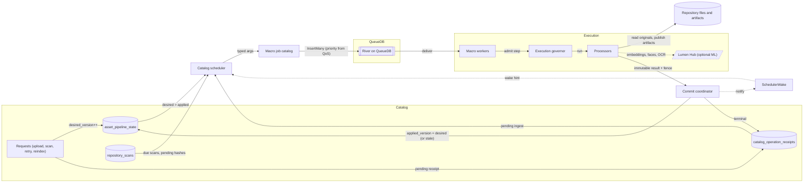

<!-- Generated by `task atlas:generate` from docs/atlas and source. Do not edit. -->

# Background work — desired state to applied state

_dataflow · source: `docs/atlas/views/dataflow/background-work.yaml`_

Every asynchronous step is catalog-owned. A request writes desired state; the scheduler derives disposable River jobs from it; workers compute outside transactions under one resource governor; the commit coordinator alone writes the results and advances applied state. Losing QueueDB only delays work.

## Elements

| Element | Description | Anchor |
| --- | --- | --- |
| Requests (upload, scan, retry, reindex) | Write desired state in the same transaction as the product change. | `go:pipeline.RequestAssetStagesTx` [`server/internal/pipeline/catalog.go:28`](../../../../server/internal/pipeline/catalog.go#L28) |
| catalog_operation_receipts | Durable ingest, reindex, and other operation receipts the browser can follow. | `sql:catalog_operation_receipts` [`server/migrations/000001_storage_baseline.up.sql`](../../../../server/migrations/000001_storage_baseline.up.sql) |
| asset_pipeline_state | desired_version vs applied_version per Asset and stage (analyze, derivatives, transcode, enrich). | `sql:asset_pipeline_state` [`server/migrations/000001_storage_baseline.up.sql`](../../../../server/migrations/000001_storage_baseline.up.sql) |
| repository_scans | Pending scans and pending_hash entries drive repository work. | `sql:repository_scans` [`server/migrations/000001_storage_baseline.up.sql`](../../../../server/migrations/000001_storage_baseline.up.sql) |
| SchedulerWake | Committed writes coalesce into one wake-up; the periodic pass is the recovery path. | `go:queue.SchedulerWake` [`server/internal/queue/scheduler_wake.go:8`](../../../../server/internal/queue/scheduler_wake.go#L8) |
| Catalog scheduler | Bounded pass that derives work only from catalog state, never from River. | `go:queue.Scheduler.ScheduleOnce` [`server/internal/queue/scheduler.go:70`](../../../../server/internal/queue/scheduler.go#L70) |
| Macro job catalog | The closed set of job kinds; payloads carry identities and fences only. | `go:jobs.RuntimeJobCatalog` [`server/internal/queue/jobs/types.go:35`](../../../../server/internal/queue/jobs/types.go#L35) |
| River on QueueDB | Disposable delivery state with uniqueness over active deliveries. | `go:queue.New` [`server/internal/queue/queue_setup.go:96`](../../../../server/internal/queue/queue_setup.go#L96) |
| Macro workers |  | `go:queue.AnalyzeAssetWorker` [`server/internal/queue/macro_asset_workers.go:61`](../../../../server/internal/queue/macro_asset_workers.go#L61) |
| Execution governor | Process-wide admission by QoS class (interactive, background, maintenance) against CPU, disk I/O, image and video codec, inference, and memory budgets. | `go:execution.Governor` [`server/internal/execution/governor.go:100`](../../../../server/internal/execution/governor.go#L100) |
| Processors | Read/compute only; publish derived files, never catalog rows. | `go:processors.AssetProcessor` [`server/internal/processors/asset_processor.go:25`](../../../../server/internal/processors/asset_processor.go#L25) |
| Lumen Hub (optional ML) |  | `ext:Lumen Hub` |
| Repository files and artifacts |  | `go:server/internal/storage.RepositoryFS` [`server/internal/storage/repository_fs.go:187`](../../../../server/internal/storage/repository_fs.go#L187) |
| Commit coordinator | Batches results into bounded writer transactions and checks fences. | `go:commit.Coordinator` [`server/internal/commit/coordinator.go:122`](../../../../server/internal/commit/coordinator.go#L122) |

## Anchored flows

| From → To | Label | Anchor |
| --- | --- | --- |
| catalogjobs → river | InsertMany (priority from QoS) | `go:queue.Scheduler.ScheduleOnce` [`server/internal/queue/scheduler.go:70`](../../../../server/internal/queue/scheduler.go#L70) |
| workers → governor | admit step | `go:execution.Engine.Run` [`server/internal/execution/governor.go:321`](../../../../server/internal/execution/governor.go#L321) |
| processors → coordinator | immutable result + fence | `go:commit.Coordinator.ApplyAssetMetadata` [`server/internal/commit/typed_catalog.go:48`](../../../../server/internal/commit/typed_catalog.go#L48) |

## The invariant

River never decides whether product work exists. If QueueDB is deleted, the next scheduler pass derives the same jobs from the catalog. If a delivery is retried, the coordinator's fence turns the second result into a stale or duplicate outcome.

## No work inside write transactions

Filesystem, media, network, and unbounded CPU work happen before the coordinator is called. Writer transactions only apply small, bounded, already-computed results.

## Related views

- [Browser upload to catalog Asset](../sequence/upload-to-catalog.md)
- [Asset lifecycle](../lifecycle/asset-lifecycle.md)
