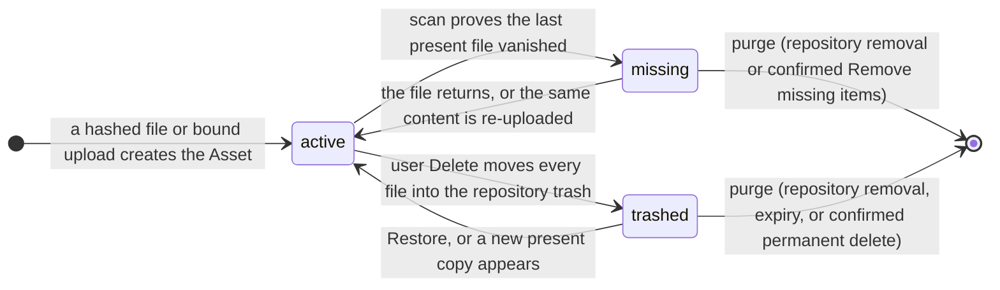

<!-- Generated by `task atlas:generate` from docs/atlas and source. Do not edit. -->

# Asset lifecycle

_lifecycle · source: `docs/atlas/views/lifecycle/asset-lifecycle.yaml`_

An Asset exists exactly while it has at least one repository entry. Its state is never written by application code: catalog triggers on repository_entries derive it from the entries, with present files winning over missing ones and missing ones over trashed ones.

## States

| State | Meaning | Anchor |
| --- | --- | --- |
| active | At least one entry is present or pending_hash. Browse, search, and processing see it. | `go:lifecycle.StateActive` [`server/internal/lifecycle/purge.go:17`](../../../../server/internal/lifecycle/purge.go#L17) |
| missing | No present entry, at least one missing. Metadata, albums, and faces are kept until the user removes it. | `go:lifecycle.StateMissing` [`server/internal/lifecycle/purge.go:18`](../../../../server/internal/lifecycle/purge.go#L18) |
| trashed | Every remaining entry is in a repository trash. Shown only in the Trash view. | `go:lifecycle.StateTrashed` [`server/internal/lifecycle/purge.go:19`](../../../../server/internal/lifecycle/purge.go#L19) |

## Transitions

| From | To | Trigger | Anchor |
| --- | --- | --- | --- |
| [*] | active | a hashed file or bound upload creates the Asset | `go:scan.Scanner.BindKnownContent` [`server/internal/storage/scan/known.go:44`](../../../../server/internal/storage/scan/known.go#L44) |
| active | missing | scan proves the last present file vanished | `go:scan.removeEntryTx` [`server/internal/storage/scan/walk.go:733`](../../../../server/internal/storage/scan/walk.go#L733) |
| missing | active | the file returns, or the same content is re-uploaded | `go:scan.Scanner.RunTurn` [`server/internal/storage/scan/walk.go:66`](../../../../server/internal/storage/scan/walk.go#L66) |
| active | trashed | user Delete moves every file into the repository trash | `go:trash.Service.Delete` [`server/internal/storage/trash/delete.go:62`](../../../../server/internal/storage/trash/delete.go#L62) |
| trashed | active | Restore, or a new present copy appears | `go:trash.Service.Restore` [`server/internal/storage/trash/restore.go:61`](../../../../server/internal/storage/trash/restore.go#L61) |
| missing | [*] | purge (repository removal or confirmed Remove missing items) | `go:lifecycle.PurgeEntriesTx` [`server/internal/lifecycle/purge.go:41`](../../../../server/internal/lifecycle/purge.go#L41) |
| trashed | [*] | purge (repository removal, expiry, or confirmed permanent delete) | `go:lifecycle.PurgeEntriesTx` [`server/internal/lifecycle/purge.go:41`](../../../../server/internal/lifecycle/purge.go#L41) |

## Where the state is written

Only the asset_lifecycle_entry_insert, _update, and _delete triggers in the catalog baseline write assets.lifecycle_state, so the state cannot drift from the entries. A lifecycle change re-publishes the OCR document and lets the logical media item serve from an active component.

## What never deletes an Asset

User Delete authorizes trashing; configured retention authorizes hourly expiry after recovery and sidecar rebuild. A scan, a watcher, and a cloud sync never unlink a file, never move one into the trash, and never purge. `lifecycle.PurgeEntriesTx` is the only Asset delete, and `task architecture:check` rejects any other code that deletes from assets.

## Related views

- [Browser upload to catalog Asset](../sequence/upload-to-catalog.md)
- [Repository scan (scan index)](../sequence/repository-scan.md)
