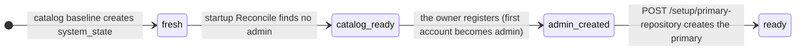

<!-- Generated by `task atlas:generate` from docs/atlas and source. Do not edit. -->

# First-run bootstrap

_lifecycle · source: `docs/atlas/views/lifecycle/bootstrap.yaml`_

The Server's first-run state machine. It is orthogonal to configuration: the phase is computed from two setup gates (an admin user exists; exactly one primary repository exists) in one place and cached only at startup. Once ready, an instance never returns to setup, even if storage is offline.

## States

| State | Meaning | Anchor |
| --- | --- | --- |
| fresh | The catalog row exists but no reconciliation has run yet. | `go:service.BootstrapPhaseFresh` [`server/internal/service/bootstrap_service.go:13`](../../../../server/internal/service/bootstrap_service.go#L13) |
| catalog_ready | SQLite is open and migrated; owner registration is pending. | `go:service.BootstrapPhaseCatalogReady` [`server/internal/service/bootstrap_service.go:14`](../../../../server/internal/service/bootstrap_service.go#L14) |
| admin_created | The owner account exists; the primary repository is not set up. | `go:service.BootstrapPhaseAdminCreated` [`server/internal/service/bootstrap_service.go:15`](../../../../server/internal/service/bootstrap_service.go#L15) |
| ready | Terminal and durable. Request paths trust the cached value. | `go:service.BootstrapPhaseReady` [`server/internal/service/bootstrap_service.go:16`](../../../../server/internal/service/bootstrap_service.go#L16) |

## Transitions

| From | To | Trigger | Anchor |
| --- | --- | --- | --- |
| [*] | fresh | catalog baseline creates system_state | `sql:system_state` [`server/migrations/000001_storage_baseline.up.sql`](../../../../server/migrations/000001_storage_baseline.up.sql) |
| fresh | catalog_ready | startup Reconcile finds no admin | `go:service.BootstrapService.Reconcile` [`server/internal/service/bootstrap_service.go:31`](../../../../server/internal/service/bootstrap_service.go#L31) |
| catalog_ready | admin_created | the owner registers (first account becomes admin) | `api:POST /api/v1/auth/register/start` [`server/docs/swagger.yaml`](../../../../server/docs/swagger.yaml) |
| admin_created | ready | POST /setup/primary-repository creates the primary | `api:POST /api/v1/setup/primary-repository` [`server/docs/swagger.yaml`](../../../../server/docs/swagger.yaml) |

## Derived, never stored mid-setup

While setting up, `BootstrapService.Phase` derives the phase from the gates through the query-only reader on every request; foreground reads never queue behind the sole catalog writer to persist it. Only startup reconciliation writes the cached phase.

## Not a configuration source

Bootstrap observes owner and primary-repository facts. It does not replace or override the TOML manifest, runtime settings, or browser preferences, which remain the three configuration owners.

## Related views

- [System context](../architecture/system-context.md)
