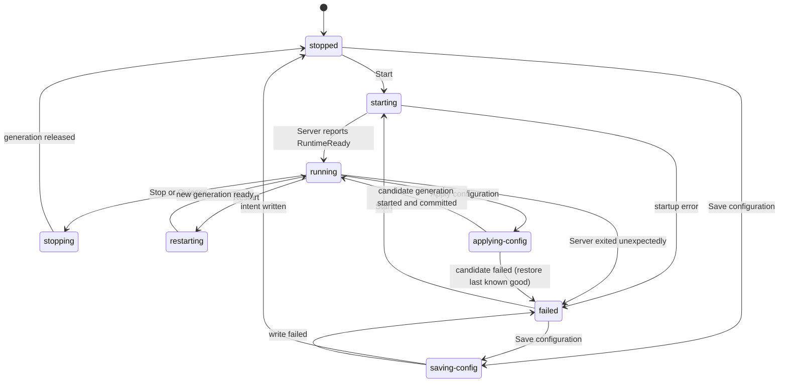

<!-- Generated by `task atlas:generate` from docs/atlas and source. Do not edit. -->

# Desktop runtime phase

_lifecycle · source: `docs/atlas/views/lifecycle/desktop-runtime.yaml`_

The Desktop App hosts the complete Server in-process and reports one runtime phase to the Settings window. Every mutation is a request-id idempotent operation; configuration is saved only while stopped and applied by a journaled quiesce-and-restart with a last-known-good fallback.

States are exactly the members of `go:desktop/internal/control/dto.RuntimePhase` [`desktop/internal/control/dto/snapshot.go:15`](../../../../desktop/internal/control/dto/snapshot.go#L15).

## States

| State | Meaning | Anchor |
| --- | --- | --- |
| stopped | No Server generation is held. | `go:desktop/internal/control/dto.RuntimeStopped` [`desktop/internal/control/dto/snapshot.go:18`](../../../../desktop/internal/control/dto/snapshot.go#L18) |
| starting | A new generation runs server/app.Run and waits for RuntimeReady. | `go:desktop/internal/control/dto.RuntimeStarting` [`desktop/internal/control/dto/snapshot.go:19`](../../../../desktop/internal/control/dto/snapshot.go#L19) |
| running | The Server owns its listener and repositories. | `go:desktop/internal/control/dto.RuntimeRunning` [`desktop/internal/control/dto/snapshot.go:20`](../../../../desktop/internal/control/dto/snapshot.go#L20) |
| stopping | Graceful shutdown of the held generation. | `go:desktop/internal/control/dto.RuntimeStopping` [`desktop/internal/control/dto/snapshot.go:21`](../../../../desktop/internal/control/dto/snapshot.go#L21) |
| restarting | Stop then start a new generation in one operation. | `go:desktop/internal/control/dto.RuntimeRestarting` [`desktop/internal/control/dto/snapshot.go:22`](../../../../desktop/internal/control/dto/snapshot.go#L22) |
| saving-config | Writing a validated runtime intent while stopped. | `go:desktop/internal/control/dto.RuntimeSavingConfig` [`desktop/internal/control/dto/snapshot.go:23`](../../../../desktop/internal/control/dto/snapshot.go#L23) |
| applying-config | Journaled quiesce, candidate start, and commit or rollback. | `go:desktop/internal/control/dto.RuntimeApplyingConfig` [`desktop/internal/control/dto/snapshot.go:24`](../../../../desktop/internal/control/dto/snapshot.go#L24) |
| failed | Start or the running Server failed; the error is in the snapshot. | `go:desktop/internal/control/dto.RuntimeFailed` [`desktop/internal/control/dto/snapshot.go:25`](../../../../desktop/internal/control/dto/snapshot.go#L25) |

## Transitions

| From | To | Trigger | Anchor |
| --- | --- | --- | --- |
| [*] | stopped |  | `go:desktop/internal/control/dto.InitialSnapshot` [`desktop/internal/control/dto/snapshot.go:317`](../../../../desktop/internal/control/dto/snapshot.go#L317) |
| stopped | starting | Start | `go:desktop/internal/runtime.Controller.Start` [`desktop/internal/runtime/controller.go:265`](../../../../desktop/internal/runtime/controller.go#L265) |
| failed | starting | Start | `go:desktop/internal/runtime.Controller.Start` [`desktop/internal/runtime/controller.go:265`](../../../../desktop/internal/runtime/controller.go#L265) |
| starting | running | Server reports RuntimeReady | `go:desktop/internal/runtime.Controller.handleResult` [`desktop/internal/runtime/controller.go:599`](../../../../desktop/internal/runtime/controller.go#L599) |
| starting | failed | startup error |  |
| running | stopping | Stop or Quiesce | `go:desktop/internal/runtime.Controller.Stop` [`desktop/internal/runtime/controller.go:269`](../../../../desktop/internal/runtime/controller.go#L269) |
| stopping | stopped | generation released |  |
| running | restarting | Restart | `go:desktop/internal/runtime.Controller.Restart` [`desktop/internal/runtime/controller.go:306`](../../../../desktop/internal/runtime/controller.go#L306) |
| restarting | running | new generation ready |  |
| running | failed | Server exited unexpectedly |  |
| stopped | saving | Save configuration | `go:runtimeconfig.TransactionController.Save` [`desktop/internal/runtime/runtimeconfig/transaction_controller.go:81`](../../../../desktop/internal/runtime/runtimeconfig/transaction_controller.go#L81) |
| failed | saving | Save configuration |  |
| saving | stopped | intent written |  |
| saving | failed | write failed |  |
| running | applying | Apply configuration | `go:runtimeconfig.TransactionController.Apply` [`desktop/internal/runtime/runtimeconfig/transaction_controller.go:152`](../../../../desktop/internal/runtime/runtimeconfig/transaction_controller.go#L152) |
| applying | running | candidate generation started and committed |  |
| applying | failed | candidate failed (restore last known good) | `go:runtimeconfig.TransactionController.RestoreLastKnownGood` [`desktop/internal/runtime/runtimeconfig/transaction_controller.go:317`](../../../../desktop/internal/runtime/runtimeconfig/transaction_controller.go#L317) |

## Completeness is enforced

This view declares `enum: RuntimePhase`, so the checker requires its states to be exactly the enum's constants. Adding a phase in control/dto fails `task atlas:check` until the diagram draws it.

## Related views

- [System context](../architecture/system-context.md)
