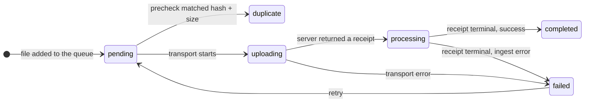

<!-- Generated by `task atlas:generate` from docs/atlas and source. Do not edit. -->

# Upload queue — one file

_lifecycle · source: `docs/atlas/views/lifecycle/upload-file.yaml`_

The browser-side state of one file in the global upload queue. The queue is intentionally not persisted: progress survives route changes but not a reload. A file only reaches completed when its server ingest receipt is terminal, not when its bytes finish uploading.

States are exactly the members of `ts:FileUploadStatus` [`web/src/features/upload/modules/process/types.ts:19`](../../../../web/src/features/upload/modules/process/types.ts#L19).

## States

| State | Meaning | Anchor |
| --- | --- | --- |
| pending | Queued; hashing in the worker. | `ts:features/upload#FileUploadStatus` [`web/src/features/upload/modules/process/types.ts:19`](../../../../web/src/features/upload/modules/process/types.ts#L19) |
| uploading | Batch or chunked transport in flight. | `ts:features/upload#createUploadTransport` [`web/src/features/upload/modules/process/transport.ts:59`](../../../../web/src/features/upload/modules/process/transport.ts#L59) |
| processing | Bytes accepted; following the ingest receipt. | `ts:waitForUploadOperations` [`web/src/lib/upload/uploadLifecycle.ts:144`](../../../../web/src/lib/upload/uploadLifecycle.ts#L144) |
| completed | The server ingest receipt is terminal and successful. | `go:commit.Coordinator.ApplyIngestReceipt` [`server/internal/commit/typed_catalog.go:93`](../../../../server/internal/commit/typed_catalog.go#L93) |
| duplicate | Precheck found the same content; the file was never sent. | `ts:DUPLICATE_STATUS` [`web/src/features/upload/modules/process/results.ts:6`](../../../../web/src/features/upload/modules/process/results.ts#L6) |
| failed | Transport or ingest failed; the File stays queued for retry. | `ts:features/upload#runUploadProcess` [`web/src/features/upload/modules/process/runner.ts:36`](../../../../web/src/features/upload/modules/process/runner.ts#L36) |

## Transitions

| From | To | Trigger | Anchor |
| --- | --- | --- | --- |
| [*] | pending | file added to the queue |  |
| pending | duplicate | precheck matched hash + size | `ts:precheckUploads` [`web/src/lib/upload/uploadTransport.ts:56`](../../../../web/src/lib/upload/uploadTransport.ts#L56) |
| pending | uploading | transport starts |  |
| uploading | processing | server returned a receipt |  |
| uploading | failed | transport error |  |
| processing | completed | receipt terminal, success |  |
| processing | failed | receipt terminal, ingest error |  |
| failed | pending | retry |  |

## Server and browser agree on "done"

The browser waits on the same ingest receipt the commit coordinator completes (see the upload sequence), so a file never shows completed while the Asset is not yet in the catalog.

## Related views

- [Browser upload to catalog Asset](../sequence/upload-to-catalog.md)
