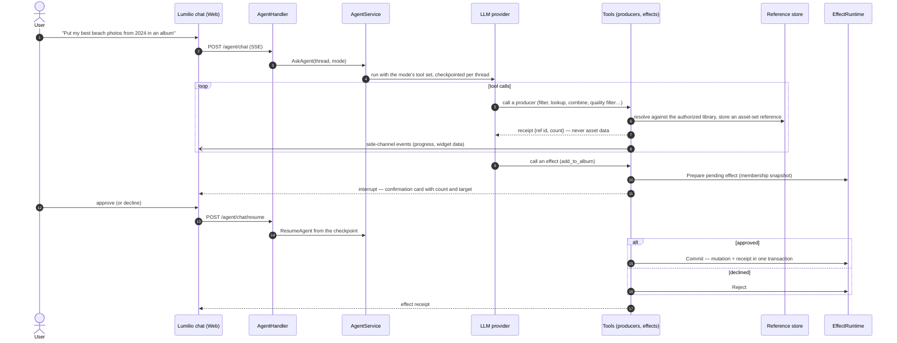

<!-- Generated by `task atlas:generate` from docs/atlas and source. Do not edit. -->

# Lumilio Agent run with a confirmed effect

_sequence · source: `docs/atlas/views/sequence/agent-effect.yaml`_

How the in-app assistant changes the library safely. The model only ever sees references to asset sets, never asset data. A mutating tool prepares a pending effect and interrupts the run; nothing changes until the user approves, and the mutation and its receipt then commit in one catalog transaction.

## Participants

| Participant | Anchor |
| --- | --- |
| User | `ext:User` |
| Lumilio chat (Web) | `ts:streamAgent` [`web/src/features/lumilio/api/agentStream.ts:139`](../../../../web/src/features/lumilio/api/agentStream.ts#L139) |
| AgentHandler | `go:handler.AgentHandler.Chat` [`server/internal/api/handler/agent_handler.go:102`](../../../../server/internal/api/handler/agent_handler.go#L102) |
| AgentService | `go:core.AgentService` [`server/internal/agent/core/agent_service.go:45`](../../../../server/internal/agent/core/agent_service.go#L45) |
| LLM provider | `go:llm.NewChatModel` [`server/internal/llm/chat_model.go:36`](../../../../server/internal/llm/chat_model.go#L36) |
| Tools (producers, effects) | `go:tools.RegisterAll` [`server/internal/agent/tools/common.go:107`](../../../../server/internal/agent/tools/common.go#L107) |
| Reference store | `sql:agent_refs` [`server/migrations/000001_storage_baseline.up.sql`](../../../../server/migrations/000001_storage_baseline.up.sql) |
| EffectRuntime | `go:core.EffectRuntime` [`server/internal/agent/core/effect_runtime.go:27`](../../../../server/internal/agent/core/effect_runtime.go#L27) |

## Steps

| # | From → To | Message | Anchor |
| --- | --- | --- | --- |
| 1 | user → web | "Put my best beach photos from 2024 in an album" |  |
| 2 | web → handler | POST /agent/chat (SSE) | `api:POST /api/v1/agent/chat` [`server/docs/swagger.yaml`](../../../../server/docs/swagger.yaml) |
| 3 | handler → service | AskAgent(thread, mode) | `go:core.AgentService.AskAgent` [`server/internal/agent/core/agent_service.go:47`](../../../../server/internal/agent/core/agent_service.go#L47) |
| 4 | service → llm | run with the mode's tool set, checkpointed per thread |  |
| 5 | llm → tools | _loop tool calls_ — call a producer (filter, lookup, combine, quality filter…) |  |
| 6 | tools → refs | _loop tool calls_ — resolve against the authorized library, store an asset-set reference | `go:core.ToolDependencies.CreateRef` [`server/internal/agent/core/tool_registry.go:256`](../../../../server/internal/agent/core/tool_registry.go#L256) |
| 7 | tools → llm | _loop tool calls_ — receipt {ref id, count} — never asset data | `go:tools.RefToolOutput` [`server/internal/agent/tools/common.go:15`](../../../../server/internal/agent/tools/common.go#L15) |
| 8 | tools → web | _loop tool calls_ — side-channel events (progress, widget data) | `go:core.SideChannelEvent` [`server/internal/agent/core/tool_registry.go:20`](../../../../server/internal/agent/core/tool_registry.go#L20) |
| 9 | llm → tools | call an effect (add_to_album) |  |
| 10 | tools → effects | Prepare pending effect (membership snapshot) | `go:core.EffectRuntime.Prepare` [`server/internal/agent/core/effect_runtime.go:62`](../../../../server/internal/agent/core/effect_runtime.go#L62) |
| 11 | tools → web | interrupt — confirmation card with count and target |  |
| 12 | user → web | approve (or decline) |  |
| 13 | web → handler | POST /agent/chat/resume | `api:POST /api/v1/agent/chat/resume` [`server/docs/swagger.yaml`](../../../../server/docs/swagger.yaml) |
| 14 | handler → service | ResumeAgent from the checkpoint | `go:core.AgentService.ResumeAgent` [`server/internal/agent/core/agent_service.go:48`](../../../../server/internal/agent/core/agent_service.go#L48) |
| 15 | tools → effects | _alt approved_ — Commit — mutation + receipt in one transaction | `go:core.EffectRuntime.Commit` [`server/internal/agent/core/effect_runtime.go:140`](../../../../server/internal/agent/core/effect_runtime.go#L140) |
| 16 | tools → effects | _else declined_ — Reject | `go:core.EffectRuntime.Reject` [`server/internal/agent/core/effect_runtime.go:132`](../../../../server/internal/agent/core/effect_runtime.go#L132) |
| 17 | tools → web | effect receipt |  |

## Invariants

Tools return receipts or typed recoverable errors, never asset rows. Effects are bounded by the membership captured at Prepare, so the library changing between the question and the approval cannot widen what is mutated. A run can be cancelled and an effect receipt reconciled even when inference is unavailable.

## Related views

- [System context](../architecture/system-context.md)
