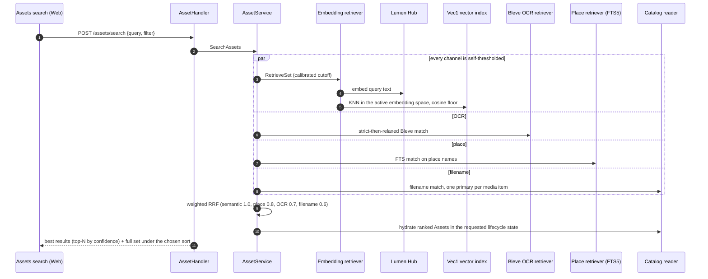

<!-- Generated by `task atlas:generate` from docs/atlas and source. Do not edit. -->

# Library search (fused retrieval)

_sequence · source: `docs/atlas/views/sequence/library-search.yaml`_

One search box, four independent channels. Each channel decides its own membership (a calibrated semantic cutoff, Bleve OCR matching, FTS place matching, filename matching); weighted reciprocal-rank fusion merges them and the fused set is the result. Search degrades gracefully when Lumen is unavailable.

## Participants

| Participant | Anchor |
| --- | --- |
| Assets search (Web) | `ts:useAssetsSearch` [`web/src/features/assets/api/useAssetsSearch.ts:61`](../../../../web/src/features/assets/api/useAssetsSearch.ts#L61) |
| AssetHandler | `go:handler.AssetHandler.SearchAssets` [`server/internal/api/handler/asset_query_handler.go:528`](../../../../server/internal/api/handler/asset_query_handler.go#L528) |
| AssetService | `go:service.AssetService` [`server/internal/service/asset_service.go:48`](../../../../server/internal/service/asset_service.go#L48) |
| Embedding retriever | `go:search.EmbeddingRetriever` [`server/internal/search/retrievers.go:26`](../../../../server/internal/search/retrievers.go#L26) |
| Lumen Hub | `go:service.LumenService` [`server/internal/service/lumen_service.go:34`](../../../../server/internal/service/lumen_service.go#L34) |
| Vec1 vector index | `sql:search_embeddings_vec` [`server/migrations/000001_storage_baseline.up.sql`](../../../../server/migrations/000001_storage_baseline.up.sql) |
| Bleve OCR retriever | `go:search.BleveOCRRetriever` [`server/internal/search/retrievers.go:260`](../../../../server/internal/search/retrievers.go#L260) |
| Place retriever (FTS5) | `sql:location_search_fts` [`server/migrations/000001_storage_baseline.up.sql`](../../../../server/migrations/000001_storage_baseline.up.sql) |
| Catalog reader | `go:search.HydrateAssets` [`server/internal/search/retrievers.go:423`](../../../../server/internal/search/retrievers.go#L423) |

## Steps

| # | From → To | Message | Anchor |
| --- | --- | --- | --- |
| 1 | web → handler | POST /assets/search {query, filter} | `api:POST /api/v1/assets/search` [`server/docs/swagger.yaml`](../../../../server/docs/swagger.yaml) |
| 2 | handler → service | SearchAssets | `go:service.AssetService.SearchAssets` [`server/internal/service/asset_service.go:111`](../../../../server/internal/service/asset_service.go#L111) |
| 3 | service → semantic | _par every channel is self-thresholded_ — RetrieveSet (calibrated cutoff) | `go:search.EmbeddingRetriever.RetrieveSet` [`server/internal/search/setretrieve.go:148`](../../../../server/internal/search/setretrieve.go#L148) |
| 4 | semantic → lumen | _par every channel is self-thresholded_ — embed query text | `go:service.LumenService.SemanticTextEmbed` [`server/internal/service/lumen_service.go:35`](../../../../server/internal/service/lumen_service.go#L35) |
| 5 | semantic → vec | _par every channel is self-thresholded_ — KNN in the active embedding space, cosine floor |  |
| 6 | service → ocr | _else OCR_ — strict-then-relaxed Bleve match | `go:search.BleveOCRRetriever.Retrieve` [`server/internal/search/retrievers.go:273`](../../../../server/internal/search/retrievers.go#L273) |
| 7 | service → place | _else place_ — FTS match on place names | `go:search.NewPlaceRetriever` [`server/internal/search/retrievers.go:197`](../../../../server/internal/search/retrievers.go#L197) |
| 8 | service → catalog | _else filename_ — filename match, one primary per media item |  |
| 9 | service → service | weighted RRF (semantic 1.0, place 0.8, OCR 0.7, filename 0.6) | `go:search.FuseSet` [`server/internal/search/setretrieve.go:359`](../../../../server/internal/search/setretrieve.go#L359) |
| 10 | service → catalog | hydrate ranked Assets in the requested lifecycle state | `go:service.assetService.searchAssetsFusedSet` [`server/internal/service/asset_search_fused.go:89`](../../../../server/internal/service/asset_search_fused.go#L89) |
| 11 | handler → web | best results (top-N by confidence) + full set under the chosen sort |  |

## No TopK anywhere

The fused set is the answer; "best results" is a confidence-ordered subset of it, and the results tier is the same set under the requested sort. Each channel only has a large safety cap.

## Degradation

If Lumen is not configured or fails, the semantic channel is skipped and the response is flagged `semantic_unavailable`; OCR, place, and filename matches still answer.

## Related views

- [System context](../architecture/system-context.md)
- [Background work — desired state to applied state](../dataflow/background-work.md)
