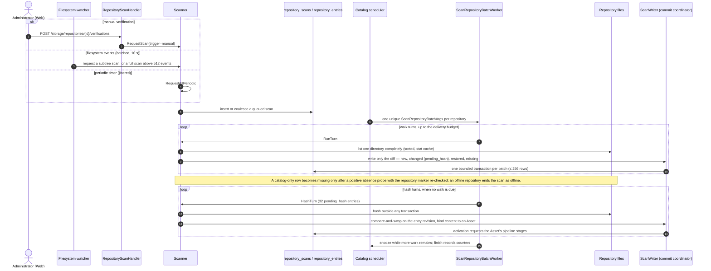

<!-- Generated by `task atlas:generate` from docs/atlas and source. Do not edit. -->

# Repository scan (scan index)

_sequence · source: `docs/atlas/views/sequence/repository-scan.yaml`_

How the catalog learns what is on disk. Scan requests from an administrator, the filesystem watcher, or the periodic timer are only queued rows; one River delivery per repository runs bounded walk turns first and hashes only when no walk is due. Absence is never inferred from a hint.

## Participants

| Participant | Anchor |
| --- | --- |
| Administrator (Web) | `ts:features/repositories#useRepositoryScan` [`web/src/features/repositories/api/useRepositoryScan.ts:22`](../../../../web/src/features/repositories/api/useRepositoryScan.ts#L22) |
| Filesystem watcher | `go:scan.Watcher` [`server/internal/storage/scan/watcher.go:27`](../../../../server/internal/storage/scan/watcher.go#L27) |
| RepositoryScanHandler | `go:handler.RepositoryScanHandler` [`server/internal/api/handler/repository_scan_handler.go:253`](../../../../server/internal/api/handler/repository_scan_handler.go#L253) |
| Scanner | `go:scan.Scanner` [`server/internal/storage/scan/scanner.go:120`](../../../../server/internal/storage/scan/scanner.go#L120) |
| repository_scans / repository_entries | `sql:repository_entries` [`server/migrations/000001_storage_baseline.up.sql`](../../../../server/migrations/000001_storage_baseline.up.sql) |
| Catalog scheduler | `go:queue.Scheduler` [`server/internal/queue/scheduler.go:28`](../../../../server/internal/queue/scheduler.go#L28) |
| ScanRepositoryBatchWorker | `go:queue.ScanRepositoryBatchWorker` [`server/internal/queue/macro_boundary_workers.go:40`](../../../../server/internal/queue/macro_boundary_workers.go#L40) |
| Repository files | `go:server/internal/storage.RepositoryFS` [`server/internal/storage/repository_fs.go:187`](../../../../server/internal/storage/repository_fs.go#L187) |
| ScanWriter (commit coordinator) | `go:commit.ScanWriter` [`server/internal/commit/scan_writer.go:14`](../../../../server/internal/commit/scan_writer.go#L14) |

## Steps

| # | From → To | Message | Anchor |
| --- | --- | --- | --- |
| 1 | admin → api | _alt manual verification_ — POST /storage/repositories/{id}/verifications | `api:POST /api/v1/storage/repositories/{id}/verifications` [`server/docs/swagger.yaml`](../../../../server/docs/swagger.yaml) |
| 2 | api → scanner | _alt manual verification_ — RequestScan(trigger=manual) | `go:scan.Scanner.RequestScan` [`server/internal/storage/scan/commands.go:28`](../../../../server/internal/storage/scan/commands.go#L28) |
| 3 | watcher → scanner | _else filesystem events (batched, 10 s)_ — request a subtree scan, or a full scan above 512 events | `go:scan.Watcher.Run` [`server/internal/storage/scan/watcher.go:104`](../../../../server/internal/storage/scan/watcher.go#L104) |
| 4 | scanner → scanner | _else periodic timer (jittered)_ — RequestAllPeriodic | `go:scan.Scanner.RequestAllPeriodic` [`server/internal/storage/scan/commands.go:47`](../../../../server/internal/storage/scan/commands.go#L47) |
| 5 | scanner → catalog | insert or coalesce a queued scan |  |
| 6 | scheduler → worker | one unique ScanRepositoryBatchArgs per repository | `go:jobs.ScanRepositoryBatchArgs` [`server/internal/queue/jobs/macro.go:68`](../../../../server/internal/queue/jobs/macro.go#L68) |
| 7 | worker → scanner | _loop walk turns, up to the delivery budget_ — RunTurn | `go:scan.Scanner.RunTurn` [`server/internal/storage/scan/walk.go:66`](../../../../server/internal/storage/scan/walk.go#L66) |
| 8 | scanner → disk | _loop walk turns, up to the delivery budget_ — list one directory completely (sorted, stat cache) | `go:scan.walkTurn.processDirectory` [`server/internal/storage/scan/walk.go:339`](../../../../server/internal/storage/scan/walk.go#L339) |
| 9 | scanner → writer | _loop walk turns, up to the delivery budget_ — write only the diff — new, changed (pending_hash), restored, missing | `go:scan.walkTurn.flush` [`server/internal/storage/scan/walk.go:672`](../../../../server/internal/storage/scan/walk.go#L672) |
| 10 | writer → catalog | _loop walk turns, up to the delivery budget_ — one bounded transaction per batch (≤ 256 rows) |  |
| 11 | worker → scanner | _loop hash turns, when no walk is due_ — HashTurn (32 pending_hash entries) | `go:scan.Scanner.HashTurn` [`server/internal/storage/scan/hash.go:37`](../../../../server/internal/storage/scan/hash.go#L37) |
| 12 | scanner → disk | _loop hash turns, when no walk is due_ — hash outside any transaction |  |
| 13 | scanner → writer | _loop hash turns, when no walk is due_ — compare-and-swap on the entry revision, bind content to an Asset | `go:scan.Scanner.commitHashTx` [`server/internal/storage/scan/hash.go:172`](../../../../server/internal/storage/scan/hash.go#L172) |
| 14 | writer → catalog | _loop hash turns, when no walk is due_ — activation requests the Asset's pipeline stages | `go:service.ApplyAssetActivationTx` [`server/internal/service/asset_activation.go:22`](../../../../server/internal/service/asset_activation.go#L22) |
| 15 | worker → scheduler | snooze while more work remains; finish records counters |  |

## Disk is the truth

The catalog mirrors each repository tree in repository_entries, one row per file or directory. A full scan is the authority; watcher events only make the next scan sooner. Nothing in this flow unlinks, trashes, or purges a file.

## Bounded writer holds

No filesystem I/O, hashing, or sleeping happens inside a catalog transaction. Write batches are at most 256 rows and are sized to stay inside the 25 ms writer-hold budget, so scanning a 40k-file repository never starves foreground requests.

## Related views

- [Asset lifecycle](../lifecycle/asset-lifecycle.md)
- [Background work — desired state to applied state](../dataflow/background-work.md)
- [Browser upload to catalog Asset](../sequence/upload-to-catalog.md)
