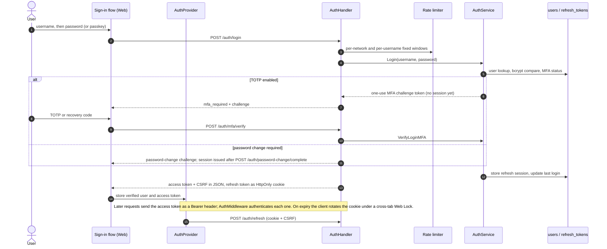

<!-- Generated by `task atlas:generate` from docs/atlas and source. Do not edit. -->

# Password sign-in with optional TOTP

_sequence · source: `docs/atlas/views/sequence/sign-in.yaml`_

How a browser session is established. The refresh credential is a host-only HttpOnly cookie; browser JavaScript holds only the short-lived access token and a session-bound CSRF proof. TOTP, when enabled, turns the first response into a one-use MFA challenge.

## Participants

| Participant | Anchor |
| --- | --- |
| User | `ext:User` |
| Sign-in flow (Web) | `ts:useLoginFlow` [`web/src/features/auth/flows/sign-in/useLoginFlow.ts:33`](../../../../web/src/features/auth/flows/sign-in/useLoginFlow.ts#L33) |
| AuthProvider | `ts:AuthProvider` [`web/src/features/auth/state/AuthProvider.tsx:32`](../../../../web/src/features/auth/state/AuthProvider.tsx#L32) |
| AuthHandler | `go:handler.AuthHandler` [`server/internal/api/handler/auth_handler.go:19`](../../../../server/internal/api/handler/auth_handler.go#L19) |
| Rate limiter | `go:ratelimit.Limiter` [`server/internal/api/ratelimit/limiter.go:33`](../../../../server/internal/api/ratelimit/limiter.go#L33) |
| AuthService | `go:service.AuthService` [`server/internal/service/auth_service.go:101`](../../../../server/internal/service/auth_service.go#L101) |
| users / refresh_tokens | `sql:refresh_tokens` [`server/migrations/000001_storage_baseline.up.sql`](../../../../server/migrations/000001_storage_baseline.up.sql) |

## Steps

| # | From → To | Message | Anchor |
| --- | --- | --- | --- |
| 1 | user → flow | username, then password (or passkey) |  |
| 2 | flow → handler | POST /auth/login | `api:POST /api/v1/auth/login` [`server/docs/swagger.yaml`](../../../../server/docs/swagger.yaml) |
| 3 | handler → limiter | per-network and per-username fixed windows | `go:handler.AuthHandler.Login` [`server/internal/api/handler/auth_handler.go:157`](../../../../server/internal/api/handler/auth_handler.go#L157) |
| 4 | handler → service | Login(username, password) | `go:service.AuthService.Login` [`server/internal/service/auth_service.go:271`](../../../../server/internal/service/auth_service.go#L271) |
| 5 | service → catalog | user lookup, bcrypt compare, MFA status |  |
| 6 | service → handler | _alt TOTP enabled_ — one-use MFA challenge token (no session yet) |  |
| 7 | handler → flow | _alt TOTP enabled_ — mfa_required + challenge |  |
| 8 | user → flow | _alt TOTP enabled_ — TOTP or recovery code |  |
| 9 | flow → handler | _alt TOTP enabled_ — POST /auth/mfa/verify | `api:POST /api/v1/auth/mfa/verify` [`server/docs/swagger.yaml`](../../../../server/docs/swagger.yaml) |
| 10 | handler → service | _alt TOTP enabled_ — VerifyLoginMFA | `go:service.AuthService.VerifyLoginMFA` [`server/internal/service/auth_mfa.go:527`](../../../../server/internal/service/auth_mfa.go#L527) |
| 11 | handler → flow | _else password change required_ — password-change challenge; session issued after POST /auth/password-change/complete | `api:POST /api/v1/auth/password-change/complete` [`server/docs/swagger.yaml`](../../../../server/docs/swagger.yaml) |
| 12 | service → catalog | store refresh session, update last login |  |
| 13 | handler → flow | access token + CSRF in JSON, refresh token as HttpOnly cookie | `go:handler.AuthHandler.installBrowserSession` [`server/internal/api/handler/auth_session.go:41`](../../../../server/internal/api/handler/auth_session.go#L41) |
| 14 | flow → provider | store verified user and access token |  |
| 15 | provider → handler | POST /auth/refresh (cookie + CSRF) | `ts:refreshBrowserSession` [`web/src/lib/http-commons/client.ts:114`](../../../../web/src/lib/http-commons/client.ts#L114) |

## What the browser can and cannot read

The refresh credential never reaches JavaScript. Every session exit converges on `resetSession`, which removes credentials, resets feature and global state, clears user-scoped preferences, and clears the Query cache before another user signs in.

## Related views

- [First-run bootstrap](../lifecycle/bootstrap.md)
- [System context](../architecture/system-context.md)
