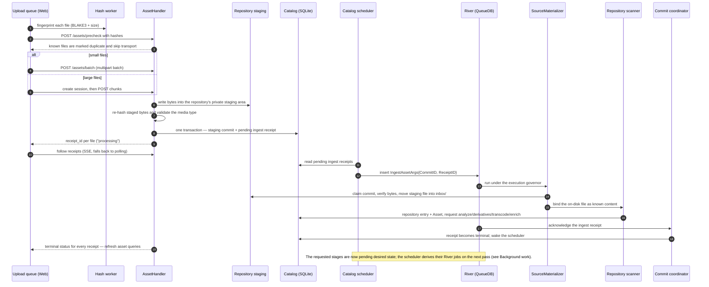

<!-- Generated by `task atlas:generate` from docs/atlas and source. Do not edit. -->

# Browser upload to catalog Asset

_sequence · source: `docs/atlas/views/sequence/upload-to-catalog.yaml`_

How a file chosen in the browser becomes a catalog Asset. The HTTP request only stages bytes and records durable intent; everything after that is derived background work, and the browser follows the ingest receipt until it is terminal.

## Participants

| Participant | Anchor |
| --- | --- |
| Upload queue (Web) | `ts:features/upload#runUploadProcess` [`web/src/features/upload/modules/process/runner.ts:36`](../../../../web/src/features/upload/modules/process/runner.ts#L36) |
| Hash worker | `ts:useGenerateHashcode` [`web/src/features/upload/modules/process/useGenerateHashcode.ts:34`](../../../../web/src/features/upload/modules/process/useGenerateHashcode.ts#L34) |
| AssetHandler | `go:handler.AssetHandler` [`server/internal/api/handler/asset_handler.go:26`](../../../../server/internal/api/handler/asset_handler.go#L26) |
| Repository staging | `go:server/internal/storage.StagingManager` [`server/internal/storage/staging_manager.go:23`](../../../../server/internal/storage/staging_manager.go#L23) |
| Catalog (SQLite) | `sql:catalog_operation_receipts` [`server/migrations/000001_storage_baseline.up.sql`](../../../../server/migrations/000001_storage_baseline.up.sql) |
| Catalog scheduler | `go:queue.Scheduler` [`server/internal/queue/scheduler.go:28`](../../../../server/internal/queue/scheduler.go#L28) |
| River (QueueDB) | `go:queue.IngestMacroWorker` [`server/internal/queue/macro_asset_workers.go:22`](../../../../server/internal/queue/macro_asset_workers.go#L22) |
| SourceMaterializer | `go:sourcing.SourceMaterializer` [`server/internal/sourcing/materializer.go:27`](../../../../server/internal/sourcing/materializer.go#L27) |
| Repository scanner | `go:scan.Scanner` [`server/internal/storage/scan/scanner.go:120`](../../../../server/internal/storage/scan/scanner.go#L120) |
| Commit coordinator | `go:commit.Coordinator` [`server/internal/commit/coordinator.go:122`](../../../../server/internal/commit/coordinator.go#L122) |

## Steps

| # | From → To | Message | Anchor |
| --- | --- | --- | --- |
| 1 | web → hasher | fingerprint each file (BLAKE3 + size) | `ts:useGenerateHashcode` [`web/src/features/upload/modules/process/useGenerateHashcode.ts:34`](../../../../web/src/features/upload/modules/process/useGenerateHashcode.ts#L34) |
| 2 | web → api | POST /assets/precheck with hashes | `api:POST /api/v1/assets/precheck` [`server/docs/swagger.yaml`](../../../../server/docs/swagger.yaml) |
| 3 | api → web | known files are marked duplicate and skip transport | `go:handler.AssetHandler.PrecheckUpload` [`server/internal/api/handler/asset_upload_handler.go:544`](../../../../server/internal/api/handler/asset_upload_handler.go#L544) |
| 4 | web → api | _alt small files_ — POST /assets/batch (multipart batch) | `api:POST /api/v1/assets/batch` [`server/docs/swagger.yaml`](../../../../server/docs/swagger.yaml) |
| 5 | web → api | _else large files_ — create session, then POST chunks | `api:POST /api/v1/assets/batch/sessions` [`server/docs/swagger.yaml`](../../../../server/docs/swagger.yaml) |
| 6 | api → staging | write bytes into the repository's private staging area | `go:server/internal/storage.StagingManager.CreateStagingFile` [`server/internal/storage/staging_manager.go:24`](../../../../server/internal/storage/staging_manager.go#L24) |
| 7 | api → api | re-hash staged bytes and validate the media type | `go:handler.AssetHandler.processCompletedUpload` [`server/internal/api/handler/asset_upload_handler.go:1098`](../../../../server/internal/api/handler/asset_upload_handler.go#L1098) |
| 8 | api → catalog | one transaction — staging commit + pending ingest receipt | `go:handler.AssetHandler.enqueueStagingCommit` [`server/internal/api/handler/asset_upload_handler.go:83`](../../../../server/internal/api/handler/asset_upload_handler.go#L83) |
| 9 | api → web | receipt_id per file ("processing") |  |
| 10 | web → api | follow receipts (SSE, falls back to polling) | `ts:waitForUploadOperations` [`web/src/lib/upload/uploadLifecycle.ts:144`](../../../../web/src/lib/upload/uploadLifecycle.ts#L144) |
| 11 | scheduler → catalog | read pending ingest receipts | `go:queue.Scheduler.ScheduleOnce` [`server/internal/queue/scheduler.go:70`](../../../../server/internal/queue/scheduler.go#L70) |
| 12 | scheduler → river | insert IngestAssetArgs{CommitID, ReceiptID} | `go:jobs.IngestAssetArgs` [`server/internal/queue/jobs/macro.go:17`](../../../../server/internal/queue/jobs/macro.go#L17) |
| 13 | river → materializer | run under the execution governor | `go:server/app.pipelineRuntime.ingest` [`server/app/pipeline_runtime.go:226`](../../../../server/app/pipeline_runtime.go#L226) |
| 14 | materializer → staging | claim commit, verify bytes, move staging file into inbox/ | `go:sourcing.SourceMaterializer.MaterializeCommit` [`server/internal/sourcing/materializer.go:141`](../../../../server/internal/sourcing/materializer.go#L141) |
| 15 | materializer → scanner | bind the on-disk file as known content | `go:scan.Scanner.BindKnownContent` [`server/internal/storage/scan/known.go:44`](../../../../server/internal/storage/scan/known.go#L44) |
| 16 | scanner → catalog | repository entry + Asset, request analyze/derivatives/transcode/enrich | `go:service.ApplyAssetActivationTx` [`server/internal/service/asset_activation.go:22`](../../../../server/internal/service/asset_activation.go#L22) |
| 17 | river → commits | acknowledge the ingest receipt | `go:commit.Coordinator.ApplyIngestReceipt` [`server/internal/commit/typed_catalog.go:93`](../../../../server/internal/commit/typed_catalog.go#L93) |
| 18 | commits → catalog | receipt becomes terminal; wake the scheduler |  |
| 19 | api → web | terminal status for every receipt — refresh asset queries | `go:handler.AssetHandler.StreamUploadOperationStatus` [`server/internal/api/handler/asset_upload_handler.go:837`](../../../../server/internal/api/handler/asset_upload_handler.go#L837) |

## Why the request never does the work

The HTTP handler's only durable effect is one catalog transaction that records the staged file and a pending receipt. If the Server, River, or QueueDB dies afterwards, the next scheduler pass derives the same ingest job again from the catalog. Nothing is lost and nothing runs twice past the commit coordinator's fences.

## Identity

The browser fingerprint is only a precheck hint. The server re-hashes the staged bytes, and the materializer re-verifies them before the move, so the catalog identity (full BLAKE3 + size) never trusts the client.

## Related views

- [Background work — desired state to applied state](../dataflow/background-work.md)
- [Asset lifecycle](../lifecycle/asset-lifecycle.md)
- [Repository scan (scan index)](../sequence/repository-scan.md)
