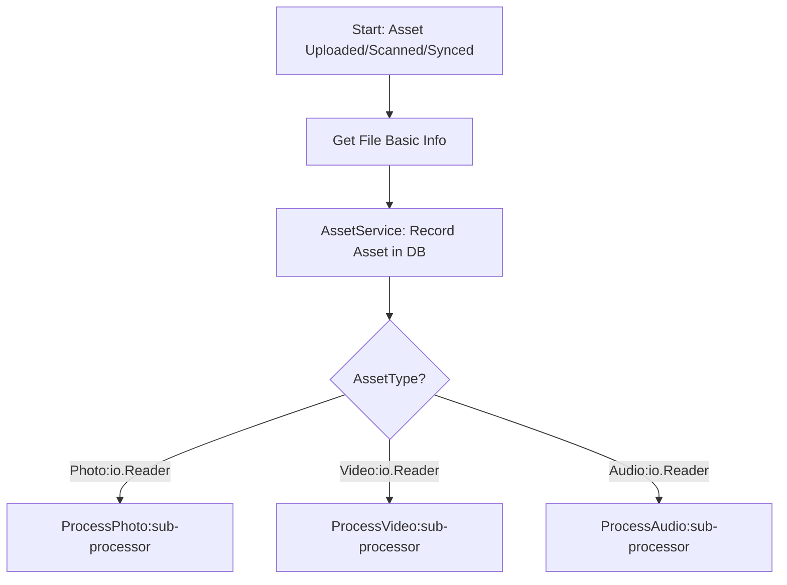

# Processors - `AssetProcessor`

*Author: Edwin Zhan, proofread by AI*

## Introduction

see `server/processors/asset_processor.go`

`AssetProcessor` depends on multiple services and storage systems. It is the core component responsible for handling all `Assets` uploaded, scanned, or synced by users. Many *sub-processors* are implemented as member functions of the `AssetProcessor` struct. They're responsible for more specific asset processing depending on different types of assets.

- `ProcessPhoto`
- `ProcessVideo`
- `ProcessAudio`

Each has a different workflow, which will be shown on this page later.

Currently, `AssetProcessor` depends on the following backend services:

- `MLService`
- `AssetService`

What does `AssetProcessor` care about, and what does it not care about?

*Care*

- `TaskInfo:` It needs information passed by the task, like filename, filepath, filehash, owner ID, upload timestamp, etc.
- `File:` It needs an `io.Reader` to process assets as streams. Ideally, only `io.Reader` should appear in all processing steps.

*Don't Care*

- `Task Enqueue and Dequeue:` It doesn't care about how tasks are managed; only context will be passed through all processing functions to allow a `Task` to be gracefully stopped.
- `Database Operations:` It doesn't care about how the DB is operated; it always should call `AssetService` to update the database.
- `Storage:` It doesn't care about and should not be able to do anything with `Storage` or the file system, except reading queued files from the `filepath` passed through by `Task`.

### Workflow

The top-level workflow for `AssetProcessor` is really simple.

1. Read the asset's basic attributes from task info.
2. Call `AssetService` to create a new DB record for the asset.
3. Open an `io.Reader` for `sub-processors` from the staged file.
4. Pass the `io.Reader` to `sub-processors`.
