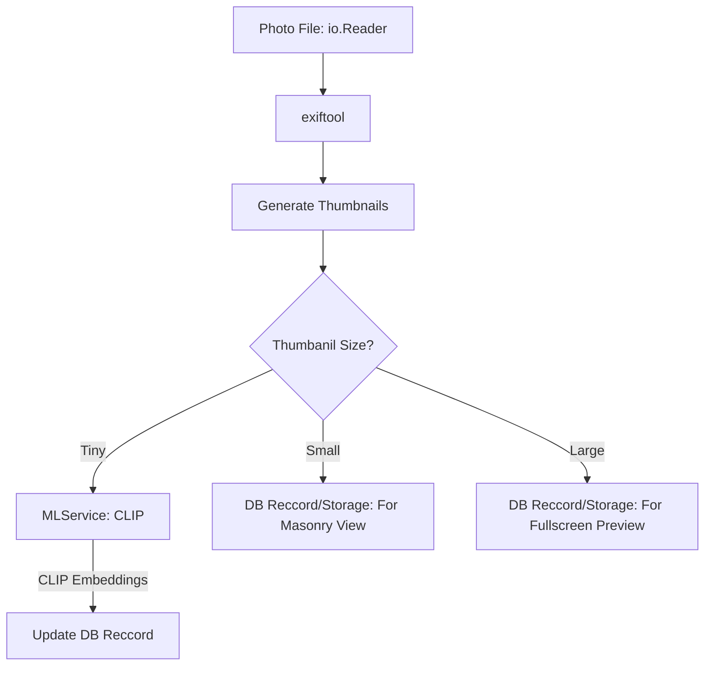

# Processor -  `ProcessPhoto`

*Author: Edwin Zhan, proofread by AI*

## Introduction

see `server/internal/processors/photo_processor.go`

`ProcessPhoto` is a member function of `AssetProcessor`, is been seen as one of the *sub-processors*. It only depends on the `context.Context`, `Asset`, `io.Reader`. All operations should be completed under file stream. It is responsible for extract the `PhotoSpecificMetadata` for `AssetTypePhoto`.
Main Process includes exif, thumbnails, CLIP embeddings.

### Photo Specific Workflow

