# Authentication System — Business Flow Diagrams

## System Overview

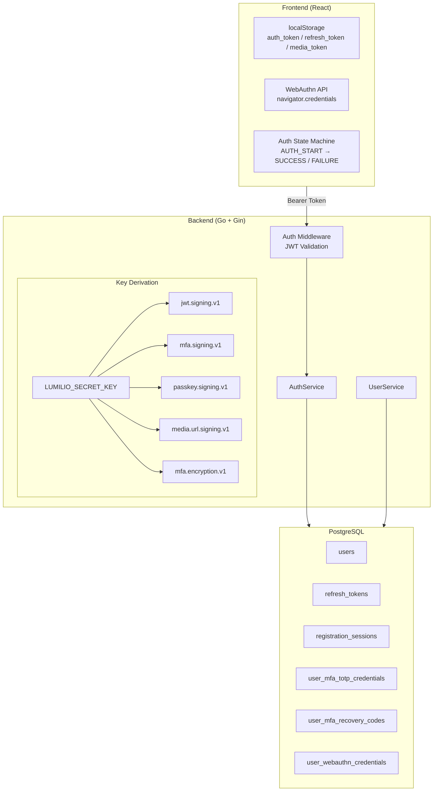

---

## 1. User Registration (Staged Flow)

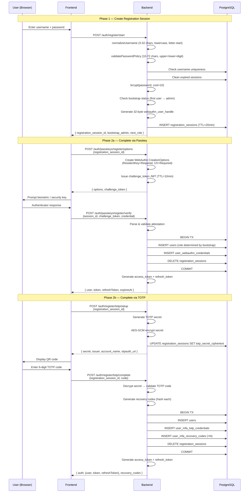

---

## 2. Login Flow (Password + MFA)

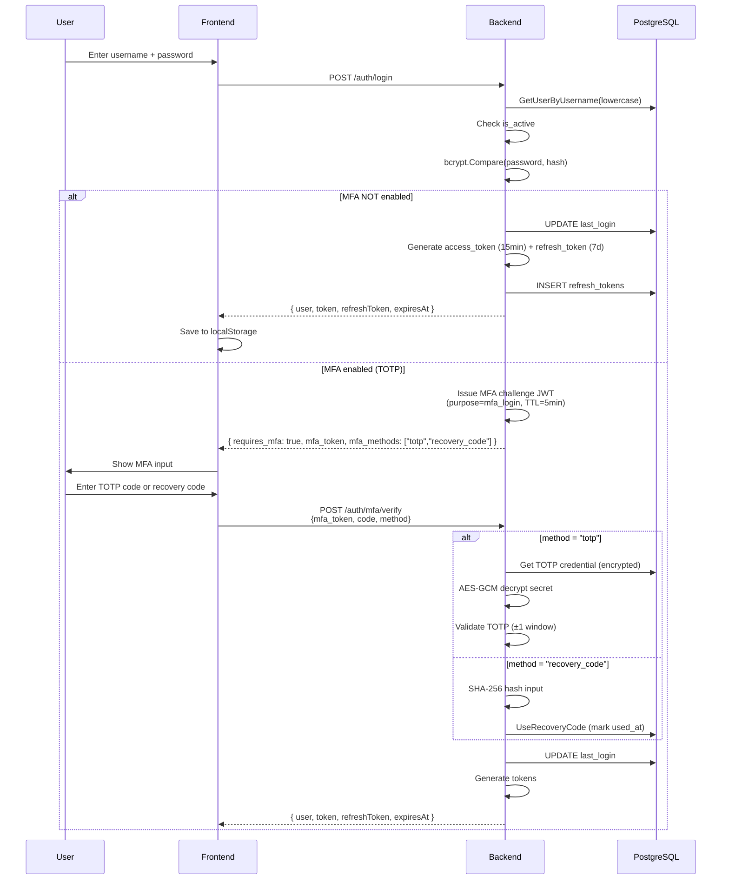

---

## 3. Passkey Login Flow

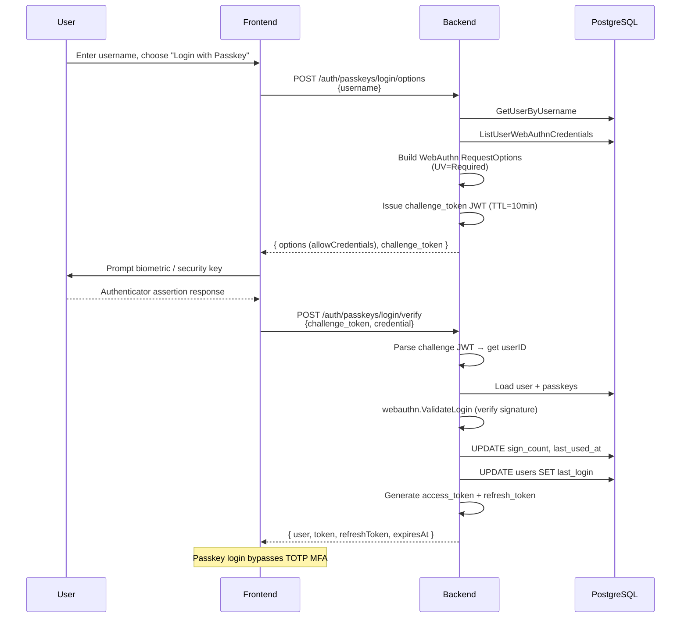

---

## 4. Token Lifecycle

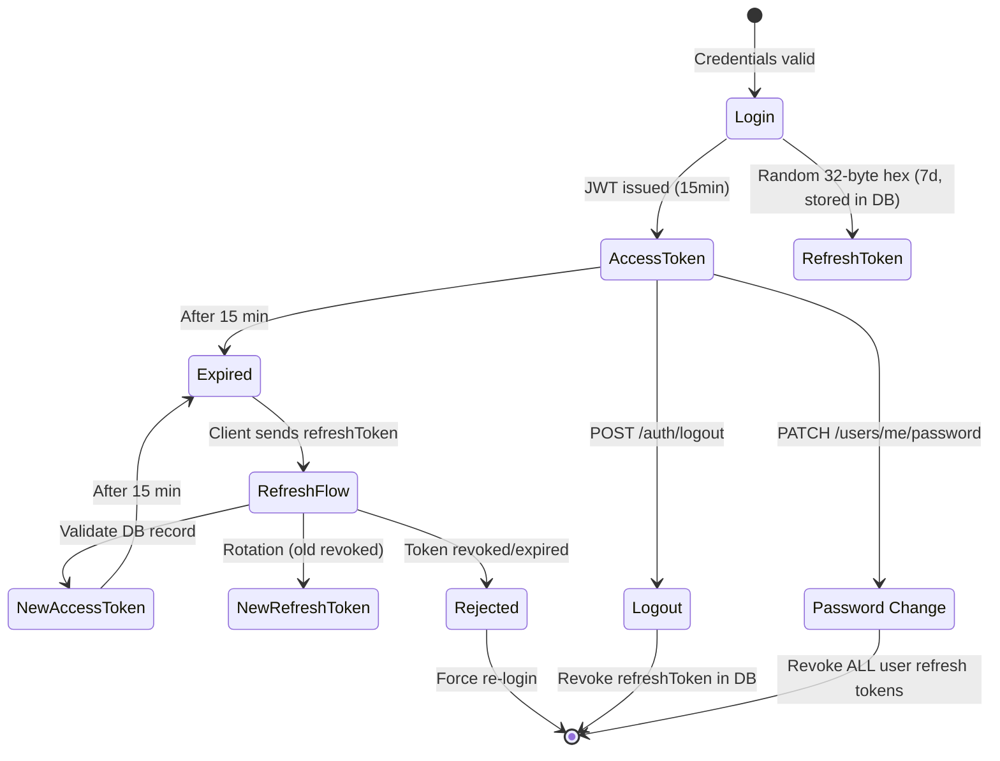

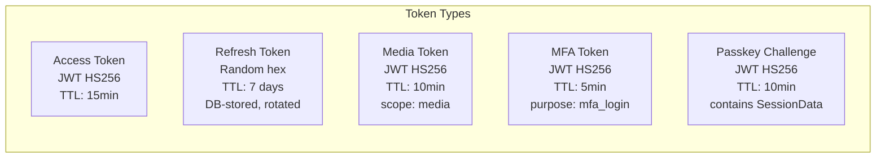

---

## 5. MFA Management (Authenticated User)

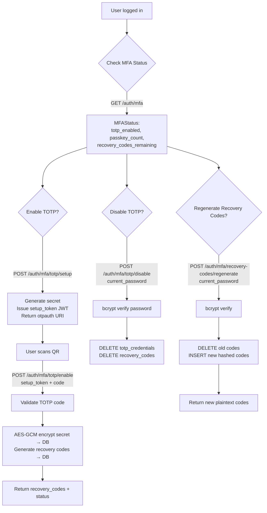

---

## 6. Passkey Enrollment & Management

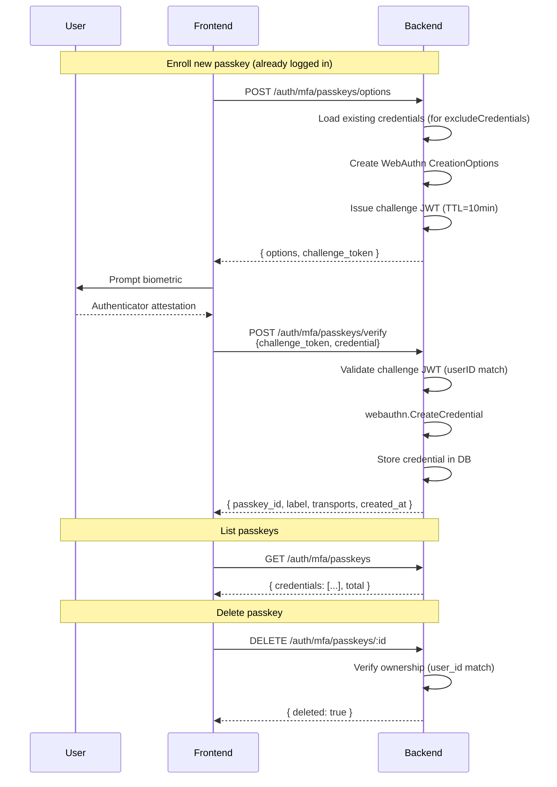

---

## 7. Admin User Management

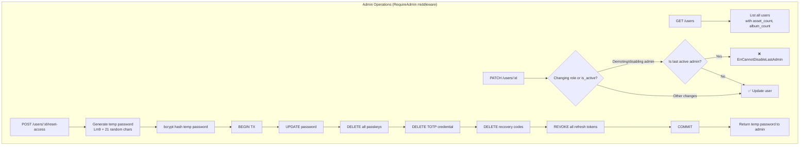

---

## 8. Role & Permission Model

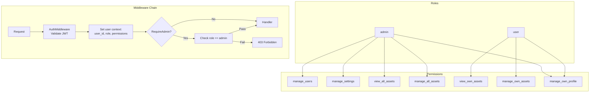

---

## 9. Bootstrap Flow (First User)

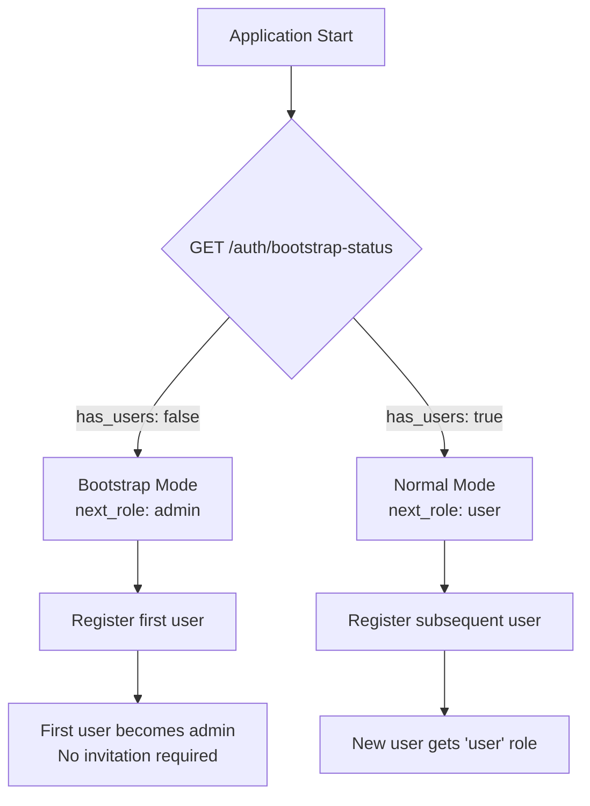

---

## 10. Secret Key Architecture

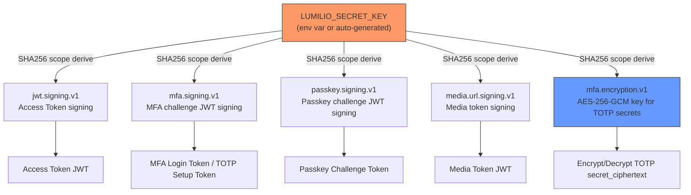

---

## API Route Map

| Method | Path | Auth | Description |
|--------|------|------|-------------|
| GET | `/auth/bootstrap-status` | — | Check if first-user bootstrap mode |
| POST | `/auth/register/start` | — | Create registration session |
| POST | `/auth/register/totp/setup` | — | Begin TOTP during registration |
| POST | `/auth/register/totp/complete` | — | Complete registration with TOTP |
| POST | `/auth/passkeys/register/options` | — | WebAuthn creation options (registration) |
| POST | `/auth/passkeys/register/verify` | — | Verify passkey attestation (registration) |
| POST | `/auth/login` | — | Password login |
| POST | `/auth/passkeys/login/options` | — | WebAuthn request options (login) |
| POST | `/auth/passkeys/login/verify` | — | Verify passkey assertion (login) |
| POST | `/auth/mfa/verify` | — | Verify MFA challenge |
| POST | `/auth/refresh` | — | Refresh access token |
| POST | `/auth/logout` | — | Revoke refresh token |
| GET | `/auth/me` | Bearer | Get current user |
| GET | `/auth/media-token` | Bearer | Get short-lived media token |
| GET | `/auth/mfa` | Bearer | Get MFA status |
| POST | `/auth/mfa/totp/setup` | Bearer | Begin TOTP setup |
| POST | `/auth/mfa/totp/enable` | Bearer | Enable TOTP |
| POST | `/auth/mfa/totp/disable` | Bearer | Disable TOTP (requires password) |
| POST | `/auth/mfa/recovery-codes/regenerate` | Bearer | Regenerate recovery codes |
| GET | `/auth/mfa/passkeys` | Bearer | List enrolled passkeys |
| POST | `/auth/mfa/passkeys/options` | Bearer | Begin passkey enrollment |
| POST | `/auth/mfa/passkeys/verify` | Bearer | Complete passkey enrollment |
| DELETE | `/auth/mfa/passkeys/:id` | Bearer | Delete a passkey |
| PATCH | `/users/me/profile` | Bearer | Update own profile |
| PATCH | `/users/me/password` | Bearer | Change own password |
| GET | `/users` | Admin | List all users |
| PATCH | `/users/:id` | Admin | Update any user |
| POST | `/users/:id/reset-access` | Admin | Reset user credentials |
