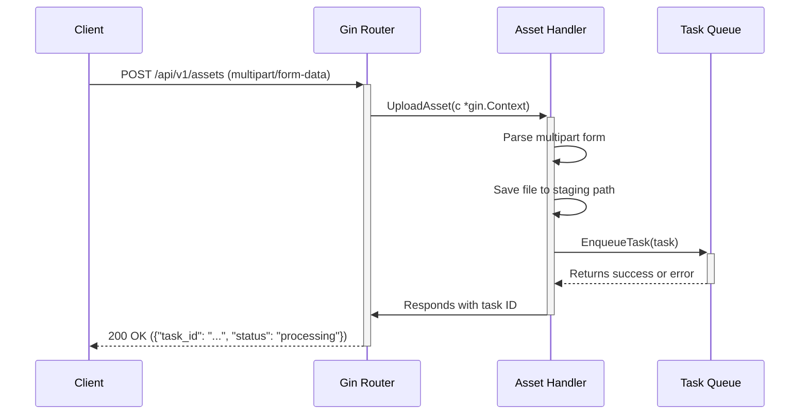
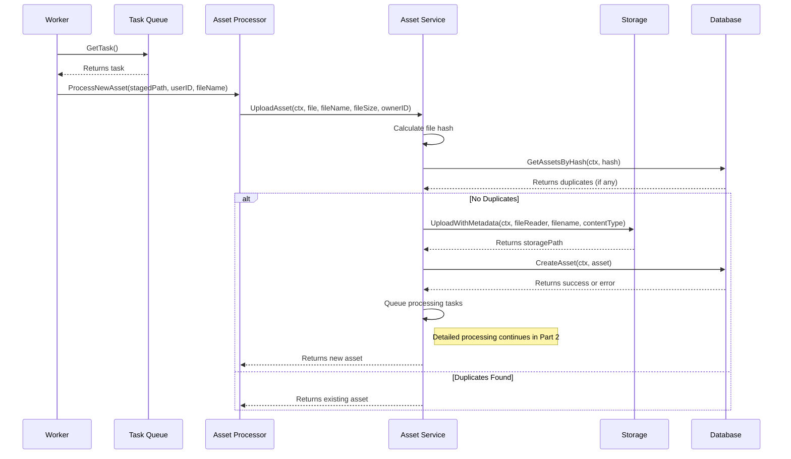
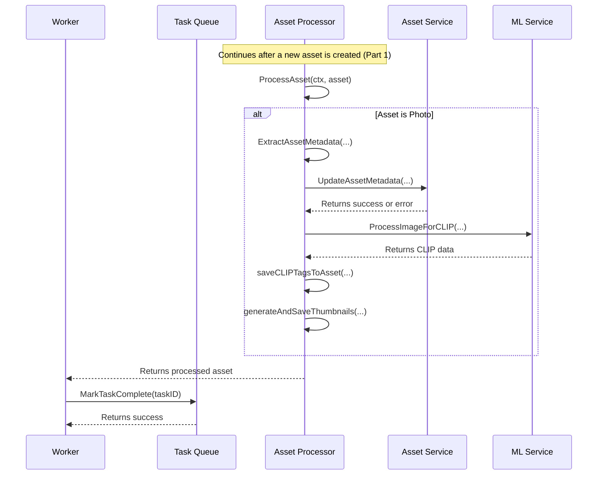

# Upload - Backend

## Initial Request

```mermaid
sequenceDiagram
    participant Client
    participant GinRouter as Gin Router
    participant AssetHandler as Asset Handler
    participant TaskQueue as Task Queue

    Client->>+GinRouter: POST /api/v1/assets (multipart/form-data)
    GinRouter->>+AssetHandler: UploadAsset(c *gin.Context)
    AssetHandler->>AssetHandler: Parse multipart form
    AssetHandler->>AssetHandler: Save file to staging path
    AssetHandler->>+TaskQueue: EnqueueTask(task)
    TaskQueue-->>-AssetHandler: Returns success or error
    AssetHandler->>-GinRouter: Responds with task ID
    GinRouter-->>-Client: 200 OK ({"task_id": "...", "status": "processing"})
```

## Part 1: Asset Ingestion and Deduplication

```mermaid
sequenceDiagram
    participant Worker
    participant TaskQueue as Task Queue
    participant AssetProcessor as Asset Processor
    participant AssetService as Asset Service
    participant Storage
    participant DB as Database

    Worker->>TaskQueue: GetTask()
    TaskQueue-->>Worker: Returns task

    Worker->>AssetProcessor: ProcessNewAsset(stagedPath, userID, fileName)
    AssetProcessor->>AssetService: UploadAsset(ctx, file, fileName, fileSize, ownerID)
    AssetService->>AssetService: Calculate file hash
    AssetService->>DB: GetAssetsByHash(ctx, hash)
    DB-->>AssetService: Returns duplicates (if any)

    alt No Duplicates
        AssetService->>Storage: UploadWithMetadata(ctx, fileReader, filename, contentType)
        Storage-->>AssetService: Returns storagePath
        AssetService->>DB: CreateAsset(ctx, asset)
        DB-->>AssetService: Returns success or error
        AssetService->>AssetService: Queue processing tasks
        note right of AssetService: Detailed processing continues in Part 2
        AssetService-->>AssetProcessor: Returns new asset

    else Duplicates Found
        AssetService-->>AssetProcessor: Returns existing asset
    end
```

## Part 2: Asset Post-Processing

```mermaid
sequenceDiagram
    participant Worker
    participant TaskQueue as Task Queue
    participant AssetProcessor as Asset Processor
    participant AssetService as Asset Service
    participant MLService as ML Service

    note over AssetProcessor: Continues after a new asset is created (Part 1)
    AssetProcessor->>AssetProcessor: ProcessAsset(ctx, asset)
    
    alt Asset is Photo
        AssetProcessor->>AssetProcessor: ExtractAssetMetadata(...)
        AssetProcessor->>AssetService: UpdateAssetMetadata(...)
        AssetService-->>AssetProcessor: Returns success or error
        
        AssetProcessor->>MLService: ProcessImageForCLIP(...)
        MLService-->>AssetProcessor: Returns CLIP data
        
        AssetProcessor->>AssetProcessor: saveCLIPTagsToAsset(...)
        AssetProcessor->>AssetProcessor: generateAndSaveThumbnails(...)
    end
    
    AssetProcessor-->>Worker: Returns processed asset

    Worker->>TaskQueue: MarkTaskComplete(taskID)
    TaskQueue-->>Worker: Returns success
```