# Upload Workflow — Business Flow Diagrams

## System Overview

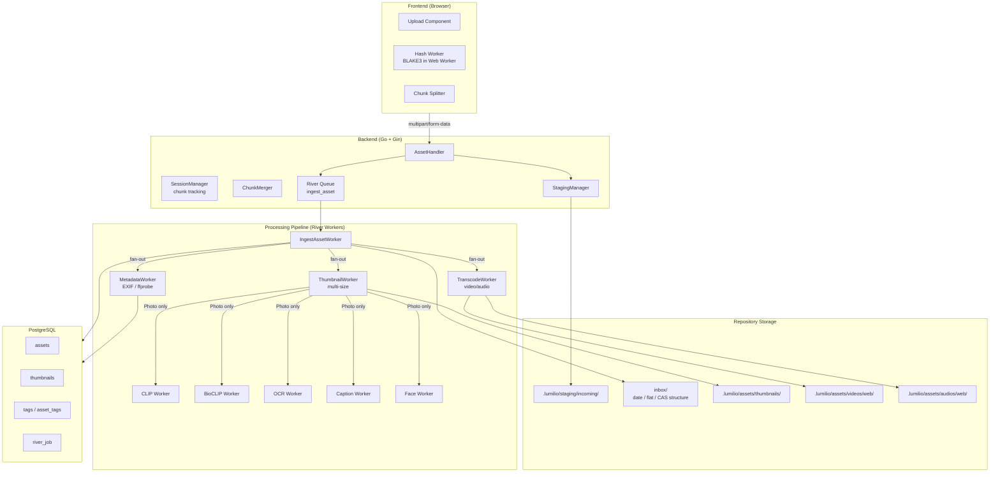

---

## 1. Single File Upload

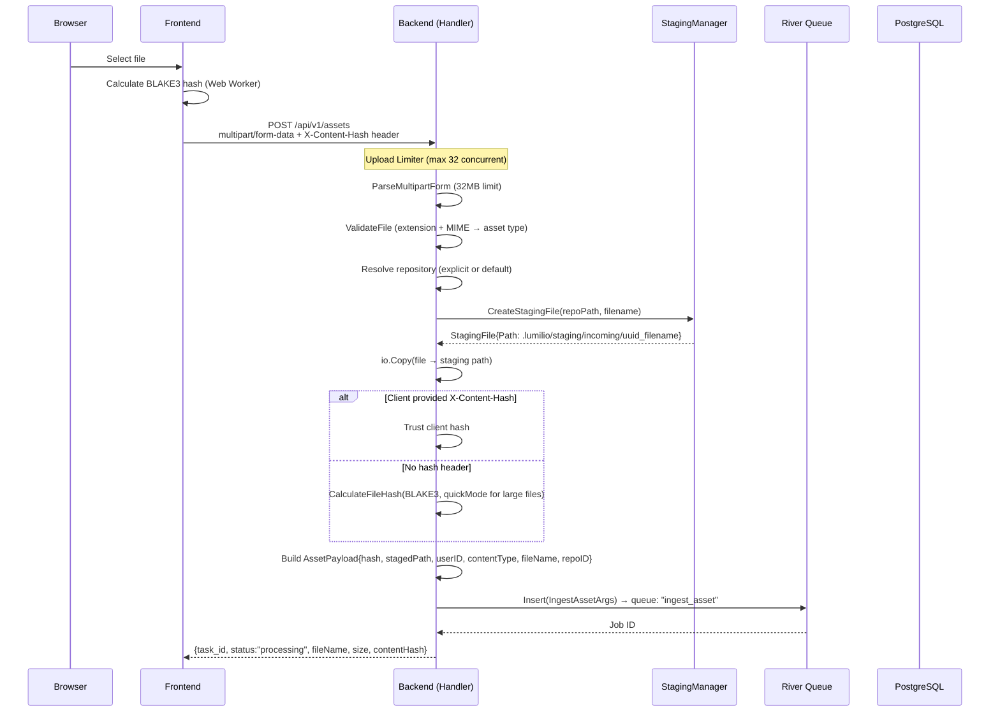

---

## 2. Batch Upload with Chunking

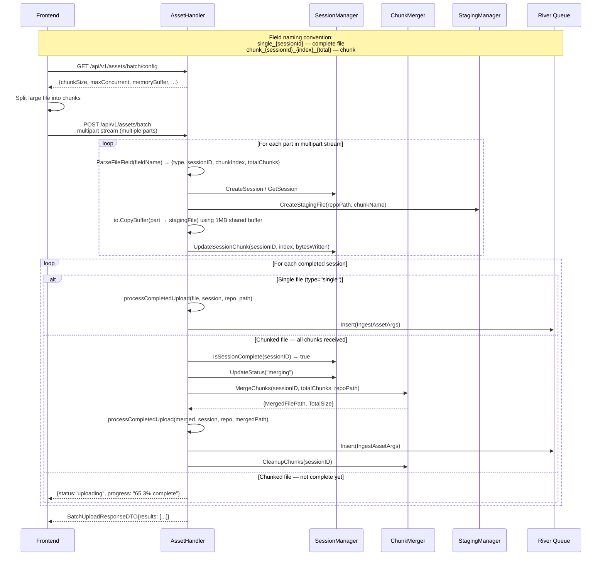

---

## 3. Upload Session Lifecycle

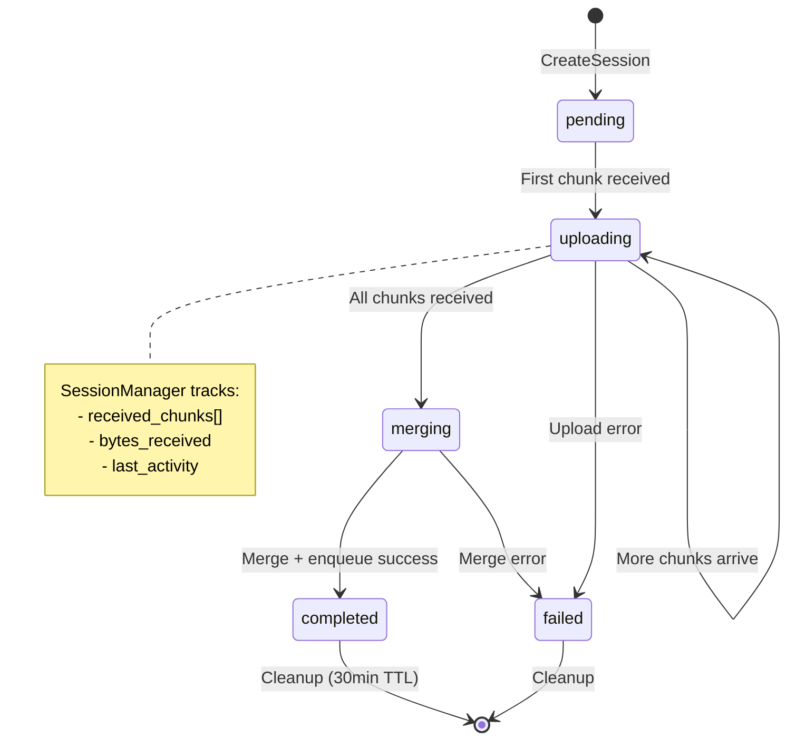

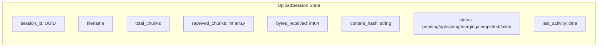

---

## 4. Ingest Worker — Asset Creation & Fan-out

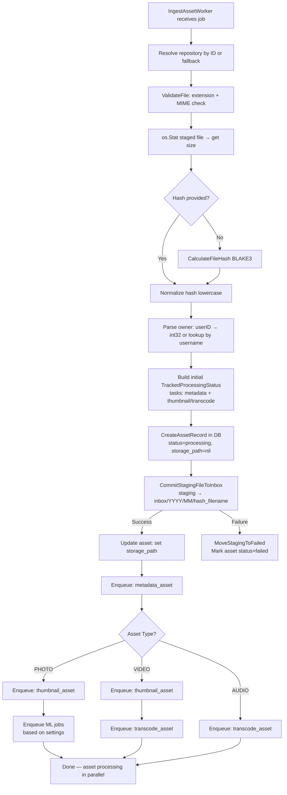

---

## 5. Processing Pipeline (Parallel Workers)

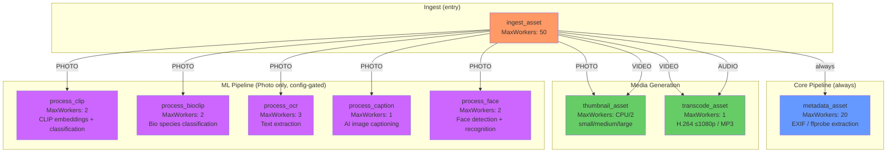

---

## 6. Pipeline Task Status Tracking

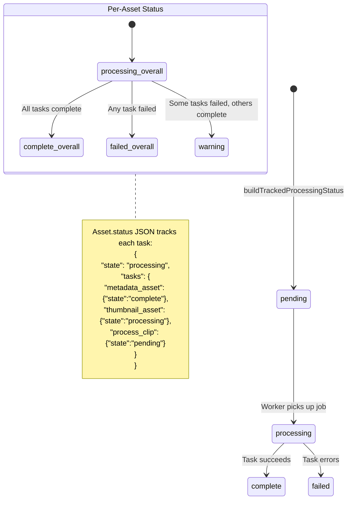

---

## 7. Repository Scan (Filesystem Discovery)

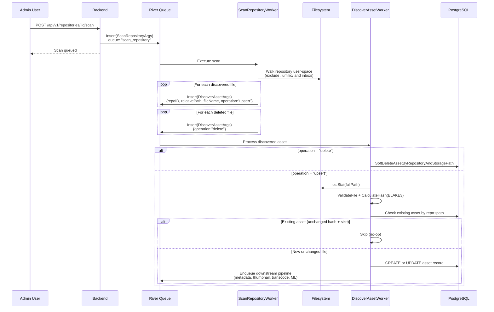

---

## 8. Storage Architecture

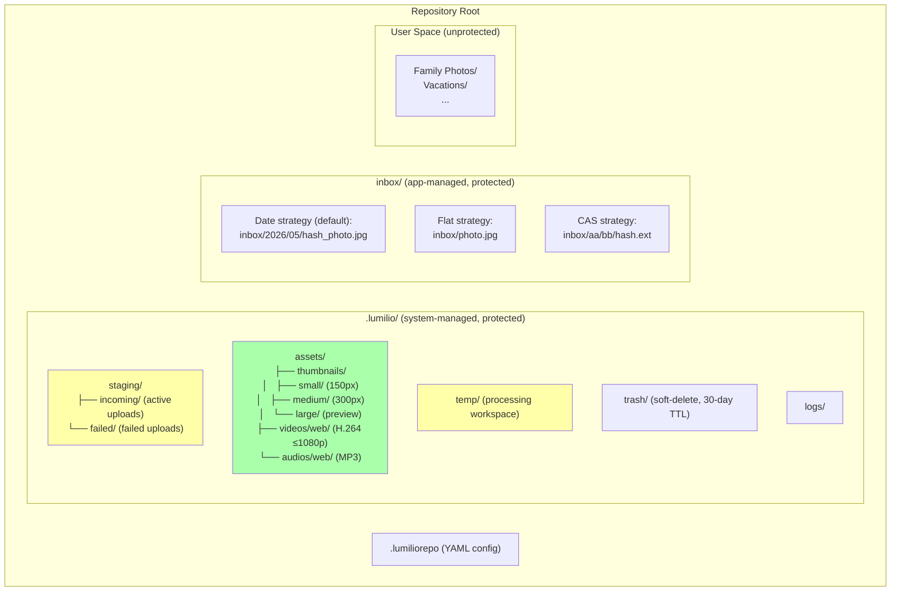

---

## 9. Storage Strategies (Inbox Commit)

```mermaid
flowchart TD
    COMMIT[CommitStagingFileToInbox] --> LOAD[Load .lumiliorepo config]
    LOAD --> STRATEGY{storage_strategy?}

    STRATEGY -->|"date" (default)| DATE_PATH["inbox/YYYY/MM/filename<br/>e.g. inbox/2026/05/IMG_001.jpg"]
    STRATEGY -->|"flat"| FLAT_PATH["inbox/filename<br/>e.g. inbox/IMG_001.jpg"]
    STRATEGY -->|"cas"| CAS_PATH["inbox/aa/bb/cc/hash.ext<br/>e.g. inbox/a1/b2/c3d4e5...jpg"]

    DATE_PATH --> DUP{Duplicate filename?}
    FLAT_PATH --> DUP
    CAS_PATH --> DONE[Move staging → final path]

    DUP -->|handle_duplicate: "rename"| RENAME["filename (1).jpg"]
    DUP -->|handle_duplicate: "uuid"| UUID_SUFFIX["filename_uuid.jpg"]
    DUP -->|handle_duplicate: "overwrite"| OVERWRITE[Replace existing]
    DUP -->|No duplicate| DONE

    RENAME --> DONE
    UUID_SUFFIX --> DONE
    OVERWRITE --> DONE
```

---

## 10. Upload Configuration (Memory-Adaptive)

```mermaid
flowchart LR
    subgraph "GET /assets/batch/config"
        MM[MemoryMonitor] --> |GetOptimalChunkConfig| CONFIG
    end

    subgraph CONFIG["Response"]
        CS[chunkSize: 5MB default]
        MC[maxConcurrent: 3]
        MB[memoryBuffer: 100MB]
        UI[updateInterval: 30s]
        MGC[mergeConcurrency: 2]
        MIR[maxInFlightRequests: 3]
    end

    subgraph "Server Limits"
        UL[uploadLimiter: chan(32)<br/>HTTP/2 multiplexing]
        ST[Session timeout: 30min]
        BG[Background cleanup: expired sessions]
    end
```

---

## 11. File Validation

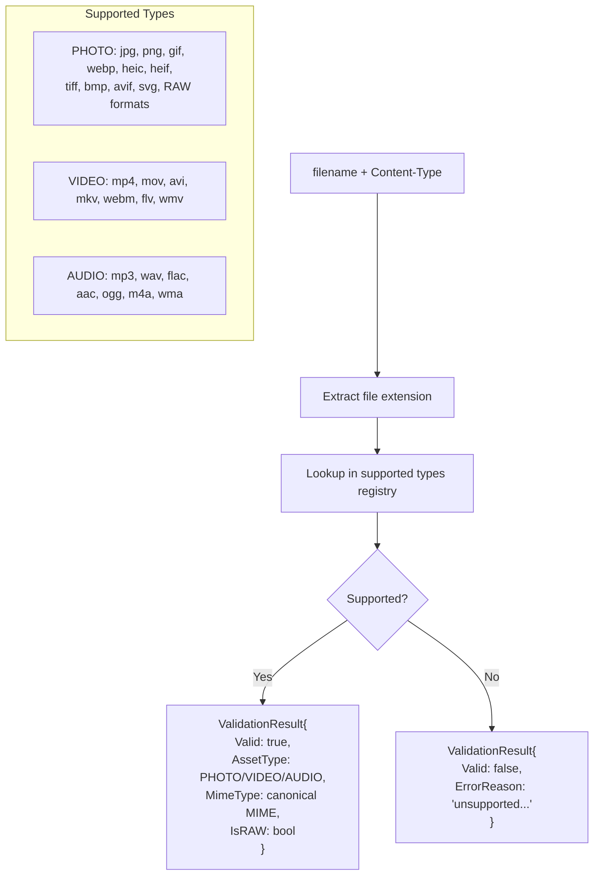

---

## 12. Complete Upload-to-Searchable Flow

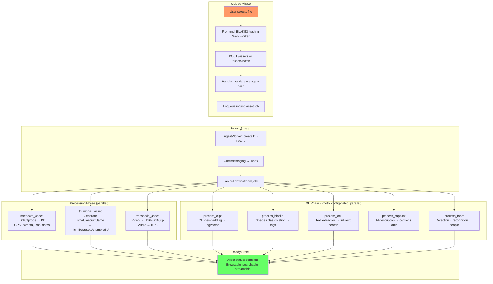

---

## 13. Error Handling & Retry

```mermaid
flowchart TD
    JOB[River Job Execution] --> SUCCESS{Success?}
    SUCCESS -->|Yes| MARK_DONE[MarkTaskComplete<br/>Update asset status JSON]
    SUCCESS -->|No| MARK_FAIL[MarkTaskFailed<br/>Update asset status JSON with error detail]
    MARK_FAIL --> RIVER_RETRY{River auto-retry?}
    RIVER_RETRY -->|Within retry limit| RETRY[Re-enqueue job]
    RIVER_RETRY -->|Exhausted| FINAL_FAIL[Asset status → failed/warning]

    FINAL_FAIL --> MANUAL[Admin can trigger:<br/>POST /assets/:id/reprocess]
    MANUAL --> RETRY_W[AssetRetryWorker<br/>queue: "retry_asset"]
    RETRY_W --> SELECTIVE[Retry only failed tasks<br/>or force full retry]
    SELECTIVE --> JOB
```

---

## API Route Map

| Method | Path | Auth | Description |
|--------|------|------|-------------|
| POST | `/assets` | Optional | Upload single file |
| POST | `/assets/batch` | Optional | Batch upload with chunk support |
| GET | `/assets/batch/config` | — | Get memory-adaptive upload config |
| GET | `/assets/batch/progress` | — | Get upload progress for sessions |
| POST | `/assets/:id/reprocess` | Optional | Retry failed processing tasks |
| POST | `/repositories` | Admin | Create new repository |
| POST | `/repositories/:id/scan` | Admin | Queue filesystem scan |
| GET | `/repositories/:id/scans/latest` | Admin | Get latest scan result |
| GET | `/repositories/:id/scans` | Admin | List scan history |

---

## Queue Configuration

| Queue | MaxWorkers | Purpose |
|-------|-----------|---------|
| `ingest_asset` | 50 | Initial staging → inbox commit |
| `discover_asset` | 20 | Filesystem discovery ingestion |
| `metadata_asset` | 20 | EXIF / ffprobe extraction |
| `thumbnail_asset` | CPU/2 | Multi-size thumbnail generation |
| `transcode_asset` | 1 | Video/audio transcoding (resource-heavy) |
| `process_clip` | 2 | CLIP embedding + classification |
| `process_bioclip` | 2 | BioCLIP species classification |
| `process_ocr` | 3 | Text extraction |
| `process_caption` | 1 | AI image captioning |
| `process_face` | 2 | Face detection + recognition |
| `retry_asset` | 2 | Selective task retry |
| `reindex_assets` | 1 | Batch reindex backfill |
| `scan_repository` | 1 | Repository tree scan |
| `rebuild_location_clusters` | 1 | Geo clustering rebuild |
