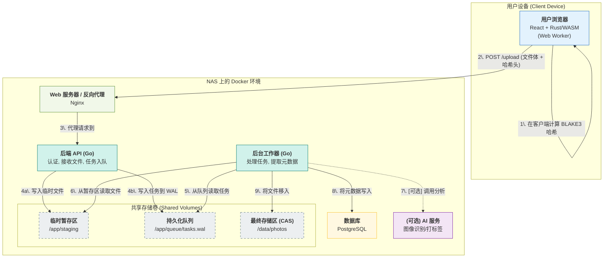

该架构的核心设计哲学是**效率**与**数据完整性**。通过在客户端（浏览器）利用 **WebAssembly (Rust)** 进行 **BLAKE3** 哈希计算，大幅降低了服务端的初始处理负载。后端采用 **Golang** 保证高并发处理能力，并设计了一个轻量级的、基于文件系统的**持久化任务队列**以避免引入Redis等外部依赖，最大限度节约NAS有限的内存资源。数据存储采用**内容寻址存储(CAS)** 策略，以哈希值为唯一标识，实现原生数据去重与完整性校验。所有服务均在**Docker** 中隔离运行，通过 `docker-compose` 进行编排，实现一键部署与轻松维护。

---

### **2.0 系统架构总览**

系统由五个核心容器化服务构成：**前端应用 (Frontend)**、**后端API网关 (API Gateway)**、**任务处理工作器 (Worker)**、**数据库 (Database)** 和一个可选的 **AI分析服务 (AI Service)**。

**数据流图：**



---

### **3.0 核心组件详解**

#### **3.1 前端 (Frontend)**

* **框架:** **React 18+**，使用函数式组件和 Hooks。
* **核心逻辑:**
    1.  **哈希计算:** 使用 `create-rust-app` 或类似脚手架，将实现了 **BLAKE3** 算法的 Rust 代码编译成 **WebAssembly (WASM)**。
    2.  **并发处理:** 将 WASM 模块载入到 **Web Worker** 中运行。当用户选择一个或多个文件后，主线程将文件句柄 (File objects) `postMessage` 给 Web Worker。
    3.  **分块读取:** Web Worker 以流式（Stream）或分块（Chunk）方式读取文件内容，增量更新 BLAKE3 哈希状态，避免将整个大文件读入内存。这对于处理数百MB的RAW文件至关重要。
    4.  **上传:** 计算完成后，Worker 将文件的 BLAKE3 哈希字符串 `postMessage` 回主线程。主线程随后发起 `fetch` 请求，将**原始文件**和**哈希字符串**（置于请求头，如 `X-Content-Hash: <blake3_hash>`）一同发送给后端API。

#### **3.2 后端 API 网关 (Backend API)**

* **语言/框架:** **Golang 1.21+**，使用标准库 `net/http` 或轻量级框架如 `Gin` / `Echo`。
* **职责:**
    1.  **轻量级入口:** 作为所有请求的入口，负责**认证**（JWT校验）、**路由**和**请求验证**。
    2.  **文件接收:** 处理 `multipart/form-data` 请求，将上传的文件流直接写入一个共享的临时目录，例如 `/app/staging/<UUID>.<ext>`。文件名使用UUID以避免冲突。
    3.  **任务分派:** 接收到文件和客户端计算的哈希后，它**不进行任何密集型计算**。其唯一任务是构造一个任务描述（如下），并将其写入持久化队列。

#### **3.3 持久化任务队列 (Queue)**

为了避免引入 Redis，我们将实现一个基于文件系统的、轻量级的**预写日志 (Write-Ahead Log, WAL)** 式队列。

* **位置:** API 和 Worker 容器共享一个挂载卷，如 `/app/queue`。
* **实现机制:**
    1.  **入队 (API端):**
        * 当 API 成功接收文件并存入 `/app/staging` 后，它会以**追加模式(Append-Only)**打开日志文件 `/app/queue/tasks.wal`。
        * 写入一行 JSON 作为任务记录，例如：
            ```json
            {"taskId": "<uuid>", "clientHash": "<blake3_hash>", "stagedPath": "/app/staging/...", "userId": "...", "timestamp": "..."}
            ```
        * 写入成功后，立即向客户端返回 `202 Accepted` 响应，表示任务已接收，正在后台处理。
    2.  **出队 (Worker端):**
        * Worker 启动时，首先扫描 `tasks.wal`，将所有任务加载到内存中的一个有界 `channel` 中。
        * Worker 持续监听此文件是否有新的追加内容，并实时将新任务送入 `channel`。
        * 当一个任务被 Worker **成功处理完毕**后，Worker 会在另一个名为 `tasks.done` 的文件中记录下已完成的 `taskId`。
    3.  **维护:** 定期（如每日凌晨）可以运行一个清理任务，将 `tasks.wal` 和 `tasks.done` 中已匹配的条目移除，防止日志文件无限增长。
* **优点:** 极低的内存占用，崩溃安全（重启后可从WAL恢复任务），无额外服务依赖。

#### **3.4 任务处理工作器 (Worker)**

* **语言:** **Golang** (可以与API服务共享大部分代码)。
* **职责:** 这是一个独立的、长期运行的后台进程。
    1.  **消费任务:** 从内存 `channel` 中获取任务。
    2.  **哈希校验:** **重新计算** `/app/staging` 中文件的 BLAKE3 哈希，必须与任务中的 `clientHash` 完全匹配。这是信任但验证（Trust but Verify）原则，确保传输过程中文件未损坏。不匹配则任务失败。
    3.  **元数据提取:** 使用 `go-exif` 等库从图片文件中提取 Exif, IPTC, XMP 等元数据。
    4.  **AI 分析 (可选):** 如果配置了 AI 服务，可通过 gRPC 或 REST API 调用该服务，传入图片，获取标签、描述等信息。
    5.  **文件归档 (核心):**
        * 计算文件的最终存储路径，采用**内容寻址存储 (Content-Addressable Storage, CAS)**。例如，哈希值为 `f16e6d...`，则文件将被移动到 `/data/photos/f1/6e/f16e6d...`。这种分级目录结构可以避免单一目录下文件过多导致的性能问题。
        * 执行文件移动操作 (`os.Rename`)，这是一个原子操作，速度极快。
    6.  **数据库更新:** 在一个**数据库事务**中，将文件的所有元数据（哈希、原始文件名、所有者、Exif、AI标签等）写入 PostgreSQL 数据库。
    7.  **任务完成:** 数据库事务成功后，才认为任务完成，并更新 `tasks.done` 文件。

---
