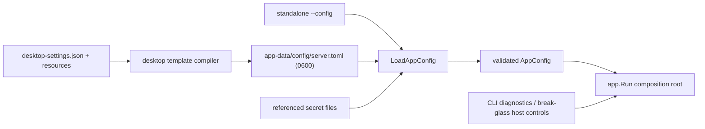

# `server/config` Dependency Map

`config` is the leaf boundary for runtime-immutable process configuration. It
imports the standard library and `go-toml`; it does not import application
packages.

## Construction contract

There is one production constructor:

```go
config.LoadAppConfig(path)
```

Its pipeline is:

```text
explicit TOML path
  → strict schema v1 decode (unknown/missing fields fail)
  → aggregate value and cross-field validation
  → resolve relative paths from the manifest directory
  → resolve bootstrap/rotated secret files
  → attach absolute path + schema version + source SHA-256
  → validated AppConfig
```

`cmd/main.go` calls it for standalone. The desktop supervisor compiles its
versioned template to app-data `config/server.toml`, atomically writes it, then
calls the same loader. There is no default constructor, environment overlay,
file search, or desktop typed-config bypass.

`app.Run` is the composition root and rejects `AppConfig` values not produced by
the loader. It passes narrow resolved slices to consumers:

| Slice | Primary consumers |
| --- | --- |
| `DatabaseConfig` | `internal/db`, setup/bootstrap, database backup |
| `ServerConfig` | HTTP server, CORS, SPA registration |
| `LoggingConfig` | `internal/logging`, repository audit provider |
| `StorageConfig` | storage layout, repositories, backup paths |
| `RepositoryScanConfig` | scanner and periodic scheduler |
| `GeocodingConfig` | location service |
| `AuthConfig` | auth, settings secretbox, share/cloud tokens |
| `TranscodeConfig` | asset processor |
| `LumenConfig` | direct Lumen SDK client construction |
| `ToolsConfig` | metadata/transcode processors |

ML feature switches and LLM/provider settings are runtime-mutable database
settings. They are intentionally absent from `AppConfig`.


