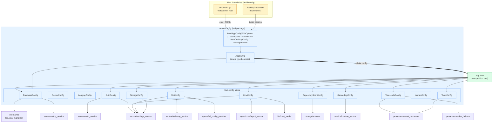

# `server/config` Dependency Map

How the `config` package relates to the rest of the server.

## Design observations

- **`config` is a leaf package.** It imports only the standard library and
  `github.com/pelletier/go-toml/v2`. It depends on *no* internal package, so the
  dependency arrows below all point **into** `config`, never out of it. This keeps
  it free of import cycles and safe to import from anywhere.
- **`AppConfig` is the single typed runtime contract.** It is assembled once at a
  host boundary, then consumed read-only everywhere else.
- **Two host entry points build it, never the consumers:**
  - `cmd/main.go` — web/docker host. Collects process env + TOML via
    `LoadAppConfigWithOptions(LoadOptions{...})`.
  - `desktop/supervisor` — desktop host. Builds typed `DesktopParams` →
    `NewDesktopConfig`, deliberately skipping generic `SERVER_*`/`DB_*` env overrides.
- **`app.Run` is the composition root.** It receives the whole `AppConfig`, then
  fans out *narrow sub-structs* to each component. Components depend on the smallest
  slice they need (e.g. `db` only sees `DatabaseConfig`, `auth_service` only sees
  `AuthConfig`) — interface-segregation applied to config, not the god-object.

## Diagram

## Component → slice table

| Slice | Consumers |
|---|---|
| `DatabaseConfig` | `internal/db` (db, dsn, migration), `service/setup_service` |
| `AuthConfig` | `service/auth_service`, `service/settings_service` |
| `MLConfig` | `service/indexing_service`, `queue/ml_config_provider`, `service/settings_service` |
| `LLMConfig` | `agent/core/agent_service`, `llm/chat_model`, `service/settings_service` |
| `StorageConfig` | `service/settings_service` |
| `RepositoryScanConfig` | `storage/scanner` |
| `GeocodingConfig` | `service/location_service` |
| `TranscodeConfig` | `processors/asset_processor`, `processors/video_helpers` |
| `ToolsConfig` | `processors/asset_processor` |
| `ServerConfig` / `LoggingConfig` / `LumenConfig` | consumed inside `app.Run` wiring |
