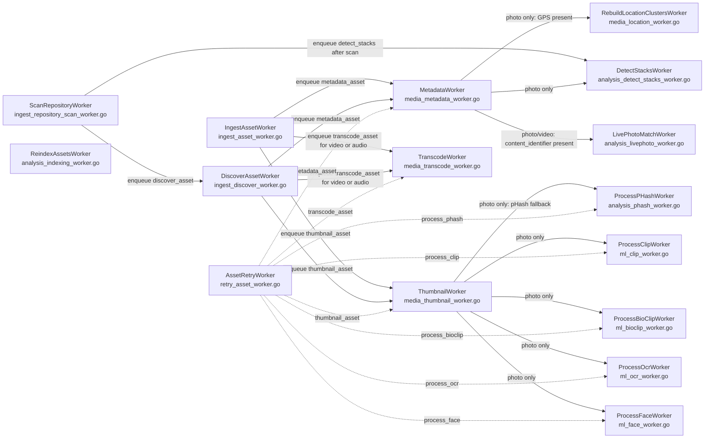

# Queue Worker Dependency DAG

This document describes the asynchronous worker graph in `server/internal/queue`.

Legend:
- Solid arrows are hard runtime dependencies: one worker enqueues the next worker as part of its normal flow.
- Dashed arrows are retry/dispatcher edges: the worker can re-enqueue another worker based on task selection.
- Some edges are conditional on asset type or metadata being present.

## Execution Notes

- `ScanRepositoryWorker` is the highest-level orchestration entry point for repository tree scans. It enqueues `DiscoverAssetWorker` per file and also schedules `DetectStacksWorker` after a scan completes.
- `IngestAssetWorker` and `DiscoverAssetWorker` both converge into the same media pipeline:
  - `MetadataWorker` is always first.
  - `ThumbnailWorker` follows for photos and videos.
  - `TranscodeWorker` follows for videos and audio.
- `MetadataWorker` is the main enrichment fan-out:
  - Photo metadata can trigger `RebuildLocationClustersWorker`, `DetectStacksWorker`, and `LivePhotoMatchWorker`.
  - Video metadata can trigger `LivePhotoMatchWorker` when `content_identifier` exists.
- `ThumbnailWorker` is the image enrichment fan-out:
  - Photos can trigger `ProcessPHashWorker` when thumbnail generation falls back.
  - Photos can also trigger CLIP, BioCLIP, OCR, and Face workers when the ML settings enable them.
- `AssetRetryWorker` is a dispatcher. It does not depend on a single downstream worker; instead, it can re-enqueue any task based on the retry request.

## Idempotence Rules

- `DetectStacksWorker` must tolerate repeated runs. It is safe to run after scans and after metadata extraction because stack creation checks existing membership before inserting.
- `LivePhotoMatchWorker` must tolerate:
  - photo before video
  - video before photo
  - metadata job retries
  - live photo matcher retries
  It uses exact `owner_id + content_identifier` matching and stack-membership checks to avoid duplicate stacks.
- `ThumbnailWorker` and ML workers are queue-level idempotent via River uniqueness plus the workers' own asset-state checks.
- `AssetRetryWorker` is intentionally permissive. It only re-enqueues the tasks requested by the caller, so the downstream workers must remain safe to run repeatedly.
