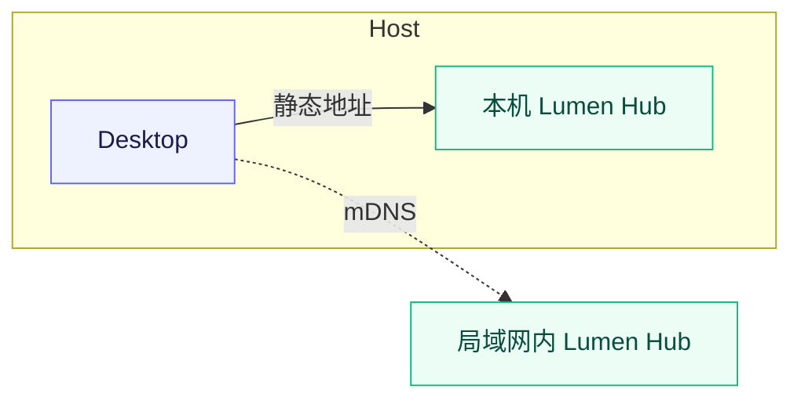

# Lumen AI

Lumen Hub 能够为流明集提供强大且多样的AI能力，它可以使用多种方式部署和连接，让算力和存储解耦。你可以将媒体存在NAS上，但将 Lumen Hub 部署在 PC, 家庭服务器，甚至是单片机，在局域网内，Lumen Hub 能够通过mDNS实现零配置+自发现，自动与流明集连接并提供高效的模型推理服务。

为什么我们需要算力和存储解耦？在NAS上，大多都使用低功耗芯片例如 Intel N100 等，这极大的限制了媒体的AI处理流程。如果你同时在单台NAS上运行 Jellyfin 做视频转码，Lumilio Photos 做照片处理，和各种AI图像推理任务，这些任务各自都需要占用大量的计算资源，导致任务被阻塞，性能下降，功耗增加。

Lumen Hub 使用 Home Native 协议，创新性将 AI 算力和存储解耦，让你能够在任何地方部署和运行推理服务，而不必担心硬件限制。你可以在NAS上部署 Lumilio Photos 和 简单的 OCR 服务，同时在GPU算力更强的服务器或者PC上部署更复杂的模型推理服务，如 SigLIP 图像语义分析，BioCLIP 物种识别 和 InsightFace 人物识别等。并且你可以仅在需要时开启这些Lumen Hub 服务，从而降低能源消耗。

## Desktop

在 Desktop 上，我们提供了静态地址节点一键部署、启动和管理的方式。同时，Desktop 能通过 mDNS 发现局域网中的其他 Lumen Hub 并自动连接和注册模型推理能力。

### 本机静态节点部署

这是 Desktop 的默认路径。控制面板会自动注册并连接本机 Hub `127.0.0.1:50051` 静态节点。

1. 打开 **Desktop 控制面板 → Lumen**，开启本机 Lumen Hub。
2. 在配置向导或 **Lumen → 配置**中选择预设、计算后端和模型缓存位置；这些选项的含义见本页最后的[统一配置](#预设模型能力与资源占用)一节。
3. 你需要注意地区选择，在中国大陆，我们会使用Github和HuggingFace镜像站来下载程序和模型。
4. 保存配置。Desktop 会下载与当前系统匹配的Lumen Hub，首次启动还会下载所选模型。
5. 等待控制面板中的 Lumen 状态变为**运行中**或**就绪**。模型下载和预热完成前，节点可能已经启动但还不能处理任务。
6. 回到 Web 的 **设置 → AI**，打开需要的任务；在[状态](./monitor)中确认节点能力和队列状态。

模型缓存不是资源库的一部分。不建议把它放进媒体备份，也不要在 Hub 运行时手动删除缓存文件。

## CLI 命令行部署

Lumen CLI 是 Lumen Hub 的推荐的统一安装器和启动器，适用于几乎所有设备。它可以把一台 Windows、macOS Apple Silicon 或 Linux 计算机变成局域网推理节点。

### 安装与首次启动

macOS Apple Silicon、Linux x64 或 Jetson Linux：

打开终端(Terminal)，逐行输入：

~~~bash
# 下载安装脚本
curl --proto '=https' --tlsv1.2 -LsSf https://lumilio.org/lumen/install.sh | sh

# 初始化配置，会有引导选项，使用键盘方向键选择，回车确认
lumen-cli init

# 启动 Lumen Hub，稍后 Lumen Hub 会自动下载模型
lumen-cli start
~~~

::: tip macOS Apple Silicon
我们强烈推荐你选择 Metal 计算后端。
:::

::: tip Jetson Linux
Jetson Linux 推荐使用 CUDA 计算后端，其他 Linux ARM 平台推荐使用 CPU 计算后端。
:::

Windows x64 PowerShell：

打开 PowerShell，逐行输入：

~~~powershell
# 下载安装脚本
powershell -ExecutionPolicy Bypass -c "irm https://lumilio.org/lumen/install.ps1 | iex"

# 初始化配置，会有引导选项，使用键盘方向键选择，回车确认
lumen-cli init

# 启动 Lumen Hub，稍后 Lumen Hub 会自动下载模型
lumen-cli start
~~~

`lumen-cli init` 会依次询问下载区域、预设、计算后端和模型缓存目录，并在用户目录下的 `.lumen/` 写入 `config.yaml` 与 `bootstrap.json`。`lumen-cli start` 会下载匹配当前系统的 Hub，校验文件后在后台启动；模型会在 Hub 第一次启动时下载。

CLI 生成的 Hub 默认监听 `0.0.0.0:50051` 并启用 mDNS。等待 Hub 完成模型下载和预热后，局域网中的 Desktop 可以直接发现它。使用 Lumilio Photos 时，如果容器收不到 mDNS，就把该设备的 `IP:50051` 加入 `discovery_static_nodes`，然后重启 Lumilio Photos。还要在运行 CLI 的设备防火墙中允许来自局域网的 TCP `50051`。

常用维护命令：

~~~bash
lumen-cli validate   # 只检查配置
lumen-cli reload     # 重新读取配置并重启 Hub
lumen-cli run        # 在前台运行并直接查看日志
lumen-cli stop       # 停止后台 Hub
~~~

不想运行安装脚本时，可以从 [Lumen-Hub Releases](https://github.com/EdwinZhanCN/Lumen-Hub/releases) 下载对应平台的 CLI 压缩包和校验文件。不要把一个平台的 Hub 压缩包复制到另一个平台使用。

## 自定义配置部署

如果预设不能满足需要，可以在下面分别选择节点设置和模型能力。表单会生成一份完整的 `lumen-config.yaml`；下载后，再根据运行系统与计算后端复制对应的 CLI 命令。

<LumenConfigBuilder />

## Docker Compose 部署 （仅受限环境下）

::: tip 关于 Docker Compose 部署
在最佳实践中，我们不推荐你使用 Docker Compose 部署 Lumen Hub。Lumen Hub 是使用 Rust 开发的高性能推理引擎，容器会带来额外的开销和不确定性。使用 CLI 或 单二进制文件运行是更加轻量且方便的部署方式。
:::

Docker Compose 适合在 Linux 服务器、NAS 或独立的 GPU 主机上运行 Lumen Hub。容器网络不会可靠转发 mDNS，因此 Compose 部署应使用主机的静态 IP 地址与 Lumilio Photos 建立连接。

开始前请先安装 Docker Engine 和 Compose v2，并确认 `docker compose version` 可以正常执行。下文不支持已经停止维护的 `docker-compose` v1；部分 NAS 自带的旧版 Compose 也可能无法正确传递 GPU。

下面三份配置分别对应 CPU、Vulkan GPU 和 CUDA GPU。选择其中一份保存为 `compose.yml` 即可，不要同时启动三个版本。模型保存在 `lumen-models` 卷中，更新或重建容器不会重新下载已经缓存的模型。

### CPU 版本

CPU 是兼容性最好的后端，也是唯一同时提供 `amd64` 和 `arm64` 容器镜像的后端。它不需要显卡或额外的主机驱动，适合没有可用 GPU 的 NAS、家庭服务器和 ARM 设备。CPU 也可以运行完整的默认模型组合，但处理速度取决于处理器性能；在低功耗设备上，我们通常只建议运行 OCR 等负载较轻的服务。

~~~yaml
services:
  lumen-hub:
    image: ghcr.io/edwinzhancn/lumen-hub:cpu
    restart: unless-stopped
    ports:
      - "50051:50051"
    volumes:
      - lumen-models:/models
      # 如需修改服务组合或下载地区，先创建配置文件，再取消下一行注释：
      # - ./lumen-config.yaml:/etc/lumen/config.yaml:ro

volumes:
  lumen-models:
~~~

### Vulkan GPU 版本

Vulkan 镜像通过 Mesa 使用 Intel 或 AMD GPU，适合没有 NVIDIA 显卡、但希望利用核显或独立显卡加速的 Linux `amd64` 主机。

- **Intel**：Skylake 及更新的核显，以及 Intel Arc 独立显卡；主机驱动需要支持 Vulkan 1.3。Skylake 之前的 Intel 核显请使用 CPU 版本。
- **AMD**：由当前 Linux 内核和 Mesa RADV 驱动支持 Vulkan 1.3 的 AMD GPU。具体支持范围取决于主机发行版的内核与 Mesa 版本。
- **NVIDIA**：不要使用 Vulkan 镜像，请直接使用下面的 CUDA 版本。

启动前先确认主机存在 `/dev/dri`，并查询 `render` 组的 GID：

~~~bash
ls -l /dev/dri
getent group render
~~~

将 `getent` 输出中的数字 GID 导出为 `RENDER_GID`。例如输出为 `render:x:109:` 时：

~~~bash
export RENDER_GID=109
~~~

部分 NAS 没有名为 `render` 的组，此时 `getent` 不会输出内容。可以直接读取渲染设备的数字 GID：

~~~bash
stat -c '%g' /dev/dri/renderD*
~~~

如果命令输出 `109`，同样执行 `export RENDER_GID=109`。存在多个 `renderD*` 设备时，请选择准备交给 Lumen Hub 的设备所使用的 GID。

然后使用下面的 Compose 配置：

~~~yaml
services:
  lumen-hub:
    image: ghcr.io/edwinzhancn/lumen-hub:vulkan
    restart: unless-stopped
    ports:
      - "50051:50051"
    devices:
      - /dev/dri:/dev/dri
    group_add:
      - "${RENDER_GID:?set RENDER_GID before starting Compose}"
    volumes:
      - lumen-models:/models
      # 如需修改服务组合或下载地区，先创建配置文件，再取消下一行注释：
      # - ./lumen-config.yaml:/etc/lumen/config.yaml:ro

volumes:
  lumen-models:
~~~

每次重新创建容器前，都需要在当前终端设置 `RENDER_GID`；也可以在 `compose.yml` 同目录的 `.env` 文件中写入相同的值，例如 `RENDER_GID=109`。启动后检查日志中的 `backend`：它应显示实际的 Intel 或 AMD 适配器。如果日志显示 `llvmpipe` 或 `Cpu`，说明容器没有正确取得 GPU，请检查设备映射、`render` 组和主机驱动。

### CUDA GPU 版本

CUDA 是面向 NVIDIA GPU 的后端，适合部署完整的 Lumen AI 服务。当前 CUDA 容器仅提供 Linux `amd64` 镜像，并基于 CUDA 12.6 运行时构建。

兼容性主要取决于 NVIDIA 驱动，而不是显卡的商品名称。GeForce、NVIDIA RTX、Quadro、RTX A 系列和数据中心 GPU 中，能够安装支持 CUDA 12.6 驱动的型号均可使用；较旧的显卡可能因为无法安装满足要求的驱动而不可用。先运行 `nvidia-smi`，确认主机能够识别 GPU，再安装并配置 [NVIDIA Container Toolkit](https://docs.nvidia.com/datacenter/cloud-native/container-toolkit/latest/install-guide.html)。

可以用下面的命令确认 Docker 已经能够访问 GPU：

~~~bash
docker run --rm --gpus all nvidia/cuda:12.6.3-base-ubuntu24.04 nvidia-smi
~~~

验证通过后使用下面的 Compose 配置：

~~~yaml
services:
  lumen-hub:
    image: ghcr.io/edwinzhancn/lumen-hub:cuda
    restart: unless-stopped
    ports:
      - "50051:50051"
    deploy:
      resources:
        reservations:
          devices:
            - driver: nvidia
              count: all
              capabilities: [gpu]
    volumes:
      - lumen-models:/models
      # 如需修改服务组合或下载地区，先创建配置文件，再取消下一行注释：
      # - ./lumen-config.yaml:/etc/lumen/config.yaml:ro

volumes:
  lumen-models:
~~~

`count: all` 会把主机上的全部 NVIDIA GPU 提供给 Lumen Hub。如果只想使用一张卡，可以改为 `count: 1`；需要锁定指定 GPU 时，则用 `device_ids: ["GPU 编号"]` 替换 `count`，两者不能同时使用。

### 启动并等待模型就绪

在 `compose.yml` 所在目录执行：

~~~bash
docker compose pull
docker compose up -d
docker compose ps
docker compose logs -f lumen-hub
~~~

三种镜像都默认启用 SigLIP、InsightFace 和 PP-OCRv6。首次启动会把模型下载到 `lumen-models` 卷；端口已经开始监听并不代表模型已经就绪，请等待日志显示下载、加载和预热完成。BioCLIP 默认关闭，因为它还需要下载较大的 Tree of Life 目录。

需要启用 BioCLIP、调整模型组合或在中国大陆使用镜像下载时，请从 Lumen Hub 仓库复制[容器默认配置](https://github.com/EdwinZhanCN/Lumen-Hub/blob/main/packaging/docker/config.default.yaml)，保存为 `lumen-config.yaml` 后修改，再取消 Compose 文件中的配置挂载。挂载的文件必须是完整配置，不能只写需要覆盖的字段；中国大陆下载源对应 `metadata.region: cn`。

### 与 Lumilio Photos 建立连接

Hub 进入就绪状态后，先从 **Lumilio Photos 所在的主机或容器**测试 Lumen Hub 的端口。把示例地址替换为实际地址：

~~~bash
nc -vz 192.168.1.30 50051
~~~

测试失败时，请检查两台主机之间的路由，并在 Lumen Hub 主机的防火墙中允许来自 Lumilio Server 的 TCP `50051`。能打开 Lumilio Web 页面，只能说明浏览器可以访问 Lumilio Server，并不能证明 Lumilio Server 可以连接 Lumen Hub。

确认网络可达后，把 Lumen Hub 的静态地址写进 Lumilio Server 使用的完整 TOML 清单：

~~~toml
[lumen]
discovery_enabled = true
discovery_mdns_enabled = false
discovery_hub_url = ""
discovery_static_nodes = ["192.168.1.30:50051"]
~~~

把示例地址替换为运行 Lumen Hub 的主机地址。`discovery_static_nodes` 使用 `host:port`，不要填写浏览器访问 Lumilio Photos 时使用的 HTTP 或 HTTPS 地址。修改完整清单后重启 Lumilio Server，再到[状态](./monitor)页确认节点及其模型能力已经出现。

::: warning 不要把推理端口暴露到公网
`50051` 只应对受信任的局域网和 Lumilio Server 开放。如果 Lumen Hub 与 Lumilio Server 不在同一个可信网络中，请先建立 VPN 或其他受保护的网络连接，不要直接做公网端口转发。
:::

## 预设、模型能力与资源占用

Desktop、CLI 和 Server 使用同一套 Lumen 模型与任务接口。Desktop 和 CLI 通过预设生成配置；Compose 没有图形化预设选择器，而是通过 `/etc/lumen/config.yaml` 选择同样的服务组合。无论选择哪种部署方式，Lumilio 都只会把已发现且已就绪的节点用于相应任务。

### 模型能力

| 能力 | 你会看到的结果 | Lumen 服务 | 适合的场景 |
| --- | --- | --- | --- |
| 语义搜索 | 用自然语言查找“海边的船”“生日聚会”等内容；也可以用一张媒体查找相似内容 | SigLIP 2 | 不想先建立文件夹或标签时，用内容找媒体 |
| 视频语义 | 从视频帧生成语义索引，搜索视频中的场景 | SigLIP 2 + Lumilio 视频采样 | 查找包含某个场景的视频 |
| 人物 | 检测人脸、生成特征并聚类，随后可以在人物页整理和命名 | InsightFace `antelopev2` | 按人物回顾家庭活动或旅行记录 |
| OCR | 识别媒体中的文字并建立全文检索 | PP-OCRv6 small | 收据、菜单、文档、截图和路牌 |
| 物种识别 | 根据图像给出物种候选，并在生物图鉴相册中整理 | BioCLIP-2 | 植物、动物和自然观察记录 |

这些任务由 Lumilio 的后台队列按需执行。打开任务开关不会立即处理已有的全部媒体；可以在[状态](./monitor)中查看节点、队列和覆盖率，再选择补齐或重建。

### 预设

预设同时决定启用哪些服务、使用哪一种模型和需要预留的空间。控制面板和 `lumen-cli` 会根据设备情况给出推荐值；不确定时从**基础（basic）**开始。

| 预设 | 包含能力 | 主要模型和数据集 | 资源参考 |
| --- | --- | --- | --- |
| **最小（minimal）** | 语义搜索、人脸 | SigLIP 2 base + InsightFace `antelopev2` | 至少 4 GB 内存、2 GB GPU/统一内存、约 2 GB 磁盘 |
| **基础（basic）** | 最小 + OCR + 物种识别 | SigLIP 2 base、PP-OCRv6 small、BioCLIP-2 + `TreeOfLife200MCore` | 至少 6 GB 内存、3 GB GPU/统一内存、约 6 GB 磁盘 |
| **完整（brave）** | 基础能力的更强语义模型和完整物种目录 | SigLIP 2 `so400m-patch14-384`、PP-OCRv6 small、BioCLIP-2 + `TreeOfLife200M` | 至少 8 GB 内存、4 GB GPU/统一内存、约 10 GB 磁盘 |

Compose 镜像默认启用 SigLIP、InsightFace 和 OCR，不等同于完整预设；要启用 BioCLIP 或更强的 SigLIP 模型，需要挂载自定义配置。表中的数值是选型参考，不是所有设备的硬性上限。模型权重和 BioCLIP 目录会按需映射，首次下载和预热时可能出现短时内存峰值。

### 计算后端

计算后端决定模型在哪种硬件上执行，不会改变 Lumilio 的任务接口：

| 部署方式 | 可选后端 | 说明 |
| --- | --- | --- |
| Desktop | Metal、GPU、CPU | macOS Apple Silicon 优先 Metal；Windows x64 优先 GPU；CPU 兼容性最好 |
| CLI | macOS 的 Metal/CPU；Windows 的 GPU/CPU；Linux 的 CPU、Vulkan、CUDA、ROCm 等发布构建 | `lumen-cli` 会根据系统和硬件选择匹配的 Hub 构建 |
| Compose | `cpu`、`vulkan`、`cuda` 镜像标签 | 计算后端由镜像标签和容器设备映射决定 |

更强的后端通常速度更快，但也更依赖驱动、显存或统一内存。低功耗设备先使用最小预设和 CPU；如果节点已发现但任务不可用，先在[状态](./monitor)确认模型是否已经完成下载和预热。

### 数据边界

Lumen 节点会接收任务需要的媒体派生数据。远程节点的运行者可能看到这些数据和运行日志，请只使用你信任的设备。不要把 `50051` 端口直接暴露到公网；原始媒体、资源库数据库、Lumen 模型缓存和节点日志应分别备份。
